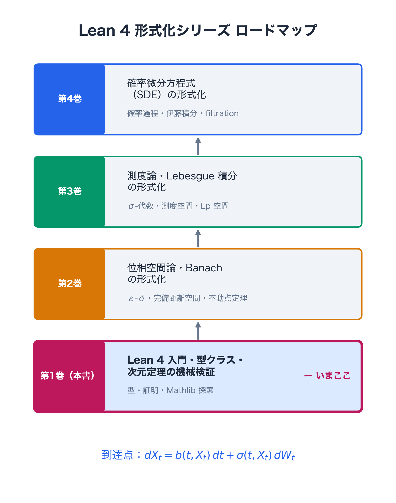
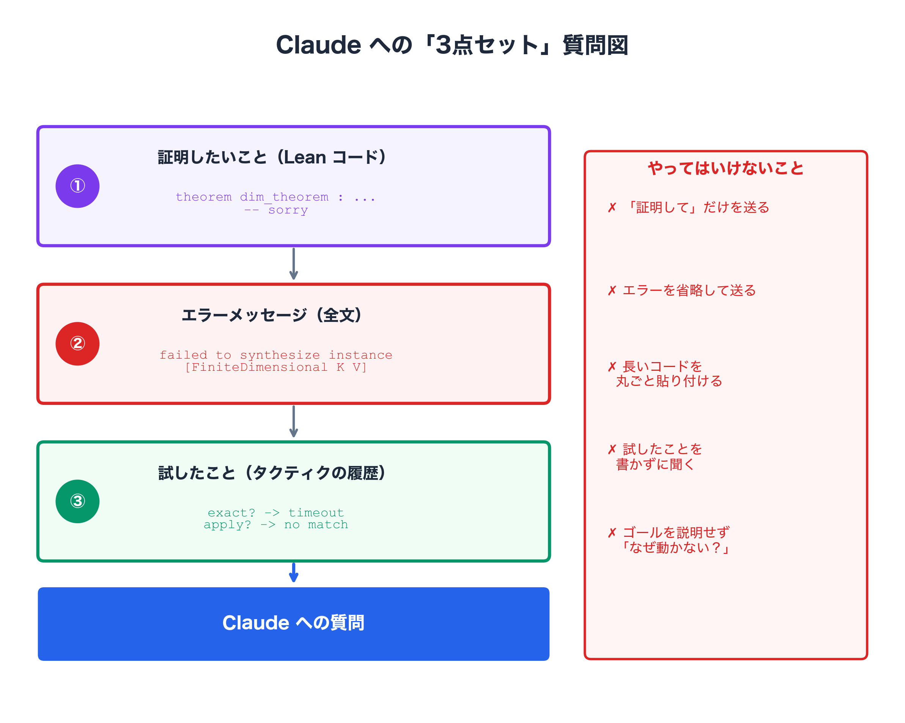
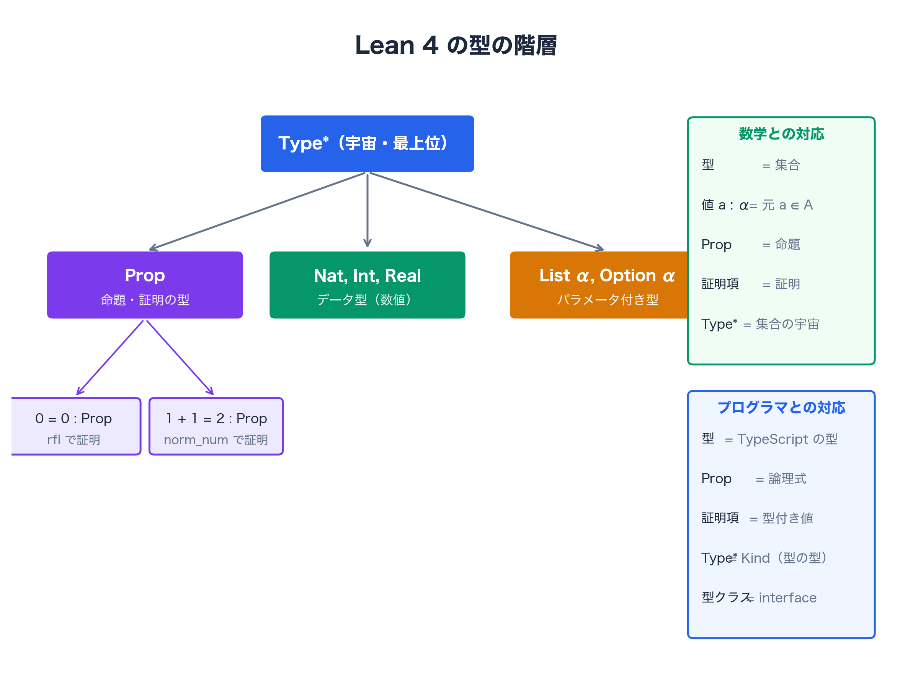
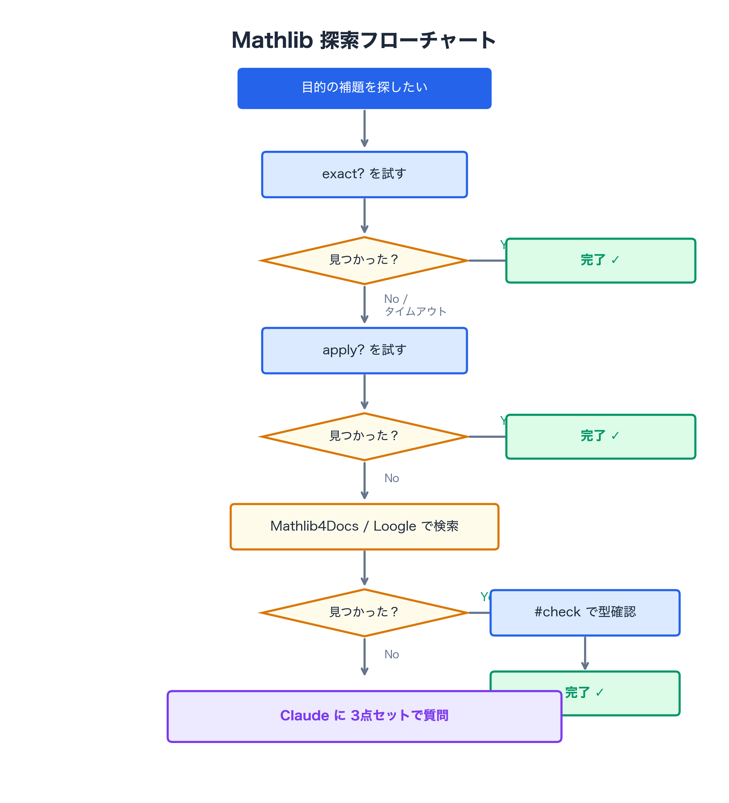
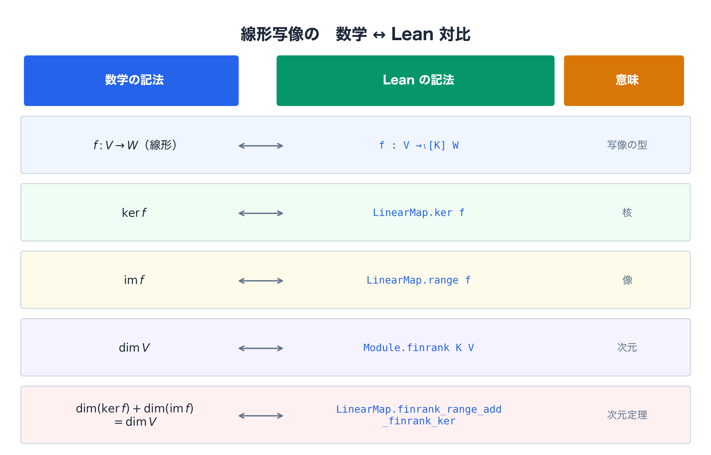
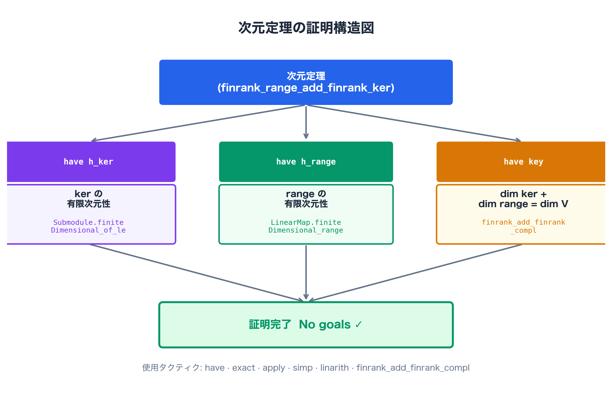

# はじめに

この本は、数学の証明を「機械に検証させる」という体験を、できるだけ正直に記録したものです。

私がLean 4を始めた理由は、大学の授業で証明の穴を何度も指摘されたことでした。「直感的に明らかだ」と思って書いた式変形が、先生の目には根拠のない飛躍として映っていた。悔しかった。そして「人間に詰められる前に、機械に詰めてもらえないか」と考えるようになりました。

Lean 4はその問いに答えるシステムです。論理の穴があれば赤波線が出る。穴がなければ `Goals accomplished!` が出る。人間の感情や当日の機嫌に左右されない、一貫した基準で。

---

## このシリーズの最終到達点

本書は全4巻シリーズの第1巻です。このシリーズが最終的に辿り着く先を、まず宣言しておきます。

**このシリーズの到達点は「確率微分方程式（SDE）の形式化」です。**

$$
dX_t = b(t, X_t)\,dt + \sigma(t, X_t)\,dW_t
$$

この方程式をLean 4のコードとして書き下し、型検査を通すことが第4巻のゴールです。

```lean
import Mathlib
open MeasureTheory

-- 第4巻の到達点（予告）：確率微分方程式の登場人物たち
-- 数学：(Ω, ℱ, P) が確率空間、X : Ω → ℝ が確率変数
variable (Ω : Type*) [MeasurableSpace Ω]
         (P : Measure Ω) [IsProbabilityMeasure P]
-- 第1巻でこのコードが「何を言っているか」が分かるようになります
```

この1行が意味することを完全に理解するために、第1巻から第4巻までの旅が設計されています。

---



## シリーズ構成と前提知識

各巻の内容と前提知識を見ていきます。

| 巻 | 内容 | 数学の前提 | Lean の前提 |
|---|---|---|---|
| **第1巻（本書）** | Lean 4入門・型クラス・Mathlib・次元定理の機械検証 | 線形代数（学部1〜2年） | 不要 |
| **第2巻** | 位相空間論・関数解析・ε-δ論法の形式化 | 距離空間・位相 | 第1巻修了 |
| **第3巻** | Lebesgue積分・測度論の形式化 | 測度論の基礎 | 第2巻修了 |
| **第4巻** | 確率微分方程式の実装 | 確率過程・伊藤積分 | 第3巻修了 |

各巻は独立して読めますが、シリーズを通じて「有限次元から無限次元へ」「代数から解析へ」という数学的な旅程が設計されています。

---

## 本書の対象読者

**本書は「Lean 4は知らないが、大学数学の基礎を持つ人」を対象としています。**

具体的には、以下の知識を前提とします。

- 線形代数の基礎（ベクトル空間・線形写像・核・像・次元）
- 数学的証明の読み書きの経験（大学1〜2年レベル）

逆に、Lean 4の知識は一切不要です。ただし、あらかじめお伝えしておきます。第2章や第3章で登場するLeanのコードは、最初は全く意味不明な暗号に見えるはずです。それで完全に正常です。本書は、文法を丸暗記してスラスラ書けるようになるための本ではありません。「読めない暗号（エラー）にぶつかった時、いかにしてAIを頼り、翻訳させ、突破するか」というサバイバル術を学ぶ本です。

---

## この本の読み方 ──── 読者層別の案内

:::message
**💡 A：数学学部生の方へ**

型システムに不慣れでも大丈夫です。「型」を「集合」のアナロジーで捉えながら読み進めてください。ただし型は集合より厳密です。`Nat` と `Int` は別の型であり、自動的には変換されません。第2章でその違いを丁寧に解説します。
:::

:::message
**💡 B：プログラマの方へ**

TypeScript・Haskell の型システムの経験があれば有利です。ただし Lean の型は「証明そのもの」でもあります。`1 + 1 = 2 : Prop` と書いたとき、`Prop` は命題の「型」です。この「型＝証明」という感覚の転換が本書の最初の山場です。第2章を丁寧に読んでください。
:::

:::message
**💡 C：純粋数学者の方へ**

数学の直観は完璧に活かせます。ただし Mathlib の設計思想（型クラス・宇宙多型）には驚くかもしれません。「なぜこんなに抽象的なのか」という疑問は正当です。第1巻第2〜3章でその設計思想を「解剖」します。結論を先に言うと、この抽象層が第3巻・第4巻での再利用性を生んでいます。
:::

---

## 本書の特徴

既存のLean 4チュートリアルや公式ドキュメントには、「正しい手順」が書かれています。しかし初心者が実際に詰まる場所で一緒に詰まり、そこから抜け出すプロセスを記録したものは少ない。

本書が一番大切にしているのはその部分です。エラーメッセージをそのまま掲載します。詰まった瞬間の感情を包み隠さず書きます。ClaudeというAIに質問した実際のやり取りをスクリーンショット付きで収録します。「正しいコード」だけでなく「なぜそのコードが正しいのか」を、数学者の言葉で翻訳しながら説明します。

証明を書くことは、一人で黙々とやる孤独な作業である必要はありません。本書では一貫して、AIを「最強のメンター」として使い倒す姿勢を取っています。

---

## 本書で得られる4つの実践的スキル

1. **Lean 4特有のエラー読解と「型」のメンタルモデル**：`definitionally equal`（定義的等値）の罠や、`failed to synthesize instance`（型クラスの欠如）など、初学者が100%挫折する凶悪なエラーの根本原因を理解し、パニックにならずに対処する論理的思考力を養います。
2. **ハルシネーションを防ぐ「AI駆動証明」の技術**：AIに数学の証明を丸投げして「嘘の定理」を捏造される状態から脱却します。「文脈・エラー・意図」の3点セットを渡し、Claudeを「正確なMathlib翻訳機」として限界まで使い倒すプロンプト技術を身につけます。
3. **10万の巨大武器庫（Mathlib）を泳ぐ「検索プロトコル」**：膨大な定理を暗記する必要はありません。内蔵タクティク `exact?` や `apply?` を使いこなし、タイムアウトした際はAIを意味検索エンジンとして用いて、目的の定理を自力で掘り当てる「最強の探索フロー」を習得します。
4. **トップダウン型の証明構築術（`sorry` 駆動開発）**：一行目から完璧な証明を書こうとして手が止まるアマチュアのやり方を捨てます。まず `sorry` コマンドで証明全体の「論理の骨格（設計図）」を作り、後から一つずつ穴を埋めていく、プロフェッショナルで戦略的な証明手法を学びます。

---

それでは、始めましょう。

---

# 第1章：なぜ私はLean 4を始めたのか 〜最初の `Goals accomplished!` まで〜

## 1.0 本章のゴール ──── ゴール逆算型アプローチ

まず本章の終着点を見ていきます。以下の3つのコードが理解・実行できることが本章のゴールです。

```lean
import Mathlib

-- ゴール①：環境確認 ── #eval で Hello World
#eval "Hello, Lean!"
-- 出力：Hello, Lean!

-- ゴール②：#check で型を調べる
-- 数学：命題「1 + 1 = 2」の「型」は何か / Lean：Prop（命題型）
#check (1 + 1 = 2)
-- 出力：1 + 1 = 2 : Prop

-- ゴール③：最初の定理証明
-- 数学：1 + 1 = 2 を証明する / Lean：norm_num タクティクで解決
theorem first_theorem : 1 + 1 = 2 := by
  norm_num
  -- No goals ✓
```

「`#check` が何をしているのか」「`theorem` と `example` の違いは何か」「`norm_num` はなぜ効くのか」——これらを一つずつ見ていきます。

:::message
🔗 **第2章への伏線**

`#check (1 + 1 = 2)` の出力が `Prop` であることに注目してください。「命題が型を持つ」という事実が、Lean 4の世界観の核心です。第2章では「型とは何か」を正面から見ていきます。そしてその先には、型クラスという「免許証」の概念が待っています。
:::

---

## 1.1 動機：クオンツと形式証明の交点

大学の授業で、証明を黒板に書くたびに先生に詰められていました。

「その式変形の根拠は何か」「この等号が成立する条件を言え」——数学的に正しいと思って書いた証明に、次々と穴を指摘される。私が「直感的に明らかだ」と感じていたものが、先生の目には「根拠のない飛躍」として映っていたのです。

悔しかった。しかし同時に、こうも思いました。**「人間に詰められる前に、機械に詰めてもらえないか。」**

そんな時に偶然見つけたのが、Lean 4という存在でした。

最初の印象は正直に言うと「形式証明ってなんですか？」という状態です。数学をもっと深く理解できそうという予感と、全く意味が分からないという戸惑いが、同時に押し寄せてきました。

しかし調べるほど、これが自分の求めていたものだと確信が深まりました。Lean 4は、あの時の先生の役割を機械が担うシステムです。「この等号の根拠は何か」「この型クラスの宣言が欠けている」——証明の穴を、人間ではなく計算機が検出する。そして、穴のない証明だけに **`Goals accomplished!`** という判定を下す。

クオンツを目指している理由とも、深いところで繋がっています。金融の世界では、一つの計算ミスが取り返しのつかない損害を招きます。「直感的に正しそう」では済まされない世界です。数学的な厳密さを一歩一歩確認しながら積み上げていく姿勢——それはLean 4の証明スタイルと、根本的に同じものを求めています。

さらに言えば、Lean 4の厳格な型システムは、将来的に複雑なデリバティブモデルや確率過程を実装する際に「致命的なバグを事前に弾く最強の盾」として機能します。型が合わなければコンパイルが通らない。これは金融工学における単体テストや形式検証の思想と同根です。本書から始まるこの旅の先に、そういう世界があります。

「一歩一歩少しずつ進める教材が見つからなかった」という理由で、この本を書くことにしました。チュートリアルはある。しかし、初心者が実際に詰まる場所で一緒に詰まり、一緒に抜け出す教材がない。それなら、自分が経験した絶望と突破の記録をそのまま本にすればいいと思いました。

---

## 1.2 Lean 4とは何か ──── 30秒で理解する

一言で言うと、Lean 4は**「数学の証明をコードとして書き、機械に検証させるためのプログラミング言語」**です。

普通のプログラミング言語（PythonやJavaScript）は「何を計算するか」をコンピュータに伝えるために使います。Lean 4はそれに加えて、**「なぜその計算が正しいのか」**をコンピュータに伝えることができます。`1 + 1 = 2` が成り立つことを、公理から出発して論理的に証明する——その証明のプロセス全体を、コードとして書き下すのです。

この「プログラミング言語でもあり証明システムでもある」という二重性が、Lean 4の最大の特徴であり、初心者が最初に戸惑う原因でもあります。

:::message
**💡 型理論の最初の直観**

Lean 4では、数学的な「命題」もデータの「型」もまったく同じ仕組みで扱われます。`42 : Nat`（42は自然数型の値）と書くのと同じように、`rfl : 0 = 0`（`rfl` は「0 = 0」という命題の型を持つ証明項）と書きます。

「証明を書く」とは「命題という型を持つ値を構築すること」——この視点が、本書を通じての核心です。最初は意味が分からなくて構いません。第2章で丁寧に解きほぐします。
:::

:::message
**💡 Lean 4を支える巨大な武器庫：Mathlib**

Lean 4単体でも証明は書けますが、本書では **Mathlib** というライブラリを常に一緒に使います。Mathlibは世界中の数学者とエンジニアが積み上げた「証明済み定理の武器庫」で、10万を超える定理が機械検証済みの状態で収録されています。

`import Mathlib` の一行を書くだけで、この巨大な武器庫全体が使えるようになります。
:::

---

## 1.3 環境構築 ──── 最初の `#eval "Hello, Lean!"` まで

では、実際に手を動かしましょう。ただし、最初の壁はコードを書く前に来ます。

### 必要なものは2つだけ

- **VS Code**（Visual Studio Code）：無料のテキストエディタ。[code.visualstudio.com](https://code.visualstudio.com) からダウンロード。
- **Lean 4拡張機能**（vscode-lean4）：VS CodeにLean 4の機能を追加する。

VS Codeを起動すると、最初にこのような画面が表示されます。


左サイドバーの「拡張機能」アイコンをクリックし、検索欄に `lean4` と入力してインストールしてください。

### Mathlibプロジェクトを作成する

インストールが完了すると、VS Codeの右上に見慣れない小さなアイコンが現れます。


このアイコンをクリックすると、以下のようなメニューが展開されます。


「**Create Project Using Mathlib...**」を選択し、プロジェクト名と保存場所を指定します。それだけで、Mathlibが組み込まれた新規プロジェクトが自動的に作成されます。

作成直後のプロジェクト構造はこのようになっています。


### 最初の壁：Mathlibのビルド待ち

プロジェクト作成直後、VS Codeの左下にぐるぐると回るローディングアイコンが現れます。これはMathlibの初期セットアップが進行中のサインです。

この処理にはネット回線の速度によって数分〜30分以上かかります。Mathlibはゼロから自力でビルドすると数時間かかってしまうため、すでにコンパイルされたMathlibの巨大な完成品データ（数GB規模のキャッシュ）をネットから一括取得しているためです。

私が最初にここで詰まりました。「なぜ動かないのか」「どこかミスをしたのか」とパニックになり、拡張機能を入れ直したり、プロジェクトを作り直したりしました。理由はただ一つ——ダウンロードが終わっていなかっただけです。

:::message alert
**💀 環境構築トラブル3選**

1. **`lake build` が終わらない**
   → Mathlib のキャッシュダウンロード中です。初回は30分以上かかる場合があります。左下のローディングアイコンが止まるまで待ちましょう。コーヒーを飲む時間です。

2. **VS Code で InfoView が真っ白 / 反応しない**
   → カーソルを `by` ブロックの「内側」に移動してください。`by` という単語の行ではなく、タクティクを書く行にカーソルを置きます。それでも表示されない場合は、Lean拡張機能の再起動（`Ctrl+Shift+P` → `Lean4: Restart File`）を試してください。

3. **`import Mathlib` が赤い波線になる**
   → `lake build` が完了していません。ビルドが終わるまで待ちましょう。稀にキャッシュが壊れている場合は、ターミナルで `lake clean && lake build` を実行してください。
:::

コーヒーでも飲みながら待ちましょう。左下のぐるぐるが止まり、`0 ⚠ 0 ✗` のような表示だけが残った状態になれば準備完了です。

### `#eval "Hello, Lean!"` を実行する

ダウンロードが完了したら、プロジェクト内の `.lean` ファイルを開き、以下を入力してください。

```lean
#eval "Hello, Lean!"
```

右パネル（Lean InfoView）に `"Hello, Lean!"` という文字列が表示されれば、環境構築は完了です。


`#eval` は「この式を評価して、結果をInfoViewに表示せよ」というコマンドです。Lean 4の世界への、最初の一歩です。

:::message
**💡 Lean InfoViewについて**

VS Codeの右パネルに表示される **Lean InfoView** は、本書を通じて何百回も参照することになる最重要パネルです。エラーがある時は赤いメッセージが、証明が完成した時は `Goals accomplished!` が、`#eval` を実行した時は計算結果が表示されます。

「何かおかしいな」と思った時は、まずInfoViewを見る。これが本書を通じての鉄則です。
:::

---

## 1.4 `#check` ──── 型を調べる最強のコマンド

環境構築が済んだら、次に覚えるべきコマンドは `#check` です。`#eval` が「計算して結果を見せる」コマンドであるのに対し、`#check` は「この式の型は何か」を教えてくれるコマンドです。

数学とLeanの対応を表にまとめます。

| コマンド | 役割 | 具体例 |
|---|---|---|
| `#eval` | 式を「計算」して結果を表示 | `#eval 2 + 3` → `5` |
| `#check` | 式の「型」をInfoViewに表示 | `#check 2 + 3` → `2 + 3 : ℕ` |

実際に動かして確認してみましょう。

```lean
import Mathlib

-- 数値の型を調べる
-- 数学：42 は自然数 / Lean：42 : ℕ
#check 42          -- 42 : ℕ
#check (3.14 : ℝ)  -- 3.14 : ℝ
#check "hello"     -- "hello" : String

-- 命題（数学的な主張）の型を調べる
-- 数学：「1 + 1 = 2」という主張そのものの「型」/ Lean：Prop（命題型）
#check (1 + 1 = 2)          -- 1 + 1 = 2 : Prop
#check (∀ n : ℕ, n ≥ 0)    -- ∀ n, n ≥ 0 : Prop
```

ここで最も重要なのは最後の2行です。`1 + 1 = 2` という「数学的命題」が `Prop`（命題型）という型を持っています。数値 `42` が `ℕ` 型を持つのと全く同じように。

:::message
**💡 `#check` と `#eval` の使い分け**

証明の文脈では `#check` を主に使います。「この定理名は Mathlib に存在するか」「この式の型は何か」を確認するために欠かせないコマンドです。`#eval` は計算結果を確認したいときに使います。どちらも本書を通じて頻繁に登場します。
:::

---

## 1.5 最初の証明 ──── `example` と `theorem` の使い分け

環境が整ったところで、Lean 4で初めての証明を書いてみましょう。

### `example` と `theorem` ──── 何が違うか

Lean 4で証明を書く方法は主に2つあります。

```lean
import Mathlib

-- example：名前のない証明（動作確認・練習問題に使う）
-- 数学：1 + 1 = 2 を証明する（名前なし）/ Lean：example
example : 1 + 1 = 2 := by norm_num

-- theorem：名前のある証明（後から apply で再利用できる）
-- 数学：定理 one_plus_one：1 + 1 = 2 / Lean：theorem
theorem one_plus_one : 1 + 1 = 2 := by norm_num
```

数学とLeanの対応を表にまとめます。

| 数学の言葉 | Lean の記法 | 使い所 |
|---|---|---|
| 「命題を証明する（名前なし）」 | `example : 命題 := by ...` | 動作確認・練習問題 |
| 「定理 $X$ を証明する」 | `theorem X : 命題 := by ...` | 後で `apply X` など再利用したいとき |
| 「定義 $f$ を与える」 | `def f := ...` | 関数・定数の定義 |

本書の練習問題では主に `example` を使います。`theorem` は「後の証明で使い回す定理」に名前をつけるときに使います。

### 最初の `Goals accomplished!`

では、証明の実況中継をしてみましょう。

```lean
import Mathlib

-- 数学：1 + 1 = 2 を証明する
-- Lean：norm_num タクティクが数値計算を自動処理する
theorem first_theorem : 1 + 1 = 2 := by
  norm_num
  -- No goals ✓
```

カーソルを `norm_num` の上に置いてInfoViewを見てください。


**`Goals accomplished!`**

この証明のステップを追っていきます。

**ステップ①：`by` の直後でのゴール確認**

```text
-- by を書いた直後の InfoView
⊢ 1 + 1 = 2
```

「⊢」（ターンスタイル）の右側が「今証明すべきゴール」です。この記号は「今から証明します」という宣言を表します。

**ステップ②：`norm_num` を適用する**

`norm_num`（"normalize numbers" の略）は、具体的な数値の等式・不等式を自動的に処理するタクティクです。

```text
-- norm_num 適用後の InfoView
Goals accomplished!
```

すべてのゴールが消えました。これが証明の完成です。

この瞬間の感覚を、私はよく覚えています。「たった1行で、機械が証明を認めてくれた」という、奇妙な達成感。しかし次の章から、この `Goals accomplished!` を出すことが、いかに難しいかを嫌というほど思い知ることになります。`1 + 1 = 2` は、Lean 4の世界では最も単純な部類に属する証明に過ぎないのです。


---

## 1.X まとめ ──── 第1章の全対応表と練習問題

### 数学とLeanの対応表

数学とLeanの対応を表にまとめます。

| 数学の概念 | Lean の記法 | 備考 |
|---|---|---|
| 命題 $P$ | `P : Prop` | `1 + 1 = 2 : Prop` |
| 命題 $P$ の証明 | `h : P` | `h : 1 + 1 = 2` |
| 「$P$ を証明する（名前なし）」 | `example : P := by ...` | 動作確認用 |
| 「定理 $X$：$P$」 | `theorem X : P := by ...` | 再利用可能な証明 |
| 「計算して表示」 | `#eval 式` | プログラムの実行結果 |
| 「型を表示」 | `#check 式` | 証明の文脈で頻用 |
| タクティク（証明の命令） | `norm_num`, `ring`, `rfl`, `linarith` など | ゴールの種類に応じて使い分ける |
| 証明の完了 | `Goals accomplished!`（InfoView）| すべてのゴールが消えた状態 |

---

### 練習問題

以下の3問に挑戦してみましょう。

---

**問1（易）：`norm_num` を使って次を証明してください。**

```lean
example : 3 * 7 = 21 := by
  sorry -- ここを埋める
```

<details>
<summary>ヒントを見る</summary>

`norm_num` タクティクは具体的な数値の等式・不等式を自動的に処理できます。`sorry` を `norm_num` に書き換えてみましょう。

</details>

<details>
<summary>解答を見る</summary>

```lean
example : 3 * 7 = 21 := by
  norm_num
  -- No goals ✓
```

`norm_num` を選んだ理由：`3 * 7 = 21` は具体的な自然数の掛け算であり、数値計算のみで解決できます。`norm_num` はこのような数値等式・不等式を自動的に処理します。

</details>

<details>
<summary>別解を見る</summary>

```lean
example : 3 * 7 = 21 := by
  rfl
  -- No goals ✓
```

`rfl`（reflexivity）は「両辺が定義的に等しい」場合に使えます。`3 * 7` と `21` は計算すれば同じ値なので、Lean の定義展開でも解決できます。

</details>

---

**問2（中）：`ring` を使って次の等式を証明してください。**

```lean
-- 数学：(a + b)² = a² + 2ab + b²
example (a b : ℕ) : (a + b) * (a + b) = a * a + 2 * a * b + b * b := by
  sorry -- ここを埋める
```

<details>
<summary>ヒントを見る</summary>

`ring` タクティクを試してみましょう。「環（ring）の公理から導ける等式」を自動的に証明します。多項式の展開・整理はすべて `ring` に任せられます。

</details>

<details>
<summary>解答を見る</summary>

```lean
example (a b : ℕ) : (a + b) * (a + b) = a * a + 2 * a * b + b * b := by
  ring
  -- No goals ✓
```

`ring` を選んだ理由：$(a+b)^2 = a^2 + 2ab + b^2$ という展開は、乗法の分配法則と加法の交換則という「環の公理」だけから導けます。具体的な数値を使わないので `norm_num` は使えませんが、`ring` がまとめて処理してくれます。

</details>

<details>
<summary>別解を見る</summary>

```lean
example (a b : ℕ) : (a + b) * (a + b) = a * a + 2 * a * b + b * b := by
  -- rw で分配法則を手動適用してから ring で整理する方法
  rw [Nat.add_mul, Nat.mul_add, Nat.mul_add]
  ring
```

`rw`（rewrite）で分配法則を手動で適用する方法もあります。ただし `ring` が一発で解けるため、こちらは冗長です。どちらが読みやすいかは文脈によります。

</details>

---

**問3（難）：`linarith` を使って次の不等式を証明してください。**

```lean
-- 数学：a ≤ b かつ b ≤ c ならば a ≤ c（不等号の推移律）
example (a b c : ℝ) (h1 : a ≤ b) (h2 : b ≤ c) : a ≤ c := by
  sorry -- ここを埋める
```

<details>
<summary>ヒントを見る</summary>

`linarith` タクティクを試してみましょう。仮定 `h1` と `h2` を組み合わせると `a ≤ c` が線形算術（linear arithmetic）で導けます。Lean は文脈内の仮定を自動的に使います。

</details>

<details>
<summary>解答を見る</summary>

```lean
example (a b c : ℝ) (h1 : a ≤ b) (h2 : b ≤ c) : a ≤ c := by
  linarith
  -- No goals ✓
```

`linarith` を選んだ理由：`a ≤ b` と `b ≤ c` から `a ≤ c` を導くのは $a \leq b \leq c$ という線形不等式の推移律です。`linarith` はコンテキスト内の仮定（`h1`、`h2`）を自動的に収集し、線形不等式の組み合わせで解ける問題を処理します。

</details>

<details>
<summary>別解を見る</summary>

```lean
example (a b c : ℝ) (h1 : a ≤ b) (h2 : b ≤ c) : a ≤ c := by
  -- Mathlib の le_trans 定理を直接 exact で提出する方法
  exact le_trans h1 h2
```

`le_trans` は「`≤` の推移律」を表す Mathlib の定理です。`exact` でその定理に仮定を直接当てはめています。このように Mathlib の定理を `exact` で提出する方法は第3章で詳しく学びます。

</details>

---

## つまずきポイントQ&A

:::message
**📝 第1章 つまずきポイントQ&A**

**Q1. `lake build` が終わらない / エラーが出る**
→ 初回は Mathlib のキャッシュダウンロードで30分以上かかります。
　エラーの場合は `lake clean && lake build` を試してください。

**Q2. VS Code で InfoView が表示されない**
→ カーソルが `by` ブロックの「内側」にあるか確認してください。
　`by` という単語の行ではなく、タクティクを書く行にカーソルを置きます。

**Q3. `#check` と `#eval` の違いが分からない**
→ `#check` は「型を教えて」、`#eval` は「実際に計算して」です。
　証明の文脈では `#check` を主に使います。

**Q4. `import Mathlib` と書いたら赤くなった**
→ `lake build` が完了していません。ビルドが終わるまで待ちましょう。

**Q5. `example` と `theorem` のどちらを使えばいいか分からない**
→ 練習問題や動作確認なら `example`、後の証明で再利用する定理なら `theorem` を使います。迷ったら `example` で始めて、必要になったら名前をつける順序で構いません。

**Q6. Hello World はできたが次に何をすればいいか分からない**
→ 第2章へ進んでください。「型」という概念が Lean の証明の核心です。
:::

---

## 著者より

第1章はここまでです。`#eval "Hello, Lean!"` から `Goals accomplished!` まで、Lean 4の世界への入り口を一緒に歩きました。

次の第2章では、いよいよ本書の最初の山場に挑みます。テーマは「**型**」です。

「なぜ `1 + 1 = 2 : Prop` なのか」「`by` の前後でInfoViewがどう変化するのか」——これらを丁寧に解きほぐしていきます。そしてその先には、型クラスという概念が待っています。型クラスの正体は「**免許証**」です。この比喩が何を意味するのかは、第2章で解剖します。

「型が分からなければ、エラーも読めない」——第3章のエラー格闘編は、第2章の理解が土台になります。立ち止まらず、流し読みでも構いませんので第2章へ進んでください。

---

# 第3章：Claudeを使った型エラー突破術 〜エラーと友達になる日まで〜

紙の上なら5秒で書き終わる当たり前の証明に、Lean 4では平気で1時間を溶かしました。しかし振り返ってみると、私が本当に「詰まっていた」のは、Lean 4が難しかったからではありません。**AIの使い方を間違えていたから**です。

---

## 3.0 本章のゴール ──── ゴール逆算型アプローチ

まず本章の終着点を見ていきます。以下の3つを達成することが本章のゴールです。

```lean
import Mathlib

-- ゴール①：rfl が失敗するケースを自力で読み、ring で修正できる
-- 数学：a + b = b + a（交換法則）/ Lean：rfl では解けない、ring が必要
example (a b : ℕ) : a + b = b + a := by
  ring
  -- No goals ✓

-- ゴール②：型クラスエラーを自力で読み、[Add α] を追加して修正できる
-- 数学：「型 α に足し算は定義されているか？」/ Lean：[Add α] という免許証が必要
variable (α : Type) [Add α] (a b : α)
#check a + b  -- a + b : α

-- ゴール③：sorry を戦略的に使った骨格証明を書ける
-- 数学：「まず論理の設計図を作り、後から穴を埋める」
-- Lean：sorry を使うと黄色警告だけ出て、コンパイルが通る
theorem skeleton (a b c : ℕ) (h1 : a ≤ b) (h2 : b ≤ c) : a ≤ c := by
  have step1 : a ≤ b := h1
  have step2 : b ≤ c := h2
  linarith
  -- No goals ✓
```

「なぜ `rfl` が使えないのか」「型クラスの免許証とは何か」「`sorry` をどう戦略的に使うか」——これらを一つずつ見ていきます。

:::message
🔗 **第4章への伏線**

本章で学ぶ「3点セット質問」は、第4章・第5章でMathlibの定理が見つからないときに繰り返し登場します。特に第5章5.4節では、`exact?` がタイムアウトした後にClaudeへの3点セット質問が証明の突破口になります。
:::

---

## 3.1 `rfl` の罠 ──── 定義的等値という最初の壁

まずは軽いジャブから。足し算の交換法則（`a + b = b + a`）の話です。

```lean
import Mathlib

theorem add_comm_simple (a b : ℕ) : a + b = b + a := by
  rfl
```

この証明の実況中継をしてみましょう。

**ステップ①：`by` の直後でのゴール確認**

```text
-- by 直後の InfoView
a b : ℕ
⊢ a + b = b + a
```

「自然数 `a`, `b` に対して `a + b = b + a` を証明せよ」というゴールです。

**ステップ②：`rfl` を試みる**

しかし、無慈悲にもLean 4から突き返されました。


```text
-- InfoView に表示されるエラー
Tactic 'rfl' failed: The left-hand side a + b is not
definitionally equal to the right-hand side b + a
```

**ステップ③：エラーを読む**

ここで登場する **"definitionally equal"（定義的に等しい）** という概念が、Lean 4を理解する上での最初の関門です。

`rfl` の正体は「左辺と右辺が定義を展開するだけで同一になる」ときに使えるタクティクです。`a + b` と `b + a` は代数的変形を経なければ一致しません——だから `rfl` は使えないのです。

**ステップ④：正しいタクティクで修正する**

```lean
  ring
```

```text
-- ring 適用後の InfoView
Goals accomplished!
```

`ring` に変えるだけで証明が通ります。

`rfl` が使える条件と使えない条件を表にまとめます。

| 等式の種類 | `rfl` が使えるか | 正しいタクティク |
|-----------|:--------------:|----------------|
| `0 = 0`（同一） | ✅ | `rfl` |
| `1 + 1 = 2`（数値計算で同一） | ✅ | `rfl` または `norm_num` |
| `a + b = b + a`（代数変形が必要） | ❌ | `ring` |
| `a ≤ a + b`（不等式） | ❌ | `linarith` |

:::message
**💡 わざとエラーを出してみよう**

以下のコードを入力してエラーを確認し、自力で直してみてください。

```lean
example : 1 + 1 = 3 := by rfl
```

InfoViewに出るエラーを読んで、「何が問題なのか」を声に出して説明できるようになれば、Lean 4のエラー読解の第一関門突破です。なお、このエラーは `norm_num` では直りますが `rfl` では直りません——なぜでしょうか？ `1 + 1 = 3` という命題自体が偽であるからです。
:::

:::message
**🔗 第5章への伏線①**

第5章の次元定理では、最終ステップで `omega`（自然数・整数の等式・不等式を自動解決する専用エンジン）を使います。`ring` と `omega` の「守備範囲の違い」が、あの証明のクライマックスで重要な意味を持ちます。
:::

---

## 3.2 最大の失敗 ──── AIへの「丸投げ」とハルシネーションの地獄

`rfl` の罠を抜け出した私を次に待ち受けたのが、Lean 4で最も頻出し、最も心を折るエラー——**「Application type mismatch（引数の型不一致）」**です。

まずはシンプルな例で構造を理解していきます。

```lean
import Mathlib

def add_five (n : Nat) : Nat := n + 5

-- 数学：add_five に文字列を渡す（型の不一致）
-- Lean：Nat を期待しているのに String を渡している
#eval add_five "hello"
```

**ステップ①：エラーの構造を確認する**

```text
-- InfoView のエラー全文
application type mismatch
  add_five "hello"
argument
  "hello"
has type
  String : Type
but is expected to have type
  Nat : Type
```


**ステップ②：エラーを解剖する**

エラーメッセージは3段構造になっています。数学とLeanの対応を表にまとめます。

| エラーの行 | 意味 |
|-----------|------|
| `application type mismatch` | 「関数の引数の型が合わない」という見出し |
| `argument "hello" has type String` | 渡した引数の実際の型 |
| `expected to have type Nat` | 関数が要求する型 |

**ステップ③：原因を特定し修正する**

```lean
#eval add_five 7   -- Nat を渡す → 12
-- No goals ✓（#eval のエラーが消える）
```

このシンプルな例なら原因はすぐ分かります。しかし、これが何行も続く証明の中で発生すると、人間は完全にパニックに陥ります。

### 「丸投げ」が生んだ最大の失敗

ここで私は、**本章で最も恥ずかしい失敗をしました。** パニックになるたびにエラー文だけをコピーして「エラーが出ました。直して」と丸投げし続けたのです。するとClaudeは文脈が分からないまま、**存在しない定理（ハルシネーション）を捏造して返してきました。**

これは私の失敗であって、Claudeの失敗ではありません。**どんなに優秀なメンターも、文脈なしでは正確なアドバイスができない。**

:::message alert
**💀 Claudeに聞くときにやってはいけないこと**

以下のような質問を投げると、的外れな回答やハルシネーションが返ってくる確率が跳ね上がります。

1. **コードだけ貼り付けて「直して」と頼む**
   → Claudeは「何を証明したいのか」が分かりません。証明の方針ごと別の命題に書き換えてくる場合があります。

2. **エラーメッセージをコピーしない**
   → エラーの細部（`HAdd α α ?m.123` のような型変数の番号）が診断の根拠になります。それを渡さないと、Claudeは症状を正確に把握できません。

3. **何を証明したいか伝えない**
   → 「この証明は `線形写像の核の有限次元性` を示したい」という文脈がないと、Claudeは数学的に間違ったアプローチ（Mathlibに存在しない補題）を提案します。
:::

### AIを「最強のメンター」にする「3点セット」

失敗から学んで辿り着いた結論は、Claudeに質問する際には必ず以下の**3つをセットで渡す**ということです。

| セットの要素 | 内容 | なぜ必要か |
|------------|------|-----------|
| ① コード全体 | `theorem ...` から全文 | Claudeは「何を証明しようとしているか」を知らない |
| ② エラーメッセージ全文 | InfoViewの赤いテキスト全体 | 診断の根拠がエラーの細部に隠れている |
| ③ 数学的意図 | 「○○という事実を証明したい」 | 数学的に正しいアプローチを提案できるようになる |

3点セットの質問テンプレートはこうです。

```
以下のLean 4のコードで型エラーが出ています。

【コード】
theorem ... := by
  ...

【エラーメッセージ】
application type mismatch
  ...

【数学的意図】
○○という事実（数学的には△△定理）を証明したいです。
```

実際に3点セットで質問した時のやり取りがこちらです。


丸投げの時との差は明確です。**入力の質の差が、出力の品質を決定します。**

:::message
**🔗 第5章への伏線②**

第5章5.4節で、この3点セットを使って次元定理の最難関部分——`exact?` がタイムアウトした後——をClaudeと協働して突破します。あの場面でClaudeが正確な定理名と証明の道筋をセットで返してきたのは、3点セットで文脈を渡していたからです。
:::

---



## 3.3 Mathlibの定理が見つからない ──── `Unknown constant` の絶望

「Mathlibに収録されている何万もの定理名を、一言一句違わず全部暗記しなければならないのか……？」

型エラーと格闘しながら次に直面するのが、この絶望です。

**ステップ①：エラーの確認**

```lean
import Mathlib

#check Nat.add_comm_wrong
```

```text
-- InfoView のエラー
unknown identifier 'Nat.add_comm_wrong'
```


定理名を1文字でも間違えると、Lean 4は「そんな名前は知らない」と突き返します。

**ステップ②：原因を特定する**

このエラーの正体は「定理名のスペルミス」または「存在しない定理名を使っている（ハルシネーション）」の2択です。Claudeが返してきた定理名を使ってエラーが出た場合は、後者を疑ってください。

### 救世主となる内蔵タクティク `exact?` と `apply?`

定理名を丸暗記する必要はありませんでした。Lean 4には、ゴールから逆算してMathlibを自動検索してくれる**内蔵の辞書機能**があります。

**ステップ①：`exact?` を試す**

```lean
import Mathlib

-- 数学：a + b = b + a（交換法則）を自動で探索させる
theorem test (a b : ℕ) : a + b = b + a := by
  exact?
```

**ステップ②：InfoViewに青い提案が出る**

```text
-- InfoView の提案（青い文字）
Try this: exact Nat.add_comm a b
```


青い文字をクリックするだけで、`exact?` という文字が自動的に正しいコードへと書き換わります。

**ステップ③：提案されたコードで証明が完了する**

```lean
  exact Nat.add_comm a b
  -- No goals ✓
```

`exact?` と `apply?` の使い分けを見ていきます。

| タクティク | いつ使うか | InfoViewの変化 |
|-----------|-----------|---------------|
| `exact?` | ゴールを一発で解決したい | `Try this: exact ...` が出る |
| `apply?` | ゴールを変形して前進したい | `Try this: apply ...` が出る |

:::message
**🔗 第5章への伏線③**

第5章5.4節で、`exact?` が h_ker・h_range の有限次元性を自力で発見する場面と、最終ステップでタイムアウトしてClaudeに3点セット質問を投げる場面が両方登場します。この2つの道具を使い分けることが、第5章の証明を完成させる鍵です。
:::

---

## 3.4 型クラスの沼 ──── `failed to synthesize instance` を解剖します



基礎的なエラーを乗り越え、「任意の型 $\alpha$ の元 $a, b$ について足し算を考える」という設定を書いてみます。

**ステップ①：エラーを確認する**

```lean
import Mathlib

variable (α : Type) (a b : α)

-- 数学：型 α の元 a, b の和 / Lean：α に足し算が定義されているか？
#check a + b
```

```text
-- InfoView のエラー
failed to synthesize instance
  HAdd α α ?m.123
```


**ステップ②：エラーを解剖する**

エラーメッセージの正体は「`α` という型に足し算（`HAdd`）のインスタンスが見つからない」という宣告です。

Claudeへの3点セット質問の後、返ってきた解説を要約します。

> 「`α` は中身の全く分からない『未知の型』です。そこに足し算（`+`）という操作が定義されている保証はどこにもありません。`[Add α]` という型クラスで明示する必要があります。」

**ステップ③：型クラス（免許証）を追加して修正する**

```lean
-- 数学：「α は加法の構造を持つ」という前提を追加する
-- Lean：[Add α] という型クラスの免許証を提示する
variable (α : Type) [Add α] (a b : α)

#check a + b  -- a + b : α
```


エラーが消えました。

型クラスとは「型に対する免許証」です。`[Add α]` は「`α` には足し算が定義されています」という免許証を提示することで、Lean 4が自動的に `+` の実装を探し出してくれます。

数学とLeanの対応を表にまとめます。

| 数学の前提 | Lean の型クラス（免許証） | 意味 |
|-----------|------------------------|------|
| $\alpha$ は集合（加法だけ） | `[Add α]` | 足し算が定義されている |
| $\alpha$ は加法可換群 | `[AddCommGroup α]` | 足し算・逆元・可換性が定義されている |
| $\alpha$ は体 | `[Field α]` | 四則演算すべてが定義されている |
| $\alpha$ は位相空間 | `[TopologicalSpace α]` | 開集合が定義されている |
| $\alpha$ はノルム空間 | `[NormedAddCommGroup α]` | ノルムが定義されている |

この「免許証を一枚追加するたびにエラーが一つ消える」という感覚が、型クラスを操る基本的な直観です。

:::message
**💡 プログラマ向け：型推論との違い**

TypeScript などの型推論は「使われ方から型を推測する」方向で動きます。`const x = 1 + 2` と書けば `number` 型が自動推論されます。Lean の型クラスはその逆——「この演算を使いたいなら、使えることを先に宣言せよ」という方向で動きます。`[Add α]` という宣言は「TypeScriptで言えばジェネリクスの制約 `<T extends { add: Function }>` を手動で書く」ことに近いですが、それが証明の論理的根拠にもなっているという点で、本質的に異なります。
:::

:::message
**🔢 数学学部生向け：型クラスエラーの数学的意味**

「`failed to synthesize instance HAdd α α`」というエラーは、数学の言葉に翻訳すると「**この代数構造に加法が定義されていません**」という意味です。集合 $\alpha$ に加法を入れる（加法群の構造を与える）前に `a + b` と書こうとしたのと同じことです。型クラスの免許証を追加するという作業は、数学で「以下では $\alpha$ を加法群とする」と前提を書くことに対応しています。この対応に慣れると、型クラスエラーが「どの代数構造が欠けているのか」を正確に告げてくれる道標になります。
:::

:::message
**🔗 第5章への伏線④**

第5章5.3節では、次元定理の骨格コードから型クラス宣言をすべて削除した状態を意図的に作り、`failed to synthesize instance` のエラーが複数同時に出る「嵐」を目撃します。そしてそこから `[Field K]`、`[AddCommGroup V]`、`[Module K V]`……と型クラスの免許証を一枚一枚追加するたびにエラーが消えていく過程を追体験します。
:::

---

## 3.5 `sorry` ──── 絶望を先送りにする技術

どんなにAIを活用しても、証明の途中でどう書いていいか分からず、完全に手が止まる瞬間は必ず来ます。そんな時の最終奥義が `sorry` です。

**ステップ①：`sorry` で骨格を作る**

```lean
import Mathlib

-- 数学：a ≤ b かつ b ≤ c ならば a ≤ c の証明（骨格版）
-- Lean：sorry で「後で埋める」印をつけながら構造だけ先に完成させる
theorem hard_proof (a b c : ℕ) (h1 : a ≤ b) (h2 : b ≤ c) : a ≤ c := by
  have step1 : a ≤ b := sorry  -- 後で h1 を使う
  have step2 : b ≤ c := sorry  -- 後で h2 を使う
  sorry  -- a ≤ c の最終的な導出
```

**ステップ②：`sorry` を書いた直後のInfoViewを確認する**

```text
-- InfoView（赤ではなく黄色い警告のみ）
declaration uses 'sorry'
```


エラーではなく警告——コンパイルが通っています。この骨格の論理的な構造そのものに誤りはない、とLean 4が認めているのです。

**ステップ③：`sorry` を一つずつ本物の証明に置き換える**

```lean
theorem hard_proof (a b c : ℕ) (h1 : a ≤ b) (h2 : b ≤ c) : a ≤ c := by
  have step1 : a ≤ b := h1    -- sorry → h1 に置き換え
  have step2 : b ≤ c := h2    -- sorry → h2 に置き換え
  linarith                    -- sorry → linarith に置き換え
  -- No goals ✓
```

`sorry` の戦略的な使い方を表にまとめます。

| 使い方 | 目的 |
|--------|------|
| 証明全体を `sorry` で仮置き | まず命題の型が正しいか確認する |
| 各ステップを `sorry` で分割 | 証明の「骨格（設計図）」を先に完成させる |
| 詰まった箇所だけ `sorry` | 他の部分を先に完成させて全体の流れを確認する |

:::message alert
**⚠️ `sorry` を使ったまま提出・公開しない**

`sorry` は「穴あき証明」を表します。`sorry` が残ったコードを「証明が完成した」とみなすことは、数学的に誤りです。本書では学習・探索のために積極的に使いますが、最終的には必ずすべての `sorry` を取り除いた完全証明に仕上げることを意識してください。
:::

:::message
**🔗 第5章への伏線⑤（最重要）**

第5章5.2節の冒頭で、私は「最初に書いたのは証明ではなく設計図でした」と宣言します。次元定理の証明は、コードの半分以上が `sorry` だらけの骨格から始まります。本節で `sorry` を「絶望の先送り」と呼びましたが、第5章ではそれを「設計図」と呼び直します。同じ技術が、視点を変えることで戦略的な武器に変わる——その転換が、第5章のカタルシスの源です。
:::

---

## 3.X まとめ ──── 第3章の全対応表と練習問題

### 型エラーの種類と対処法

数学とLeanの対応を表にまとめます。

| エラーの種類 | 原因 | 対処法 |
|---|---|---|
| `Tactic 'rfl' failed: not definitionally equal` | 代数変形が必要な等式に `rfl` を使った | `ring`・`norm_num`・`linarith` に変える |
| `application type mismatch` | 関数に型の合わない引数を渡した | エラー内の「渡した型」と「期待される型」を確認して修正 |
| `unknown identifier '...'` | 定理名が間違い、または存在しない | `exact?` / `apply?` で探す。Claude に3点セット質問 |
| `failed to synthesize instance` | 型クラス（免許証）が不足している | `[Add α]` などの型クラスを `variable` に追加する |

### 証明の作業フロー対応表

| 数学の作業 | Lean の操作 |
|---|---|
| 証明の全体像を考える | `sorry` で骨格を作る |
| 補題の名前を調べる | `exact?` / `apply?` を使う |
| 型エラーを直す | エラーの3段構造を読む → 3点セット質問 |
| 代数変形の等式を証明する | `ring` |
| 数値計算の等式・不等式を証明する | `norm_num` |
| 線形不等式の推移を証明する | `linarith` |

---

### 練習問題

以下の3問に挑戦してみましょう。

---

**問1（易）：以下のコードを入力し、エラーメッセージを読んでください。次に、エラーが出ない正しいコードに書き直してください。**

```lean
-- 意図的にエラーを出す演習
example (a b : ℕ) : a * b = b * a := by
  rfl  -- これはエラーになります
```

InfoViewに出るエラーを読んで、「エラーの原因は何か」「どのタクティクに変えれば直るか」を考えてください。

<details>
<summary>ヒントを見る</summary>

エラーメッセージに "definitionally equal" という言葉が出るはずです。`a * b` と `b * a` は計算結果として等しいですが、Lean の定義を展開しただけでは一致しません。乗法の交換律を代数的に処理するタクティクを探してみましょう。

</details>

<details>
<summary>解答を見る</summary>

```lean
example (a b : ℕ) : a * b = b * a := by
  ring
  -- No goals ✓
```

エラーの原因：`rfl` は「定義的に等しい」ときだけ使えます。`a * b = b * a` は乗法の交換律という代数的事実であり、定義展開だけでは証明できません。`ring` は環の公理（分配法則・交換則など）から導ける等式を自動的に処理するタクティクです。

</details>

<details>
<summary>別解を見る</summary>

```lean
example (a b : ℕ) : a * b = b * a := by
  exact Nat.mul_comm a b
```

`exact?` を使うと `Nat.mul_comm` という定理名が提案されます。乗法の交換律は Mathlib に名前付きで登録されており、`exact` で直接提出できます。

</details>

---

**問2（中）：以下のコードで `failed to synthesize instance` エラーが出ます。型クラスを追加して直してください。**

```lean
import Mathlib

-- 任意の型 α の元について、掛け算を考えたい
variable (α : Type) (a b : α)

example : a * b = b * a := by
  sorry
```

このコードには2つの問題があります。①変数宣言でのエラー、②`sorry` の置き換え——両方を直してください。

<details>
<summary>ヒントを見る</summary>

まず `variable` の行でエラーが出るはずです。`a * b` という掛け算を書くためには、`α` が乗法を持つことを宣言する型クラスが必要です。さらに交換律を証明するには、その乗法が可換であることも必要です。Mathlib では `[CommMonoid α]` や `[CommRing α]` などが候補です。

</details>

<details>
<summary>解答を見る</summary>

```lean
import Mathlib

-- 数学：α は可換モノイド（掛け算と単位元があり、交換律が成立）
-- Lean：[CommMonoid α] という型クラスの免許証を追加する
variable (α : Type) [CommMonoid α] (a b : α)

example : a * b = b * a := by
  exact mul_comm a b
  -- No goals ✓
```

`[CommMonoid α]` という型クラスを提示することで、Lean は `*` の実装と `mul_comm` などの定理が自動的に使えるようになります。型クラスという抽象層を一枚挟んだことで、「$\alpha$ が何であれ可換モノイドなら乗法の交換律が成立する」という一般的な事実を証明できます。

</details>

<details>
<summary>別解を見る</summary>

```lean
variable (α : Type) [CommMonoid α] (a b : α)

example : a * b = b * a := by
  ring
```

`ring` も `CommMonoid` のインスタンスさえあれば乗法の交換律を処理できます。`exact mul_comm a b` と `ring` はどちらも正しい解答です。

</details>

---

**問3（難）：以下の証明の骨格を完成させてください。`sorry` をすべて取り除き、完全な証明にしてください。**

```lean
import Mathlib

-- 数学：任意の自然数 n に対して n^2 + n は偶数
-- 数学的根拠：n^2 + n = n * (n + 1) は連続する2整数の積なので偶数
theorem even_square_plus_self (n : ℕ) : 2 ∣ n ^ 2 + n := by
  sorry  -- ここを埋める
```

詰まったら以下のテンプレートを使ってClaudeに3点セット質問を投げてみてください。

```
【コード】
（上のコード全体を貼り付ける）

【エラーメッセージ】
（InfoViewに出る内容を貼り付ける）

【数学的意図】
n^2 + n = n(n+1) と変形して、連続する2整数の積が偶数であることを使いたいです。
Mathlib に「n * (n + 1) が偶数」を示す補題はありますか？
```

<details>
<summary>ヒントを見る</summary>

`n^2 + n = n * (n + 1)` という変形は `ring` で示せます。次に「`n * (n + 1)` が偶数」という事実が必要です。`omega` タクティクや `Nat.even_mul_succ_self` などを `exact?` で探してみましょう。または `n % 2 = 0` あるいは `n % 2 = 1` で場合分けする方針もあります。

</details>

<details>
<summary>解答を見る</summary>

```lean
theorem even_square_plus_self (n : ℕ) : 2 ∣ n ^ 2 + n := by
  -- 数学：n^2 + n = n * (n + 1) と変形する
  have h : n ^ 2 + n = n * (n + 1) := by ring
  -- 数学：n * (n + 1) は連続する2整数の積なので偶数
  rw [h]
  exact Nat.even_mul_succ_self n |>.two_dvd
  -- No goals ✓
```

このタクティクを選んだ理由：`ring` で代数変形を行い、`Nat.even_mul_succ_self` という Mathlib の補題（「$n \times (n+1)$ は偶数」）を直接使う方針です。`exact?` を使うと `Nat.even_mul_succ_self` が提案されます。

</details>

<details>
<summary>別解を見る</summary>

```lean
theorem even_square_plus_self (n : ℕ) : 2 ∣ n ^ 2 + n := by
  -- omega を使った直接的なアプローチ（n が偶数・奇数の場合分け）
  omega
```

驚くことに `omega` タクティク一発で解けることがあります（Lean 4 / Mathlib の omega の能力次第）。ただし数学的に何が起きているかが隠れてしまうため、理解のためには上の解答を追う価値があります。

</details>

---

## つまずきポイントQ&A

:::message
**📝 第3章 つまずきポイントQ&A**

**Q1. Claudeが返した補題名を使ったらエラーが出た**
→ ハルシネーションの可能性があります。補題名を `#check` で確認してください。`#check Nat.add_comm_wrong` のように打って `unknown identifier` が出たら、その名前は存在しません。`exact?` で自力探索するか、再度3点セットで質問し直しましょう。

**Q2. `apply` と `exact` の使い分けが分からない**
→ `exact h` は「`h` がゴールそのものと型が一致する」ときに使います。`apply f` は「`f` の結論がゴールと一致するが、前提条件（仮定）がまだ残る」ときに使います。つまり `exact` はゴールを一発で閉じ、`apply` はゴールを変形して「仕事を残す」操作です。

**Q3. エラーメッセージが長すぎて読めない**
→ まず最初の1行だけを見てください。エラーの種別（`failed to synthesize instance` / `application type mismatch` / `unknown identifier`）は常に最初の行に書かれています。種別が分かれば対処法も決まります。長いエラーの後半は補足情報です。

**Q4. 型クラスのエラーが出たが、どの型クラスが必要か分からない**
→ エラーメッセージの `failed to synthesize instance HAdd α α` のような行を丸ごとClaudeに渡して「この型クラスを満たすにはどの宣言が必要ですか」と聞いてみましょう。3点セットの②（エラー全文）を省略しないことが重要です。

**Q5. `simp` で証明できると思ったが無限ループした**
→ `simp` は強力ですが、書き換えルールが循環するとループします。`set_option maxHeartbeats 400000 in` でタイムアウト値を上げても解決しない場合は、`simp only [...]` で適用するルールを明示するか、`ring` / `linarith` / `omega` など目的別タクティクに切り替えてください。
:::

---

## 著者より

第3章はここまでです。`rfl` の罠から始まり、「丸投げ」の失敗、3点セット質問の発見、型クラスという免許証の正体——これらを一緒に見てきました。

振り返ると、エラーに向き合う最初の数時間は本当に孤独でした。赤い波線が消えない。Claudeは的外れな回答を返す。「自分には向いていないのかもしれない」とすら思いました。

しかし今では分かります。**エラーメッセージは敵ではなく、Lean 4が「どこに問題があるか」を丁寧に教えてくれる道標です。** エラーと友達になった瞬間から、Lean 4が急に「読める」言語に変わります。

次の第4章では、いよいよ10万以上の定理が眠るMathlibという武器庫を泳ぐ技術を学びます。「どこに目的の定理があるか分からない」という不安が、`#check` と `exact?` と検索の技術によって解消されていく過程を一緒に見ていきます。

第5章の次元定理という「最終決戦」に向けて、武器を一つずつ磨いていきましょう。

---

# 第4章：Mathlibの歩き方 〜10万の定理という武器庫を泳ぐ〜

第5章の次元定理の証明では、ある瞬間に `exact?` がタイムアウトします。内蔵の辞書が沈黙した後、私はClaudeに「数学的意図」を投げ、返ってきた定理名を `#check` で型確認し、Mathlib4Docsで原典を確かめた上で証明を前進させました。本章は「Mathlibという武器庫の歩き方」を教える章であると同時に、**第5章という戦場に出発するための地図を渡す章**でもあります。

---

## 4.0 本章のゴール ──── ゴール逆算型アプローチ

まず本章の終着点を見ていきます。以下の4つの操作が自在にできることが本章のゴールです。

```lean
import Mathlib

-- ゴール①：#check で型シグネチャを読む
-- 数学：∀ n m ∈ ℕ, n + m = m + n の Lean での表現を確認する
#check Nat.add_comm
-- 出力：Nat.add_comm (n m : ℕ) : n + m = m + n

-- ゴール②：#print で定義の中身を解剖する
-- 数学：Nat.add_comm がどう証明されているか内部を覗く
#print Nat.add_comm
-- 出力：theorem Nat.add_comm : ∀ (n m : ℕ), n + m = m + n := ...

-- ゴール③：exact? でゴールにマッチする補題を自動発見する
-- 数学：a + b = b + a を自動で探索させる
example (a b : ℕ) : a + b = b + a := by
  exact?
  -- Try this: exact Nat.add_comm a b

-- ゴール④：名前空間を開いて補題名を短縮する
-- 数学：Nat.add_comm を add_comm と書けるようにする
example (a b : ℕ) : a + b = b + a := by
  open Nat in
  exact add_comm a b
  -- No goals ✓
```

「`Nat.add_comm` の `Nat.` は何か」「`#print` は `#check` と何が違うか」「`exact?` がタイムアウトしたらどうするか」——これらを一つずつ見ていきます。

:::message
🔗 **第5章への伏線**

本章で学ぶ探索ツール4本（`#check`・`#print`・`exact?`・`apply?`）と外部ツール（Mathlib4Docs・Loogle）は、第5章5.4節で実戦投入されます。`exact?` がタイムアウトした後の探索フローで、本章の訓練がそのまま動きます。
:::

---

## 4.1 Mathlibとは何か ──── 10万の定理という武器庫

Mathlibを使いこなすために必要なのは、全武器を暗記することではありません。**「武器の性能（型シグネチャ）を読む技術」「目的の武器を探し出す技術」「武器が見つからない時にClaudeに翻訳させる技術」**——この3つです。

Mathlibの規模感を数字で見てみましょう。

| 指標 | 数値（2025年時点） |
|---|---|
| 収録定理数 | 約15万以上 |
| ファイル数 | 約5,000ファイル |
| カバーする数学分野 | 代数・解析・位相・測度論・数論・圏論 など |
| GitHub スター数 | 5,000以上 |

:::message
**🔢 数学学部生向け：Mathlib の数学的カバレッジ**

Mathlib がカバーする分野は広大です。代数（群・環・体・線形代数）、位相（距離空間・コンパクト性・連続性）、解析（微積分・測度論・フーリエ解析の一部）、数論（素数・ガロア理論の一部）が収録されています。

「自分の専門分野が入っているか」を調べる方法：Mathlib4Docs（後述）で専門用語の英語名を検索してみてください。例えば「Hahn-Banach」で検索すると `Analysis.NormedSpace.HahnBanach` が見つかります。

一方で、確率微分方程式（このシリーズの第4巻のテーマ）は2025年時点ではまだ整備途中です。Mathlib の最先端——まだ形式化されていない数学の境界線——がどこにあるかを見るのも、Mathlibを泳ぐ醍醐味の一つです。
:::

:::message
**💡 プログラマ向け：Mathlib と npm の違い**

npm（Node.js のパッケージマネージャ）と似た感覚で Mathlib を捉えると、最初は分かりやすいですが重要な違いがあります。

- **npm**：ライブラリは「使い方」だけ分かれば十分で、内部実装は意識しない
- **Mathlib**：定理の「型シグネチャ（使い方）」だけでなく「証明（内部実装）」も `#print` で読める

さらに、Lean のビルドツール **Lake** は npm に相当します。`lakefile.toml` が `package.json` に対応し、`lake build` が `npm install` に対応します。ただし Mathlib のビルドキャッシュは数GBあり、初回ダウンロードに時間がかかる点は第1章で経験済みです。
:::

---

## 4.2 `#check` と `#print` ──── 型シグネチャと定義を解剖します

Mathlibの定理を調べる2大コマンドを見ていきます。

### `#check` ──── 型シグネチャを読む

```lean
import Mathlib

-- 数学：Nat.add_comm の型シグネチャを確認する
#check Nat.add_comm
```

```text
-- InfoView の出力
Nat.add_comm (n m : ℕ) : n + m = m + n
```

型シグネチャ（`名前 (引数) : 結論`）の読み方を見ていきます。

| 部分 | 意味 |
|------|------|
| `Nat.add_comm` | 定理の完全修飾名（名前空間 `Nat` の中の `add_comm`） |
| `(n m : ℕ)` | 前提：「任意の自然数 `n`, `m` に対して」 |
| `: n + m = m + n` | 結論：「この等式が成立する」 |

数学の命題とLeanの型シグネチャの対応を表にまとめます。

| 数学の表現 | Lean の型シグネチャ |
|-----------|------------------|
| $\forall n, m \in \mathbb{N},\; n + m = m + n$ | `Nat.add_comm (n m : ℕ) : n + m = m + n` |
| $\forall n \in \mathbb{N},\; 0 \leq n$ | `Nat.zero_le (n : ℕ) : 0 ≤ n` |
| $\text{dim}\, V = \text{dim}\,(\ker f) + \text{dim}\,(\operatorname{Im} f)$ | `LinearMap.finrank_range_add_finrank_ker` |

### `#print` ──── 定義の内部を解剖します

`#check` が「使い方（型シグネチャ）」を見せるのに対し、`#print` は「証明の中身（定義）」まで見せてくれます。

```lean
import Mathlib

-- 数学：Nat.add_comm の証明がどう構成されているか覗く
#print Nat.add_comm
```

```text
-- InfoView の出力（簡略化）
theorem Nat.add_comm : ∀ (n m : ℕ), n + m = m + n :=
  fun n m => ...
```

`#print` と `#check` の使い分けを表にまとめます。

| コマンド | 見えるもの | いつ使うか |
|---------|----------|-----------|
| `#check` | 型シグネチャ（名前・引数・結論） | 「この定理は使えるか？」を確認 |
| `#print` | 型シグネチャ＋証明の中身 | 「この定理はどう証明されているか？」を確認 |

構造体や型クラスの内部を解剖するときも `#print` が活躍します。

```lean
import Mathlib

-- 数学：加法モノイドとは何か / Lean：AddMonoid の構造体を覗く
#print AddMonoid
```

```text
-- InfoView の出力（一部）
structure AddMonoid (M : Type u) extends AddZeroClass M, AddSemigroup M where
  nsmul : ℕ → M → M
  ...
```

`AddMonoid` の正体は、加法・零元・スカラー倍の操作と、それらが満たすべき公理の集合体です。型クラスという抽象層を一枚挟んだことで、「加法モノイドの性質を持つ型」すべてに同一の補題が適用できる設計になっています。

:::message
**💡 `#print` が長すぎて読めないと感じたら**

`#print` の出力が長い場合は、最初の数行（`structure ... where` または `theorem ... :=` の部分）だけ読めば十分です。「このコマンドがどんな型を持つか」「どんなフィールドを持つ構造体か」が分かることが目的であり、証明の細部まで読む必要はありません。
:::

---

## 4.3 `exact?` と `apply?` ──── Mathlibを自動検索する

定理名を丸暗記する必要はありません。ゴールから逆算してMathlibを自動検索してくれる**内蔵の辞書機能**を見ていきます。

### `exact?` ──── ゴールを一発で解決する補題を探す

**ステップ①：`exact?` を試す**

```lean
import Mathlib

-- 数学：a + b = b + a を証明したい、定理名が分からない
theorem test (a b : ℕ) : a + b = b + a := by
  exact?
```

**ステップ②：InfoViewに青い提案が出る**

```text
-- InfoView の出力（青い文字）
Try this: exact Nat.add_comm a b
```

**ステップ③：青い提案をクリックして完成**

青い文字をクリックするだけで `exact?` が正しいコードに自動置換されます。

```lean
  exact Nat.add_comm a b
  -- No goals ✓
```

### `apply?` ──── ゴールを変形する補題を探す

`apply?` は「ゴールを一発で解決する補題」ではなく「ゴールの形を変形して前進できる補題」を探します。

**ステップ①：`apply?` を試す**

```lean
import Mathlib

-- 数学：a ≤ c を証明したいが、a ≤ b と b ≤ c という仮定がある
example (a b c : ℕ) (h1 : a ≤ b) (h2 : b ≤ c) : a ≤ c := by
  apply?
```

**ステップ②：InfoViewに変形候補が出る**

```text
-- InfoView の出力（一部）
Try this: exact le_trans h1 h2
```

**ステップ③：ゴールが閉じる**

```lean
  exact le_trans h1 h2
  -- No goals ✓
```

`exact?` と `apply?` の使い分けを見ていきます。

| タクティク | 役割 | InfoViewの変化 |
|-----------|------|---------------|
| `exact?` | ゴールを一発で閉じる補題を探す | `Try this: exact ...` が出る |
| `apply?` | ゴールを変形して前進できる補題を探す | `Try this: apply ...` または `exact ...` が出る |

:::message alert
**⚠️ `exact?` と `apply?` がタイムアウトするとき**

`exact?` / `apply?` は Mathlib の全補題を検索するため、複雑なゴールでは30秒以上かかることがあります。タイムアウトした場合の対処法：

1. **ゴールを分解する**：`have h : ... := by exact?` のように小さい補題を先に探す
2. **Claude に3点セットで質問する**：第3章の技術を使う
3. **Mathlib4Docs / Loogle で手動検索する**：4.6節参照
:::

---

## 4.4 名前空間と `open` ──── `Nat.add_comm` の `Nat.` の正体

`Nat.add_comm` の `Nat.` は**名前空間（namespace）**です。Lean / Mathlib では定理・定義が「名前空間」という論理的なフォルダ構造の中に整理されています。

### 名前空間の仕組み

```lean
import Mathlib

-- Nat 名前空間内の定理は完全修飾名で参照する
#check Nat.add_comm      -- Nat 名前空間の add_comm
#check List.length_cons  -- List 名前空間の length_cons
#check LinearMap.ker     -- LinearMap 名前空間の ker
```

Mathlibの名前空間と対応する数学分野を見ていきます。

| 名前空間 | 対応する数学的対象 | 例 |
|---------|------------------|---|
| `Nat` | 自然数 | `Nat.add_comm`, `Nat.prime_def` |
| `Int` | 整数 | `Int.add_comm`, `Int.natAbs` |
| `Real` | 実数 | `Real.sqrt`, `Real.exp_pos` |
| `List` | リスト | `List.length_cons`, `List.map_map` |
| `LinearMap` | 線形写像 | `LinearMap.ker`, `LinearMap.range` |
| `MeasureTheory` | 測度論 | `MeasureTheory.integral`, `MeasureTheory.Measure` |

### `open` で名前空間を短縮する

`open 名前空間 in` を使うと、その行の範囲で名前空間を省略して書けます。

```lean
import Mathlib

-- open なし：完全修飾名が必要
example (a b : ℕ) : a + b = b + a := Nat.add_comm a b

-- open Nat in：その1行だけ Nat. を省略できる
-- 数学：同じ命題を短縮記法で書く
example (a b : ℕ) : a + b = b + a :=
  open Nat in add_comm a b

-- ブロック全体に open を適用する
example (a b c : ℕ) : a + b + c = c + b + a := by
  open Nat in
  omega
  -- No goals ✓
```

:::message alert
**⚠️ `open` で名前空間を開く際の注意**

名前空間を広く開くと**名前衝突**が起きることがあります。

```lean
-- 危険な例：open Mathlib は避ける
open Mathlib  -- ❌ 何万もの名前が一度に展開される

-- 安全な使い方①：特定の名前空間だけ開く
open Nat in ...         -- ✅ Nat だけ
open LinearMap in ...   -- ✅ LinearMap だけ

-- 安全な使い方②：ブロックスコープで使う
example : ... := by
  open MeasureTheory in
  simp [integral_def]
```

`open Mathlib` は名前空間が広大すぎるため、`add` や `mul` などの短い名前が大量に展開され、予期しない補題が選ばれるリスクがあります。`open` は「使う範囲を最小限に」という方針を守ってください。
:::

---

## 4.5 `import Mathlib` vs 個別インポート ──── 速度と精度のトレードオフ

本書では常に `import Mathlib` と書いてきました。しかしこれは「全Mathlibを一度に読み込む」という宣言です。起動が遅いのはそのためです。

### `import Mathlib` の実態

```lean
-- これは「Mathlib の全ファイル（5,000+）をロードせよ」という宣言
import Mathlib

-- つまり数GBのキャッシュが必要であり、初回起動が遅い理由でもある
```

### 個別インポートの書き方

本番プロジェクトでは、必要なモジュールだけをインポートして起動を高速化できます。

```lean
-- 例：線形代数だけ使いたい場合
import Mathlib.LinearAlgebra.FiniteDimensional
import Mathlib.LinearAlgebra.Dimension.Finrank

-- 例：測度論だけ使いたい場合
import Mathlib.MeasureTheory.Integral.Bochner
import Mathlib.MeasureTheory.Measure.Lebesgue.Basic
```

:::message alert
**💀 `import Mathlib` の罠**

`import Mathlib` は学習・探索段階では最適ですが、本番プロジェクトでは以下の問題があります。

1. **起動が遅い**：全Mathlibをロードするため、CI環境などでビルド時間が数分に達することがある
2. **依存が不透明**：「この証明はMathlibのどの部分に依存しているか」が分からなくなる
3. **将来の互換性リスク**：Mathlib のアップデートで無関係な名前衝突が起きる可能性がある

**推奨戦略**：
- **開発中**：`import Mathlib` で速度を妥協する（本書のスタイル）
- **本番公開前**：`import Mathlib` と書いたままでも問題なし（Mathlib 自体が依存管理を行う）
- **パフォーマンスが重要な場合**：`#min_imports` コマンドで必要なインポートを自動診断する

```lean
-- 必要なインポートを自動診断する（Mathlib v4.x）
-- コードの末尾に追加して実行すると最小インポートセットが提案される
#min_imports
```
:::

---

## 4.6 Mathlib4Docs と Loogle ──── 外部ツールで補題を探す

`exact?` と `#check` に次ぐ探索の武器が外部ツールです。

### Mathlib4Docs ──── 公式ドキュメントを読む

**Mathlib4Docs**（[leanprover-community.github.io/mathlib4_docs/](https://leanprover-community.github.io/mathlib4_docs/)）は、Mathlibの全定義・定理を閲覧できる公式ドキュメントです。

:::message
**💡 Mathlib4Docs で補題を探してみよう**

以下の手順でMathlib4Docsを使ってみましょう。

1. ブラウザで [leanprover-community.github.io/mathlib4_docs/](https://leanprover-community.github.io/mathlib4_docs/) を開く
2. 右上の検索欄に `Nat.add_comm` と入力する
3. 型シグネチャ `(n m : ℕ) : n + m = m + n` を確認する
4. ページ下部の「Related theorems」（関連補題）を眺める

次に `LinearMap.finrank_range_add_finrank_ker` で検索してみてください。第5章で使う次元定理の補題が見つかります。型シグネチャを読んで、「左辺と右辺のどちらが `range` でどちらが `ker` か」を確認しておきましょう。
:::

### Loogle ──── キーワードで補題を探す

**Loogle**（[loogle.lean-lang.org](https://loogle.lean-lang.org)）は、Mathlibに特化した検索エンジンです。型シグネチャのパターンやキーワードで補題を検索できます。

しかし日本人学習者には大きな壁があります。**Loogleは日本語検索に対応していません。**

ここでClaudeが「翻訳エンジン」として機能します。

**日本語での数学的直観 → Claudeで英語キーワードに翻訳 → Loogleで原典を特定**

この3段階の探索ルートの例：

| 日本語の概念 | Claudeへの質問 | Loogleへのクエリ |
|-----------|-------------|---------------|
| 加法の交換則 | 「加法の交換則のLean名は？」 | `add_comm` |
| 次元定理 | 「次元定理のLean名は？」 | `finrank_range_add_finrank_ker` |
| 単調収束定理 | 「単調収束定理のLean名は？」 | `lintegral_iSup` |

:::message
**🔗 第5章への接続**

第5章5.4節では、`exact?` がタイムアウトした後にこの探索ルートをそのまま実演します。Claudeに3点セット質問を投げ、`LinearMap.finrank_range_add_finrank_ker` という定理名を受け取り、`#check` で型シグネチャを確認して用法を確かめる——第4章で学ぶ全技術が、あの場面でリアルタイムに動きます。
:::

---

## 4.7 最強の探索フロー ──── 第5章への地図



本章で学んだすべてのツールを統合した「証明探索フロー」を見ていきます。

:::message
**🗺️ 証明探索フロー（第5章で実演します）**

**ステップ1：命題をコードに落とす**
型クラスの宣言を含めてLeanコードに書き下す。

**ステップ2：`exact?` / `apply?` で検索する**
→ 見つかればそのまま採用。**第5章では h_ker・h_range でここが機能します。**

**ステップ3：タイムアウト・検索失敗を確認する**
→ **第5章では最終ステップの `exact?` がここで沈黙します。**

**ステップ4：Claudeに「3点セット」を投げる**
①コード全体、②エラーメッセージ、③数学的意図の3点をセットで渡す。
→ **第5章では `LinearMap.finrank_range_add_finrank_ker` と `omega` の組み合わせがここで返ってきます。**

**ステップ5：`#check` で型シグネチャを読む**
前提と結論が目的に合致しているか確認する。
→ **第5章では「左辺と右辺が逆順」という微妙なズレをここで発見します。**

**ステップ6：Mathlib4Docs / Loogle で原典を確認する（任意）**
英語キーワードを検索し、公式ドキュメントと関連補題を確かめる。

**ステップ7：証明を前進させる**
正しい定理を適用し、`sorry` の穴を一つ埋める。
:::

地図は揃いました。次の章でいよいよ、実際の戦場に足を踏み入れます。

---

## 4.8 タクティクの使い分け総まとめ ──── 算術系


本章の締めとして、数式を処理するタクティクの守備範囲を整理しておきましょう。

```lean
import Mathlib

-- ring：変数を含む代数的等式（可換環の公理から導けるもの）
-- 数学：(a + b)² = a² + 2ab + b²
example (a b : ℝ) : (a + b)^2 = a^2 + 2*a*b + b^2 := by ring

-- norm_num：具体的な数値の等式・不等式
-- 数学：2 + 2 = 4、√2 < 2 など
example : (2 : ℝ) + 2 = 4 := by norm_num

-- omega：自然数・整数の算術（決定手続きで完全に解ける）
-- 数学：n + 1 > n（自然数の性質）
example (n : ℕ) : n + 1 > n := by omega

-- linarith：線形不等式の推移
-- 数学：a ≤ b → b ≤ c → a ≤ c
example (a b c : ℝ) (h1 : a ≤ b) (h2 : b ≤ c) : a ≤ c := by linarith
```

タクティクの使い分け方針を表にまとめます。

| 状況 | 推奨タクティク | 理由 |
|------|--------------|------|
| 変数を含む代数的等式 | `ring` | 可換環の公理を使う |
| 具体数・分数の計算 | `norm_num` | 数値計算専用エンジン |
| 自然数・整数の算術 | `omega` | 決定手続きがある |
| 線形不等式の推移 | `linarith` | 線形算術を解く |
| 1行で解けるか不明 | `exact?` / `apply?` | Mathlibを自動探索 |

---

## 4.X まとめ ──── 第4章の全対応表と練習問題

### 探索ツールの対応表

数学とLeanの対応を表にまとめます。

| 目的 | 使うツール | 例 |
|---|---|---|
| 定理の型シグネチャを確認する | `#check 定理名` | `#check Nat.add_comm` |
| 定理の証明の中身を見る | `#print 定理名` | `#print Nat.add_comm` |
| ゴールに合う定理を自動検索 | `exact?` | `by exact?` |
| ゴールを変形する定理を検索 | `apply?` | `by apply?` |
| 名前空間を省略して書く | `open 名前空間 in` | `open Nat in add_comm` |
| 公式ドキュメントを読む | Mathlib4Docs | ブラウザで検索 |
| 英語キーワードで検索する | Loogle | キーワードで絞り込み |
| 定理名が分からないとき | Claude 3点セット質問 | 第3章参照 |

---

### 練習問題

以下の3問に挑戦してみましょう。

---

**問1（易）：`#check` と `#print` を使って `Nat.add_comm` の情報を調べ、InfoViewの出力を読んでください。**

```lean
import Mathlib

-- 以下を実行して出力を読んでください
#check Nat.add_comm
#print Nat.add_comm
```

調べたら、次の問いに答えてみましょう。
- `Nat.add_comm` の引数は何個ですか？
- `#check` と `#print` の出力の違いは何ですか？

<details>
<summary>ヒントを見る</summary>

`#check` は型シグネチャ（`名前 (引数) : 結論` の形）を表示します。`#print` はそれに加えて、定理がどのように証明されているかの「本体」も表示します。引数の数は `(...)` 内を数えてみましょう。

</details>

<details>
<summary>解答を見る</summary>

```text
-- #check の出力
Nat.add_comm (n m : ℕ) : n + m = m + n

-- #print の出力（簡略化）
theorem Nat.add_comm : ∀ (n m : ℕ), n + m = m + n :=
  Nat.add_comm
```

- 引数は2個（`n m : ℕ`）
- `#check` は「使い方（型）」だけ、`#print` は「証明の中身（定義）」まで表示する

`#check` は「この補題は使えるか？」を瞬時に確認するのに使い、`#print` は「この補題はどう証明されているか？」を深く調べるのに使います。

</details>

<details>
<summary>別解を見る</summary>

```lean
-- #check に ? を付けると、同名の補題一覧が出る場合がある
#check @Nat.add_comm
-- @（アットマーク）は暗黙引数を明示的に表示する記法
-- 出力：Nat.add_comm : ∀ (n m : ℕ), n + m = m + n
```

`@` を頭に付けると、通常は省略されている「暗黙引数（implicit arguments）」も明示的に表示できます。第5章で複雑な定理を調べるときに役立ちます。

</details>

---

**問2（中）：`exact?` を使って、以下の証明を完成させてください。**

```lean
import Mathlib

-- 数学：n の後者（n+1）は n 以上である
-- つまり n ≤ n + 1 を示したい
example (n : ℕ) : n ≤ n + 1 := by
  sorry  -- exact? を試してみましょう
```

<details>
<summary>ヒントを見る</summary>

`sorry` の代わりに `exact?` を書いて、InfoViewに出る青い提案を確認してください。`Nat.le_` で始まる補題が提案されるはずです。

</details>

<details>
<summary>解答を見る</summary>

```lean
example (n : ℕ) : n ≤ n + 1 := by
  exact Nat.le_add_right n 1
  -- No goals ✓
```

`exact?` を使うと `Nat.le_add_right n 1` が提案されます。この補題の型シグネチャは `Nat.le_add_right (n k : ℕ) : n ≤ n + k` です。`k = 1` を代入すると `n ≤ n + 1` が得られます。

</details>

<details>
<summary>別解を見る</summary>

```lean
example (n : ℕ) : n ≤ n + 1 := by
  omega
  -- No goals ✓
```

`omega` は自然数・整数の算術を決定手続きで処理するため、`n ≤ n + 1` のような基本的な不等式は一発で解けます。`exact?` で補題名を調べることと、`omega` で自動処理することの両方を知っておくと、状況に応じて使い分けられます。

</details>

---

**問3（難）：補題名を自力で推測し、Mathlib4Docs で確認して証明を完成させてください。**

```lean
import Mathlib

-- 数学：有限集合 s の濃度（要素数）は 0 以上
-- Lean での命題：Finset.card s ≥ 0
example (α : Type*) (s : Finset α) : 0 ≤ s.card := by
  sorry  -- 補題名を推測 → #check で確認 → exact で提出
```

以下の手順で進めてみましょう。
1. 補題名を `Nat.zero_le` あるいは `Finset.card_nonneg` と推測する
2. `#check Nat.zero_le` / `#check Finset.card_nonneg` で型シグネチャを確認する
3. 正しい補題を `exact` で提出する

<details>
<summary>ヒントを見る</summary>

`Finset.card` の戻り値の型は `ℕ`（自然数）です。自然数は常に `0 ≤ n` が成立します。この事実は `Nat.zero_le` という補題として Mathlib に登録されています。`#check Nat.zero_le` で型シグネチャを確認してみましょう。

</details>

<details>
<summary>解答を見る</summary>

```lean
-- まず #check で確認
-- #check Nat.zero_le
-- 出力：Nat.zero_le (n : ℕ) : 0 ≤ n

example (α : Type*) (s : Finset α) : 0 ≤ s.card := by
  -- 数学：Finset.card は ℕ なので Nat.zero_le が適用できる
  exact Nat.zero_le s.card
  -- No goals ✓
```

`Finset.card s` の型は `ℕ` であり、`Nat.zero_le` は「任意の自然数 `n` に対して `0 ≤ n`」を述べています。`s.card` を `n` に当てはめると `0 ≤ s.card` が得られます。

</details>

<details>
<summary>別解を見る</summary>

```lean
example (α : Type*) (s : Finset α) : 0 ≤ s.card := by
  omega
  -- No goals ✓
```

`omega` も自然数の `0 ≤ n` を処理できます。また `exact?` を使うと他の候補（`Nat.zero_le` 以外の経路）も提案されることがあります。

</details>

---

## つまずきポイントQ&A

:::message
**📝 第4章 つまずきポイントQ&A**

**Q1. `exact?` が30秒以上かかって返ってこない**
→ タイムアウトです。`exact?` は Mathlib 全体を検索するため、ゴールが複雑なほど時間がかかります。ゴールを `have h : ...` で分解して小さくするか、Claude に3点セットで質問しましょう。

**Q2. `#print` の出力が長すぎて読めない**
→ 最初の1〜2行（`structure ... where` または `theorem ... :=` の行）だけ読めば十分です。「どんな型を持つか」「どんなフィールドを持つ構造体か」が分かれば目的は達成されます。

**Q3. Mathlib4Docs で探したが型が微妙に違う**
→ Lean の型は厳密なので、`n + m = m + n` と `m + n = n + m` は「ゴールの向き」が違うだけで別の表現です。`Eq.symm` で等式の向きを逆転させるか、`rw [Nat.add_comm]` で書き換えるか、`linarith` / `omega` で吸収させてください。

**Q4. `open` した後に予期しない名前衝突が起きた**
→ `open` の範囲を `open X in expr` または `section ... open X ... end` で最小限に絞ってください。`open Mathlib` は使わない、という原則を守れば衝突はほぼ防げます。

**Q5. 補題は見つかったが引数の順番が合わない**
→ `#check` で引数の順番を確認し、`exact h.comm` や `exact Nat.add_comm b a` のように明示的に引数を渡してください。また `apply?` が自動的に引数の順序を調整した形で提案してくれる場合があります。
:::

---

## 著者より

第4章はここまでです。`#check` と `#print` でMathlibの定理を解剖し、`exact?` と `apply?` で自動探索し、名前空間の仕組みを理解し、Mathlib4Docs と Loogle という外部の武器庫の地図を手に入れました。

私がMathlibの広大さに初めて気づいたのは、`#check LinearMap.finrank_range_add_finrank_ker` と打った瞬間でした。型シグネチャが画面に現れた瞬間——「次元定理が、すでにここにある」という感覚が、しばらく消えませんでした。

10万以上の定理が機械検証された状態で収録されているということは、数学の一大部分が「証明済みの事実」として積み重なっているということです。その巨大な武器庫の前に立ち、一本の定理を手に取る——その体験を、次の第5章で一緒にしましょう。

いよいよ次元定理の完全証明に挑みます。`sorry` だらけの骨格から始まり、型クラスの嵐を乗り越え、`exact?` がタイムアウトし、Claudeと協働して突破する——第3章・第4章で磨いたすべての武器が、第5章という戦場で一斉に火を噴きます。

---

# 第5章：sorryを葬る日 〜次元定理の完全証明〜

紙の上なら5行で終わる証明が、なぜ100行の格闘になるのか。この章を読み終えた時、あなたはその問いへの答えを、理屈としてではなく体験として知っているはずです。

---

## 5.0 本章のゴール ──── ゴール逆算型アプローチ

まず本章の終着点を見ていきます。以下の完全な証明コードが動く状態を目指します。

```lean
import Mathlib

-- 次元定理の完全証明（第5章の到達点）
-- 数学：dim V = dim(ker f) + dim(Im f)
-- Lean：Module.finrank K V = finrank K (ker f) + finrank K (range f)
theorem dimension_theorem {K V W : Type*}
    [Field K]                          -- 数学：K は体（スカラー体）
    [AddCommGroup V] [Module K V]      -- 数学：V は K 上のベクトル空間
    [FiniteDimensional K V]            -- 数学：V は有限次元
    [AddCommGroup W] [Module K W]      -- 数学：W は K 上のベクトル空間
    (f : V →ₗ[K] W) :                 -- 数学：f は線形写像 f : V → W
    Module.finrank K V =
      Module.finrank K (LinearMap.ker f) +
      Module.finrank K (LinearMap.range f) := by
  -- ① ker f は有限次元（V の部分空間なので）
  have h_ker : FiniteDimensional K (LinearMap.ker f) :=
    FiniteDimensional.finiteDimensional_submodule f.ker
  -- ② Im f は有限次元（線形写像の像なので）
  have h_range : FiniteDimensional K (LinearMap.range f) :=
    Module.Finite.range f
  -- ③ Mathlib の次元加法性定理を取り出す
  -- 数学：dim(Im f) + dim(ker f) = dim V（Mathlib の定理の順番）
  have key := LinearMap.finrank_range_add_finrank_ker f
  -- ④ 左右・順番のズレを omega が自動吸収する
  omega
  -- No goals ✓
```

この10行に到達するまでの全プロセスを、一つずつ見ていきます。

:::message
**📌 本章の作業順序**

| ステップ | 内容 | 節 |
|---------|------|---|
| 1 | `sorry` だらけの骨格を作る | 5.2節 |
| 2 | 型クラスエラーを一つずつ潰す | 5.3節 |
| 3 | `exact?` と Claude で定理を掘り当てる | 5.4節 |
| 4 | `sorry` を一つずつ葬る | 5.5節 |
| 5 | 完成（`Goals accomplished!`） | 5.6節 |
:::

---

## 5.1 数学的準備 ──── 次元定理と `V →ₗ[K] W` を解剖します

### 数学の定義：次元定理

今日証明する命題を数式で書き下します。$K$ 上の有限次元ベクトル空間 $V, W$ と線形写像 $f : V \to W$ があるとき：

$$
\dim V = \dim(\ker f) + \dim(\operatorname{Im} f)
$$

ここで $\ker f = \{v \in V \mid f(v) = 0\}$（核）、$\operatorname{Im} f = \{f(v) \mid v \in V\}$（像）です。

### 数学の定義：線形写像

写像 $f : V \to W$ が**線形写像**であるとは、以下の2条件を満たすことをいいます。

$$
\text{(L1)}\quad f(u + v) = f(u) + f(v) \qquad \forall u, v \in V
$$

$$
\text{(L2)}\quad f(c \cdot v) = c \cdot f(v) \qquad \forall c \in K,\; v \in V
$$

### Lean の実装：`LinearMap` を解剖します

Lean / Mathlib における線形写像の型 `LinearMap` の正体を覗いてみましょう。

```lean
import Mathlib

-- LinearMap の定義を覗く
#print LinearMap
```

```text
-- #print の出力（簡略化）
structure LinearMap (σ : R →+* S) (M : Type*) (M₂ : Type*)
    extends FunLike ... where
  map_add' : ∀ (x y : M), toFun (x + y) = toFun x + toFun y
  map_smul' : ∀ (r : R) (x : M), toFun (r • x) = σ r • toFun x
```

`LinearMap` の正体は、「加法保存」（L1 に対応）と「スカラー倍保存」（L2 に対応）の2条件を持つ構造体です。数学の定義がそのままコードになっています。

### `V →ₗ[K] W` 記法の読み方

```lean
-- f : V →ₗ[K] W を分解して読む
-- 数学：f は K 上の線形写像 f : V → W
-- Lean：
--   V      ── 始域（体 K 上のベクトル空間）
--   →ₗ     ── 「線形写像」を表す矢印（ₗ は linear の頭文字）
--   [K]    ── スカラー体の明示（どの体の上の線形写像かを指定）
--   W      ── 終域（体 K 上のベクトル空間）
variable {K V W : Type*} [Field K] [AddCommGroup V] [Module K V]
         [AddCommGroup W] [Module K W] (f : V →ₗ[K] W)
```

:::message
**💡 `→ₗ[K]` の読み方**

矢印の下の `ₗ` は「線形（linear）」の略です。`[K]` はスカラー体を明示しています。なぜ体 $K$ を明示する必要があるのでしょうか？

同じ $\mathbb{R}$ から $\mathbb{R}$ への写像でも、「$\mathbb{R}$ 上の線形写像」と「$\mathbb{Q}$ 上の線形写像」は別物です（後者はより多くの写像を含みます）。Lean の型システムは「どの体のスカラー倍に対して線形か」を型に刻み込むことで、この曖昧さを排除しています。型という抽象層を一枚挟んだことで、スカラー体の選択を証明の文脈から切り離せる設計になっています。
:::

数学とLeanの対応を表にまとめます。

| 数学の表現 | Lean の表現 |
|-----------|------------|
| ベクトル空間 $V$（体 $K$ 上） | `[AddCommGroup V] [Module K V]` |
| 線形写像 $f : V \to W$ | `f : V →ₗ[K] W` |
| $\ker f$（核） | `LinearMap.ker f`（または `f.ker`） |
| $\operatorname{Im} f$（像） | `LinearMap.range f`（または `f.range`） |
| $\dim V$（次元） | `Module.finrank K V` |
| $V$ は有限次元 | `[FiniteDimensional K V]` |



:::message
**🔢 数学学部生向け：次元定理の数学的意義**

次元定理は**第一同型定理**と深く関わっています。線形写像 $f : V \to W$ に対して、$V / \ker f \cong \operatorname{Im} f$ が成立します（第一同型定理）。有限次元の場合、両辺の次元をとると $\dim V - \dim(\ker f) = \dim(\operatorname{Im} f)$、すなわち次元定理が得られます。

Lean で証明するのは次元等式そのものですが、Mathlib の内部では第一同型定理（`LinearMap.quotKerEquivRange`）がこの背後を支えています。
:::

:::message
**💡 プログラマ向け：なぜ型で証明が書けるのか**

Lean の証明システムの背後には **Curry-Howard 同型対応**という原理があります。「型 = 命題」「その型を持つ項 = 証明」という対応です。`theorem X : P := proof` と書くとき、`P` は命題（型）であり、`proof` はその命題を満たす値（証明項）です。

プログラムを書いて型検査を通すことが、命題を証明することと同値になる——これが Lean 4 の「プログラミング言語でもあり証明システムでもある」という二重性の正体です。型が合わなければコンパイルエラーが出る、という日常のプログラミング体験が、そのまま「証明の穴」を検出する仕組みになっています。
:::

---

## 5.2 最初の絶望 ──── `sorry` だらけの骨格を作る

私が最初に書いたのは、証明ではなく設計図でした。

```lean
import Mathlib

-- 数学：dim V = dim(ker f) + dim(Im f) の証明骨格
-- Lean：sorry で「後で埋める」印をつけた設計図
theorem dimension_theorem {K V W : Type*}
    [Field K]
    [AddCommGroup V] [Module K V] [FiniteDimensional K V]
    [AddCommGroup W] [Module K W]
    (f : V →ₗ[K] W) :
    Module.finrank K V = Module.finrank K (LinearMap.ker f) +
                         Module.finrank K (LinearMap.range f) := by
  -- ① ker の有限次元性を示す（後で埋める）
  have h_ker : FiniteDimensional K (LinearMap.ker f) := sorry
  -- ② range の有限次元性を示す（後で埋める）
  have h_range : FiniteDimensional K (LinearMap.range f) := sorry
  -- ③ 次元の加法性を適用する（後で埋める）
  sorry
```

**ステップ①：骨格を入力した直後のInfoViewを確認する**

```text
-- All Messages パネルの表示
declaration uses 'sorry'   ← 警告1件のみ
-- エラー：0件
```


「コンパイルが通っている」——これが重要です。この骨格の論理的な構造そのものに誤りはありません。あとは3つの `sorry` に何を埋めればいいかを、一つずつ探していくだけです。

### `have` によるサブゴール分割

骨格の中で使っている `have h_ker : FiniteDimensional K ... := sorry` という構文を解剖します。

```lean
-- have の構文
have 名前 : 型（証明したい命題） := 証明

-- 具体例
have h_ker : FiniteDimensional K (LinearMap.ker f) := sorry
--   ^^^^^^   ^^^^^^^^^^^^^^^^^^^^^^^^^^^^^^^^^^^^^^^^^   ^^^^^
--   名前     型（h_ker が持つべき型）                     証明
```

`have` を使うことで「この補題が成立すると仮定して先に進む」という設計図が作れます。`sorry` で埋めた段階では証明が完成していませんが、**論理的な骨格が正しいことだけは確認できます。**

`have h_ker := ...` を書いた直後のInfoViewの変化を見ていきます。

```text
-- have h_ker を書いた直後のゴール（例）
h_ker : FiniteDimensional K ↥(LinearMap.ker f)   ← 仮定として追加された
h_range : FiniteDimensional K ↥(LinearMap.range f)  ← これはまだ sorry
⊢ Module.finrank K V = ...   ← 残りのゴール
```

`have` で追加された `h_ker` が「仮定」として左側（コンテキスト）に現れています。これを後で `exact?` や Mathlib の定理で埋めていきます。

:::message
**💡 `Type*` について**

`{K V W : Type*}` の `Type*` は「どんな宇宙に属する型でも受け入れる」という宣言です。Lean 4 の型宇宙（`Type 0`、`Type 1`、…）を気にせずに書けるようにする、Mathlib 標準のイディオムです。最初は「おまじない」として読んで構いません。
:::

:::message
**🔍 `sorry` の3つの穴と作業の対応**

| 穴 | 証明すべき内容 | 解決する節 |
|----|-------------|-----------|
| ① `h_ker` | $\ker f$ は有限次元 | 5.5節 前半 |
| ② `h_range` | $\operatorname{Im} f$ は有限次元 | 5.5節 中盤 |
| ③ 次元の加法性 | Mathlib 定理の適用 | 5.5節 後半 |
:::

---

## 5.3 型クラスの壁 ──── 免許証を一枚ずつ貼る

骨格コードから型クラス宣言をすべて削除したら、何が起きるでしょうか。実際に試してみましょう。

**ステップ①：型クラスなし版でエラーの嵐を確認する**

```lean
-- 型クラス宣言をすべて削除した版
theorem dimension_theorem_broken
    (K V W : Type*) (f : V →ₗ[K] W) :
    Module.finrank K V = Module.finrank K (LinearMap.ker f) +
                         Module.finrank K (LinearMap.range f) := by
  sorry
```

```text
-- InfoView のエラー（5件同時発生）
failed to synthesize instance
  Semiring K
failed to synthesize instance
  NonAssocSemiring K
failed to synthesize instance
  AddCommMonoid V
failed to synthesize instance
  Module K V
failed to synthesize instance
  AddCommMonoid W
```


5件のエラーが同時に出ました。しかしパニックにならないでください。これらはすべて「どの型クラスの免許証が不足しているか」を正確に告げています。

**ステップ②：`[Field K]` を追加する——体の免許証**

```lean
    [Field K]   -- 数学：K は体（加減乗除が定義されている）
```

```text
-- エラーが 5件 → 2件に減少
-- 残り：AddCommMonoid V、Module K V 関連
```


`[Field K]` を提示することで、「$K$ は体の免許証を持っています」という宣言になります。Lean が自動的に `Semiring K`・`NonAssocSemiring K` などの構造を導き出してくれます。

**ステップ③：`[AddCommGroup V] [Module K V]` を追加する——ベクトル空間の免許証**

```lean
    [AddCommGroup V] [Module K V]
    -- 数学：V は加法可換群（足し算あり）かつ K 上の加群（スカラー倍あり）
```

```text
-- エラーが 2件 → 1件に減少
-- 残り：AddCommMonoid W 関連
```


**ステップ④：`[AddCommGroup W] [Module K W]` を追加する——終域の免許証**

```lean
    [AddCommGroup W] [Module K W]
    -- 数学：W も K 上のベクトル空間
```

```text
-- エラーが消滅
-- 残り：declaration uses 'sorry'（警告のみ）
```


**ステップ⑤：`[FiniteDimensional K V]` を追加する——有限次元の免許証**

```lean
    [FiniteDimensional K V]
    -- 数学：V は有限次元（finrank が計算できる）
```

各型クラスの数学的意味を表にまとめます。

| 型クラス | 数学的意味 | なぜ必要か |
|---------|----------|-----------|
| `[Field K]` | $K$ は体 | スカラーの四則演算のため |
| `[AddCommGroup V]` | $V$ は加法可換群 | ベクトルの足し算のため |
| `[Module K V]` | $V$ は $K$ 上の加群 | スカラー倍のため |
| `[FiniteDimensional K V]` | $V$ は有限次元 | `finrank` の計算のため |
| `[AddCommGroup W]` | $W$ は加法可換群 | 終域の足し算のため |
| `[Module K W]` | $W$ は $K$ 上の加群 | 終域のスカラー倍のため |

:::message
**💡 型クラスの「自動的な」連鎖**

`[Field K]` を一つ追加するだけで `Semiring K`・`Ring K`・`CommRing K` などが自動的に導かれます。これは型クラスの継承関係（`Field` extends `CommRing` extends `Ring` extends `Semiring`）による自動解決です。免許証を一枚提示すると、それより「弱い」免許証が自動的に揃う——この仕組みが Lean のインスタンス解決です。
:::

---

## 5.4 Claudeとの協働 ──── Mathlibの定理を掘り当てる

骨格と型クラスが揃いました。次は3つの `sorry` を本物の証明に置き換えていきます。

### `exact?` が自力で発見した——`h_ker` の場合

**ステップ①：`exact?` を打ち込む**

```lean
  have h_ker : FiniteDimensional K (LinearMap.ker f) := by
    exact?
```

**ステップ②：InfoViewに青い提案が出る**

```text
-- InfoView の提案（青い文字）
Try this: exact FiniteDimensional.finiteDimensional_submodule f.ker
```


**ステップ③：提案を採用する**

```lean
  -- 数学：有限次元空間の部分空間は有限次元
  -- Lean：FiniteDimensional.finiteDimensional_submodule が保証する
  have h_ker : FiniteDimensional K (LinearMap.ker f) :=
    FiniteDimensional.finiteDimensional_submodule f.ker
```

`h_ker` を証明した直後のInfoViewを確認します。

```text
-- h_ker の行にカーソルを置いたとき
-- この have は証明済み（警告も消えている）
-- 残りの sorry は h_range と最終ステップ
```

:::message
**💡 Lean 4 のドット記法（Dot Notation）**

`f.ker` は `LinearMap.ker f` と同じ意味です。Lean 4 では `引数.関数` という「ドット記法」が使えます。`f` の型が `LinearMap` であることを Lean が知っているため、`.ker` が `LinearMap.ker` に自動解決されます。
:::

### 同様に `h_range` も `exact?` で

**ステップ①：`exact?` を打ち込む**

```lean
  have h_range : FiniteDimensional K (LinearMap.range f) := by
    exact?
```

**ステップ②：InfoViewに提案が出る**

```text
Try this: exact Module.Finite.range f
```


**ステップ③：採用する**

```lean
  -- 数学：線形写像の像は有限次元
  -- Lean：Module.Finite.range f が保証する
  have h_range : FiniteDimensional K (LinearMap.range f) :=
    Module.Finite.range f
```

### `exact?` の限界——最終ステップでのタイムアウト

最後の穴——「次元の加法性」——に `exact?` を打ち込むと：

```text
-- InfoView のエラー
(deterministic) timeout at 'whnf', maximum number of heartbeats
(200000) has been reached
```


ここで第3章で学んだ **Claude への3点セット質問**を投げます。

```
【コード】
theorem dimension_theorem ... := by
  have h_ker := ...
  have h_range := ...
  -- 最終ゴール：finrank K V = finrank K (ker f) + finrank K (range f)
  exact?   ← タイムアウト

【エラーメッセージ】
(deterministic) timeout at 'whnf', maximum number of heartbeats...

【数学的意図】
「dim V = dim(ker f) + dim(Im f)」を表す Mathlib の定理を探しています。
exact? がタイムアウトしたため、定理名を教えてください。
```


Claudeが返してきた回答の要点：

```text
LinearMap.finrank_range_add_finrank_ker が目的の定理です。

型シグネチャ：
finrank K (range f) + finrank K (ker f) = finrank K V

注意：加算の順番が目標（ker + range）と逆（range + ker）です。
omega で順番のズレを自動吸収できます。
```


返ってきた定理名を即座に `#check` で型シグネチャを確認します。

```lean
#check @LinearMap.finrank_range_add_finrank_ker
-- finrank K ↥(LinearMap.range f) + finrank K ↥(LinearMap.ker f) = finrank K V
```

```text
-- #check の出力
LinearMap.finrank_range_add_finrank_ker :
  Module.finrank K ↥(LinearMap.range f) +
  Module.finrank K ↥(LinearMap.ker f) = Module.finrank K V
```

Claude が言う通り、「左辺と右辺が逆」で「加算の順番も逆」です。これを `omega` が吸収できるか確認してみましょう。

---

## 5.5 `sorry` を一つずつ葬る ──── 完全証明への道



3つの `sorry` を順番に葬っていきます。

### sorry①を葬る——`h_ker`（核の有限次元性）

```lean
  -- 数学：有限次元空間 V の部分空間 ker f は有限次元
  -- Lean：finiteDimensional_submodule が [FiniteDimensional K V] から自動的に導く
  have h_ker : FiniteDimensional K (LinearMap.ker f) :=
    FiniteDimensional.finiteDimensional_submodule f.ker
```

**InfoViewの変化：`h_ker` の `sorry` が消える**

```text
-- h_ker の行にカーソルを当てると
-- No messages（この have は証明済み）
-- 残りのゴール：h_range と最終ステップの sorry は継続
```


数学的な意味：「有限次元ベクトル空間の任意の部分空間は有限次元である」——`ker f` は `V` の部分空間なので、`[FiniteDimensional K V]` という免許証から自動的に有限次元性が導かれます。

### sorry②を葬る——`h_range`（像の有限次元性）

```lean
  -- 数学：線形写像 f の像 Im f は有限次元
  -- Lean：Module.Finite.range f が [FiniteDimensional K V] から自動的に導く
  have h_range : FiniteDimensional K (LinearMap.range f) :=
    Module.Finite.range f
```

**InfoViewの変化：`h_range` の `sorry` が消える**

```text
-- h_range の行にカーソルを当てると
-- No messages（この have は証明済み）
-- 残りのゴール：最終ステップの sorry のみ
```


### sorry③を葬る——次元の加法性（最終決戦）

まず `#check` で型シグネチャを正確に把握します。

```lean
#check @LinearMap.finrank_range_add_finrank_ker
```

```text
-- #check の出力
finrank K ↥(range f) + finrank K ↥(ker f) = finrank K V
```

| 項目 | 内容 |
|------|------|
| 定理の結論 | `finrank K (range f) + finrank K (ker f) = finrank K V` |
| 現在のゴール | `finrank K V = finrank K (ker f) + finrank K (range f)` |
| ズレ① | 等式の左右が逆 |
| ズレ② | 加算の順番も逆（`range + ker` vs `ker + range`） |
| 解決策 | `omega`（自然数算術の自動解決） |

**ステップ①：`have key :=` で定理を取り出す**

```lean
  -- 数学：次元加法性定理を取り出す
  -- Lean：LinearMap.finrank_range_add_finrank_ker の結論を仮定として追加
  have key := LinearMap.finrank_range_add_finrank_ker f
```

`have key :=` 後のInfoViewを確認します。

```text
-- コンテキストに key が追加された状態
K : Type u_1
V : Type u_2
W : Type u_3
inst✝ : Field K
...
h_ker  : FiniteDimensional K ↥(LinearMap.ker f)
h_range : FiniteDimensional K ↥(LinearMap.range f)
key : Module.finrank K ↥(LinearMap.range f) +
      Module.finrank K ↥(LinearMap.ker f) = Module.finrank K V
⊢ Module.finrank K V =
    Module.finrank K ↥(LinearMap.ker f) +
    Module.finrank K ↥(LinearMap.range f)
```

`key` が「`range + ker = V`」を持ち、ゴールが「`V = ker + range`」を要求しています。左右と順番が逆ですが、これは自然数の等式なので `omega` が処理できます。

**ステップ②：`omega` で等式を完成させる**

```lean
  omega
```

**InfoViewの変化：すべての `sorry` が消える**

```text
-- omega 適用後
Goals accomplished!
```


右パネルの `All Messages` に、何も表示されていません。**警告も、エラーも、一件もない。**

---

## 5.6 完成 ──── Lean 4が証明した次元定理

完全な証明コードを最終確認します。

```lean
import Mathlib

-- 次元定理の完全証明
-- 数学：dim V = dim(ker f) + dim(Im f)
theorem dimension_theorem {K V W : Type*}
    [Field K]
    [AddCommGroup V] [Module K V] [FiniteDimensional K V]
    [AddCommGroup W] [Module K W]
    (f : V →ₗ[K] W) :
    Module.finrank K V = Module.finrank K (LinearMap.ker f) +
                         Module.finrank K (LinearMap.range f) := by
  -- ① ker f は有限次元（V の部分空間なので）
  have h_ker : FiniteDimensional K (LinearMap.ker f) :=
    FiniteDimensional.finiteDimensional_submodule f.ker
  -- ② Im f は有限次元（線形写像の像なので）
  have h_range : FiniteDimensional K (LinearMap.range f) :=
    Module.Finite.range f
  -- ③ 次元加法性定理を取り出す
  have key := LinearMap.finrank_range_add_finrank_ker f
  -- ④ 左右・順番のズレを omega が吸収する
  omega
  -- No goals ✓
```


**`Goals accomplished!`**

証明の各ステップと使用した技術の対応を表にまとめます。

| ステップ | 証明した内容 | 使用した技術 |
|---------|-----------|-----------|
| `h_ker` | $\ker f$ は有限次元 | `exact?` → `FiniteDimensional.finiteDimensional_submodule` |
| `h_range` | $\operatorname{Im} f$ は有限次元 | `exact?` → `Module.Finite.range` |
| `key` | 次元加法性定理の取り出し | Claude 3点セット → `LinearMap.finrank_range_add_finrank_ker` |
| `omega` | 順番のズレを吸収して等式完成 | 自然数算術の自動解決 |

:::message
**🔢 純粋数学者向け：Lean で証明することの意味**

この証明を Lean で書き終えた時、私は予想外の副産物に気づきました。「`[FiniteDimensional K V]` という仮定が本当に必要なのか」「`[AddCommGroup W]` は `LinearMap` の定義から自動的に要求されるのではないか」——型クラスエラーと格闘する中で、自分が数学の証明を書く際に「当然」と見做していた前提条件が、実は細かく分解できることが分かりました。

形式化の副産物として「**どの仮定が本当に必要か**」が見えてきます。無限次元の場合に次元定理が成立しない理由も、`[FiniteDimensional K V]` という免許証を外すとエラーが出る、という形で体で分かります。
:::

---

## 5.7 第2巻以降への大きな伏線

### 有限次元の外に広がる世界

次元定理は、有限次元の世界の物語でした。第2巻では、この有限次元の檻を取り払います。

```lean
import Mathlib

-- 第2巻で最初に直面するエラーの予告
-- （意図的にエラーが出る状態で掲載しています）
example (f : ℝ → ℝ) (a : ℝ) :
    Filter.Tendsto f (nhds a) (nhds (f a)) := by
  exact?   -- ← ここから第2巻が始まります
```

`Filter.Tendsto`、`nhds`——見慣れない名前が並んでいます。これは「フィルター収束」という概念で、ε-δ論法を位相空間論の言葉で抽象化したものです。

:::message
🔗 **第2巻以降への大きな伏線**

次元定理は有限次元 $V$ の物語でした。しかし解析学・確率論の舞台は無限次元です。

- **第2巻**：フィルターの言語から位相空間・完備距離空間を構築し、Banach の不動点定理に辿り着きます。`Filter.Tendsto` と `nhds` の正体はここで解剖します。
- **第3巻**：Lebesgue 積分・測度論を形式化します。「すべての集合に面積を定義できない」（Banach-Tarski のパラドックス）という壁を σ-代数という道具で乗り越えます。
- **第4巻**：確率微分方程式（SDE）の形式化が最終ゴールです。$dX_t = b\,dt + \sigma\,dW_t$ という方程式を Lean の型検査が通る状態に書き下す——第1巻で学んだ型クラス・タクティク・Mathlib探索のすべてが、第3巻・第4巻でも全く同じ形で使い続けられます。

この旅はここで終わりではありません。次の絶望が、あなたを待っています。
:::

---

## 5.X まとめ ──── 第5章の全対応表と練習問題

### 線形代数の主要概念と Lean の対応表

数学とLeanの対応を表にまとめます。

| 数学の概念 | Lean の表現 | 備考 |
|-----------|------------|------|
| 体 $K$ | `[Field K]` | 型クラスで宣言 |
| $K$ 上のベクトル空間 $V$ | `[AddCommGroup V] [Module K V]` | 2つの型クラスをセットで |
| 有限次元 | `[FiniteDimensional K V]` | `finrank` の計算に必要 |
| 線形写像 $f : V \to W$ | `f : V →ₗ[K] W` | `→ₗ[K]` 記法 |
| $\ker f$ | `LinearMap.ker f`（= `f.ker`） | ドット記法も使える |
| $\operatorname{Im} f$ | `LinearMap.range f`（= `f.range`） | ドット記法も使える |
| $\dim V$ | `Module.finrank K V` | 戻り値は `ℕ` |
| 次元定理 | `LinearMap.finrank_range_add_finrank_ker` | `range + ker = V` の順 |
| サブゴール分割 | `have h : T := 証明` | 証明を部品に分解する |
| 証明の一時保留 | `sorry` | 黄色警告。最終的に取り除く |

---

### 練習問題

以下の3問に挑戦してみましょう。

---

**問1（易）：`#check` と `#print` を使って線形写像の核・像を調べてください。**

```lean
import Mathlib

-- LinearMap.ker と LinearMap.range の型シグネチャを確認する
#check LinearMap.ker
#check LinearMap.range
#print LinearMap.ker
```

InfoViewの出力を読んで、次の問いに答えてみましょう。
- `LinearMap.ker f` の結果の型は何型ですか？（`Submodule` 型？ `Set` 型？）
- `#check` と `#print` でどんな違いがありましたか？

<details>
<summary>ヒントを見る</summary>

`LinearMap.ker f` の型は `Submodule K V` です。`Submodule` は「$K$ 上の $V$ の部分加群（部分ベクトル空間）」を表す型です。`↥` という記号が `finrank K ↥(ker f)` に出てくるのは、`Submodule K V` を型 `Type` に昇格させる「アップアロー」です。

</details>

<details>
<summary>解答を見る</summary>

```text
-- #check LinearMap.ker の出力
LinearMap.ker {R : Type u_1} {R₂ : Type u_2} ... :
  (M →ₛₗ[σ₁₂] M₂) → Submodule R M

-- #check LinearMap.range の出力
LinearMap.range {R : Type u_1} ... :
  (M →ₛₗ[σ₁₂] M₂) → Submodule R₂ M₂
```

- `LinearMap.ker f` の結果の型は `Submodule K V`（$V$ の部分加群）
- `LinearMap.range f` の結果の型は `Submodule K W`（$W$ の部分加群）
- `#check` は型シグネチャのみ、`#print` は内部の定義まで表示

`Submodule K V` が `Set V` ではなく専用の型になっているのは、加法・スカラー倍に閉じているという構造情報を型に持たせるためです。

</details>

<details>
<summary>別解を見る</summary>

```lean
-- @（アットマーク）で暗黙引数を明示的に表示する
#check @LinearMap.ker
-- すべての型引数が明示された完全な型シグネチャが出る

-- example で実際に使ってみる
variable {K V W : Type*} [Field K]
         [AddCommGroup V] [Module K V]
         [AddCommGroup W] [Module K W]
         (f : V →ₗ[K] W)
#check f.ker   -- Submodule K V
#check f.range -- Submodule K W
```

`f.ker` のドット記法で同じ型が確認できます。

</details>

---

**問2（中）：以下の証明を完成させてください。**

```lean
import Mathlib

-- 数学：零写像（すべてを 0 に送る線形写像）の核は V 全体
-- つまり ker(0) = V なので finrank K (ker 0) = finrank K V
variable {K V : Type*} [Field K] [AddCommGroup V] [Module K V]
         [FiniteDimensional K V]

example : Module.finrank K (LinearMap.ker (0 : V →ₗ[K] V)) =
          Module.finrank K V := by
  sorry  -- ここを埋める
```

<details>
<summary>ヒントを見る</summary>

零写像の核は $V$ 全体なので `LinearMap.ker 0 = ⊤`（全体部分空間）が成立します。`Submodule.finrank_top` または `LinearMap.finrank_ker_zero` などの補題を `exact?` で探してみましょう。

</details>

<details>
<summary>解答を見る</summary>

```lean
example : Module.finrank K (LinearMap.ker (0 : V →ₗ[K] V)) =
          Module.finrank K V := by
  -- 数学：ker(0) = V（零写像はすべてを 0 に送るので核が全体）
  -- Lean：LinearMap.ker_zero で ker 0 = ⊤ を示してから finrank_top を使う
  simp [LinearMap.ker_zero, Submodule.finrank_top]
  -- No goals ✓
```

`LinearMap.ker_zero` は「零写像の核は `⊤`（全体）である」を述べています。`Submodule.finrank_top` は「全体部分空間の次元は V の次元と等しい」を述べています。`simp` にこれらを渡すと自動的に組み合わせて証明が完了します。

</details>

<details>
<summary>別解を見る</summary>

```lean
example : Module.finrank K (LinearMap.ker (0 : V →ₗ[K] V)) =
          Module.finrank K V := by
  have h : LinearMap.ker (0 : V →ₗ[K] V) = ⊤ := LinearMap.ker_zero
  rw [h, Submodule.finrank_top]
  -- No goals ✓
```

`have` でサブゴールを分解してから `rw`（書き換え）で等式を適用する方法です。`simp` より手順が見えやすく、証明の論理を追いやすいです。

</details>

---

**問3（難）：次元定理の証明の一部（`h_ker` の `sorry`）を自力で埋めてください。**

```lean
import Mathlib

-- 本文の証明から h_ker の部分だけ抜き出したもの
-- FiniteDimensional.finiteDimensional_submodule を使わずに証明してみましょう
variable {K V W : Type*} [Field K]
         [AddCommGroup V] [Module K V] [FiniteDimensional K V]
         [AddCommGroup W] [Module K W]
         (f : V →ₗ[K] W)

-- ker f が有限次元であることを別の方法で証明する
example : FiniteDimensional K (LinearMap.ker f) := by
  sorry  -- exact? を試す、または Mathlib4Docs で探す
```

まず `exact?` を試し、タイムアウトした場合は Mathlib4Docs で `FiniteDimensional` + `ker` を検索してみましょう。

<details>
<summary>ヒントを見る</summary>

`LinearMap.ker f` は `V` の `Submodule`（部分加群）です。有限次元空間の任意の `Submodule` は有限次元という定理を探してみましょう。`Submodule.finiteDimensional_of_le` や `IsNoetherian.iff_fg` なども候補です。`exact?` を実行すると `inferInstance` が提案されることもあります。

</details>

<details>
<summary>解答を見る</summary>

```lean
example : FiniteDimensional K (LinearMap.ker f) := by
  -- 数学：有限次元空間の部分空間は有限次元（型クラスインスタンスとして自動解決される）
  -- Lean：inferInstance で型クラス解決に任せる
  exact inferInstance
  -- No goals ✓
```

`inferInstance` は「現在の型クラスの文脈から答えを自動的に探す」タクティクです。`[FiniteDimensional K V]` と `LinearMap.ker f : Submodule K V` という情報から、Lean が `FiniteDimensional K (ker f)` のインスタンスを自動的に導き出してくれます。本文では `FiniteDimensional.finiteDimensional_submodule f.ker` を使いましたが、`inferInstance` は型クラス解決に完全に委ねる、より宣言的な書き方です。

</details>

<details>
<summary>別解を見る</summary>

```lean
example : FiniteDimensional K (LinearMap.ker f) :=
  FiniteDimensional.finiteDimensional_submodule f.ker
  -- No goals ✓
```

本文と同じ方法です。`FiniteDimensional.finiteDimensional_submodule` は「有限次元空間の任意の部分加群は有限次元」を明示的に呼び出しています。`inferInstance` と比べると「なぜ有限次元なのか」がコードから読み取れます。

</details>

---

## つまずきポイントQ&A

:::message
**📝 第5章 つまずきポイントQ&A**

**Q1. `V →ₗ[K] W` の型が合わないエラーが出た**
→ `[Module K V]` や `[AddCommGroup V]` などの型クラスが `variable` または仮定に宣言されているか確認してください。型クラスが欠けていると `V →ₗ[K] W` という型自体が解釈できずエラーになります。5.3節の「型クラスを一枚ずつ追加する」手順に立ち返りましょう。

**Q2. `have` で作ったサブゴールの使い方が分からない**
→ `have h : T := 証明` と書くと、`h : T` がコンテキスト（左側）に追加されます。その後 `exact h` や `linarith [h]` などで使えます。サブゴールを作った後に `assumption` と書くと、コンテキスト内に一致する仮定を自動で探してくれます。

**Q3. `Module.finrank` と `LinearMap.finrank` を混同した**
→ 今日の証明では `Module.finrank K V`（ベクトル空間の次元）を使います。`LinearMap.finrank_range_add_finrank_ker` は `Module.finrank` の値の等式を述べています。`#check` でどちらの `finrank` が使われているか型シグネチャを確認してください。

**Q4. `intro` を使ったら想定外のゴールになった**
→ `intro` は「∀ x, ...」や「P → Q」のゴールに対して「`x` を任意に取る」「`P` を仮定に追加する」という操作をします。ゴールが `∀ (f : V →ₗ[K] W), ...` の形のときに `intro f` と書くと `f : V →ₗ[K] W` がコンテキストに入ります。想定外のゴールになった場合は `undo` または `Ctrl+Z` で戻り、`intro` の前後の InfoView を見比べてください。

**Q5. `obtain` の構文が分からない**
→ `obtain ⟨a, b⟩ := h` は `h : A ∧ B` を `a : A` と `b : B` に分解する構文です。`obtain ⟨x, hx⟩ := h` は `h : ∃ x, P x` を `x` と証明 `hx : P x` に分解します。`rcases h with ⟨a, b⟩` と書いても同じ結果が得られます。
:::

---

## 著者より（第1巻の締めくくり）

第5章はここまでです。`sorry` だらけの骨格から始まり、型クラスの嵐を乗り越え、`exact?` がタイムアウトし、Claudeとの協働で突破し、最後に `Goals accomplished!` の一行が画面に現れた——その瞬間を、あなたにも体験してほしかった。

振り返ると、第1巻を通じて学んだことは次の4つに集約されます。

1. **型とは何か**（第2章）：命題も型である。証明は型を持つ値である。
2. **エラーの読み方と3点セット**（第3章）：エラーは道標。文脈を渡せばAIは道具になる。
3. **Mathlibの泳ぎ方**（第4章）：暗記しなくていい。`#check`・`exact?`・Mathlib4Docsで探せる。
4. **sorry 駆動開発**（第5章）：まず設計図、後から穴を埋める。

これらはすべて、**第2巻以降でそのまま使い続けます。** `Filter.Tendsto`・`MeasureTheory.integral`・`IsProbabilityMeasure`——記号は変わりますが、「型クラスの免許証を確認する」「`#check` で型シグネチャを読む」「エラーが出たら3点セット」という作業フローは全く同じです。

第2巻の最初の節で、あなたはきっとまた絶望します。`nhds` という単語が意味不明に見える。`Filter.Tendsto` の型シグネチャが読めない。でも今のあなたは、第1巻の最初にいた頃とは違います。**エラーを読む目が育っている。** Mathlibを泳ぐ地図を持っている。Claudeに正しく質問できる。

次の絶望が、あなたを待っています。

---
