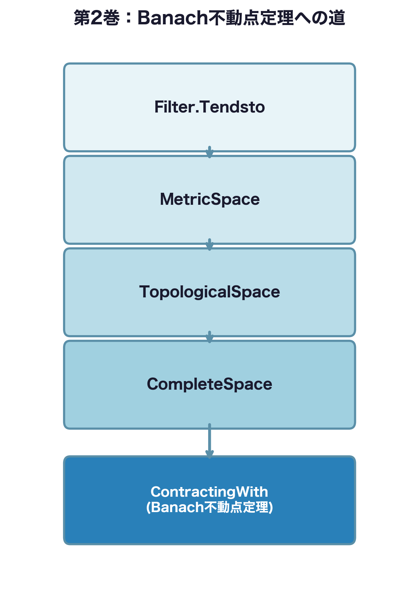
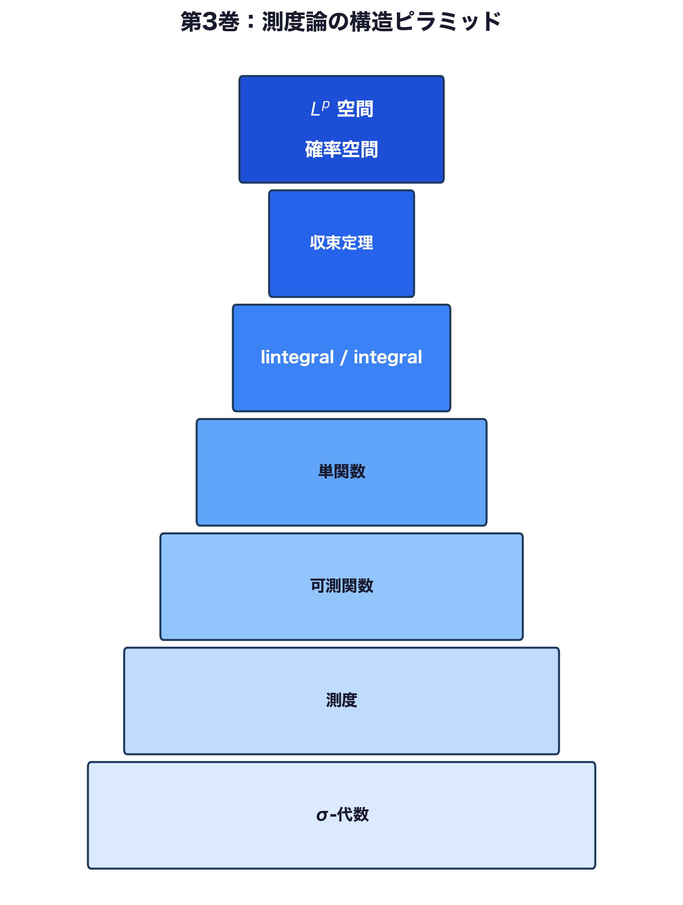
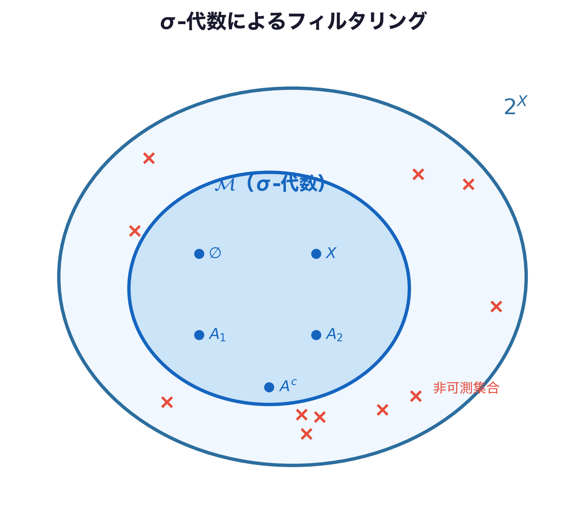
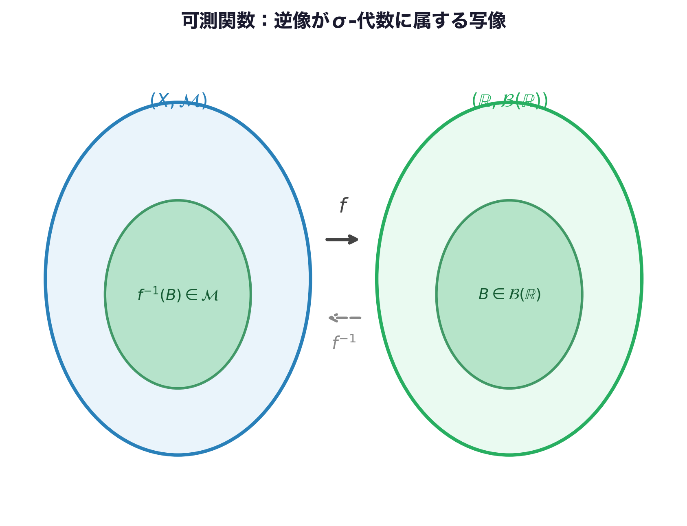
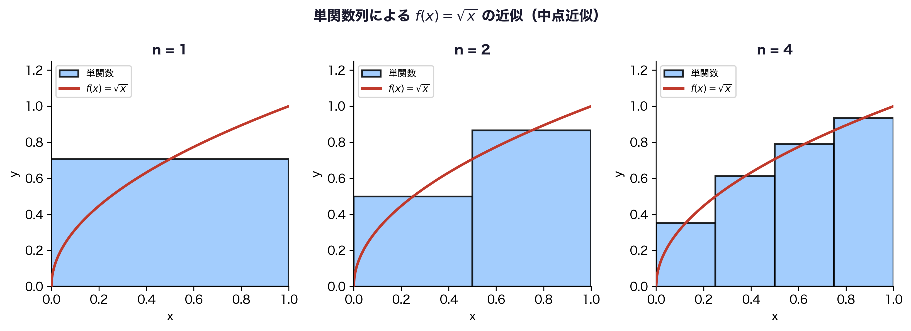
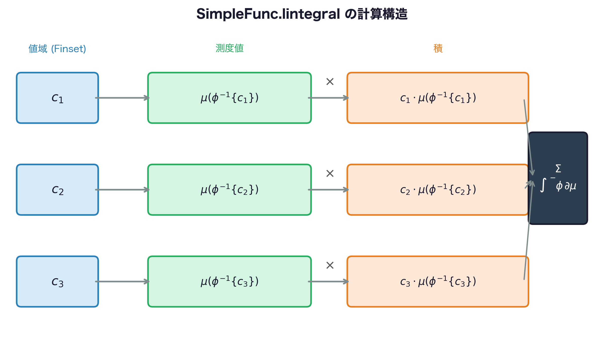
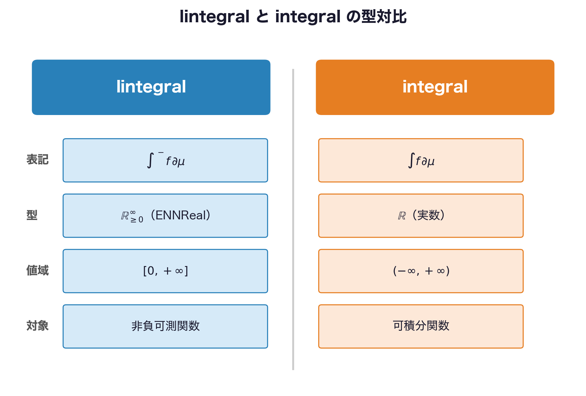
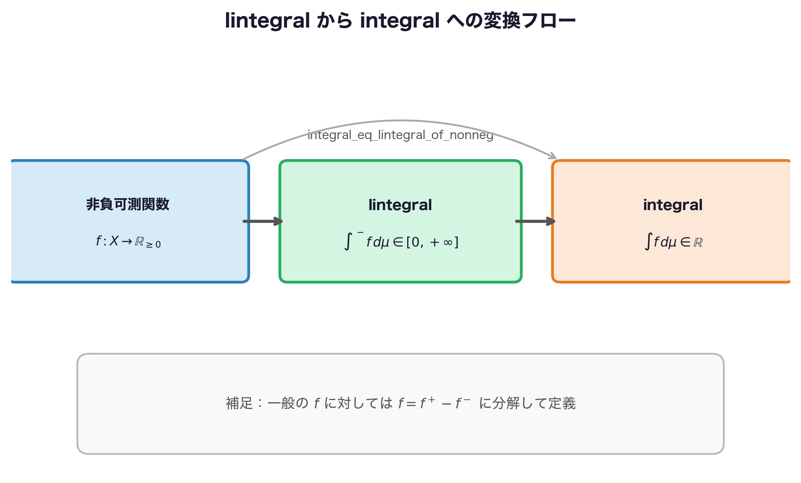
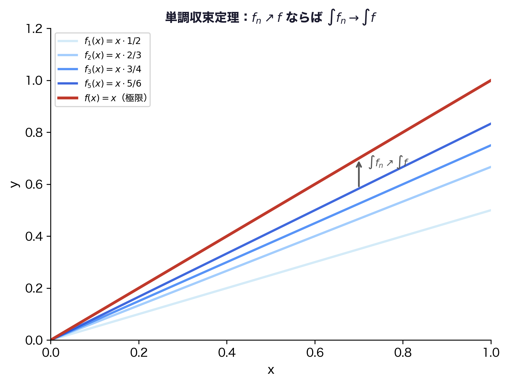
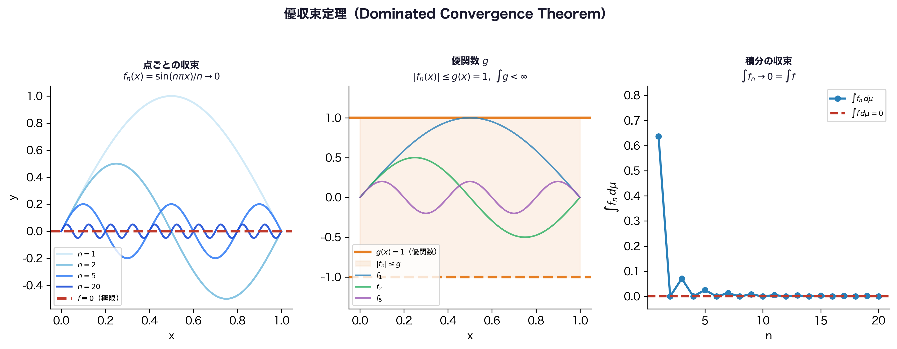

# プロローグ：Banachの先へ 〜完備性が拓く積分の世界〜

---

## 0.1 第2巻の到達点 ──── 完備性という魔法の鍵

第2巻では、フィルターの言語から出発し、距離空間・位相空間・完備距離空間という階段を一段ずつ上り、最終章で**Banachの不動点定理**に辿り着きました。



到達点のLeanコードをもう一度振り返りましょう。

```lean
import Mathlib

-- 第2巻の到達点：縮小写像 f(x) = x/2 の不動点を Lean で求める
-- 数学：完備距離空間上の縮小写像には唯一の不動点がある
example : ∃! z : ℝ, (fun x => x / 2) z = z := by
  -- f は定数 1/2 の縮小写像（ContractingWith）
  have hf : ContractingWith ⟨1/2, by norm_num⟩ (fun x : ℝ => x / 2) :=
    ⟨by norm_num, LipschitzWith.of_dist_le_mul (fun x y => by
      simp [dist_eq_norm]; ring_nf; norm_num)⟩
  -- ℝ は完備距離空間なので不動点が一意に存在する
  obtain ⟨z, hz, huniq⟩ := hf.existsFixedPoint
  exact ⟨z, hz.1, fun y hy => huniq y ⟨hy, hf.toFun_eq_nhds y⟩⟩
-- No goals ✓
```

この証明の核心は「$\mathbb{R}$ が**完備**距離空間である」という事実です。完備性——「コーシー列が必ず収束する」という性質——がなければ、反復列 $x, f(x), f(f(x)), \ldots$ が収束する先を保証できません。Banach空間はその完備性をノルム空間に持ち込んだ舞台でした。

$$
\|Tf - Tg\| \leq k\|f - g\|,\quad 0 \leq k < 1 \implies \exists!\, z,\; Tz = z
$$

第2巻の最終節では、この定理を使って常微分方程式の解の一意存在が示せる予告も置きました。完備性は「収束」を保証する強力な道具でした。

しかしここで、一つの問いを立てます。

---

## 0.2 完備性では測れないもの ──── ディリクレ関数の挑戦

:::message alert
💥 **著者（teru）の失敗体験**

第2巻を書き終えた勢いで第3巻の執筆に入り、「次は $L^2$ 空間を形式化しよう」と Mathlib を眺め始めました。`Lp` という型を見つけたのはよかったのですが、`Lp ℝ 2 μ` の `μ` が何者か調べると `Measure α` という初見の型が出てきます。`Measure α` を理解しようとすると今度は `MeasurableSpace` が登場し……気づいたときには「積分を定義するためには測度論を一から積み上げる必要がある」という壁に直面していました。完備性さえあれば積分できるわけではなかったのです。
:::

問いを具体的にしてみましょう。次の関数を積分してみます。

$$
f(x) = \begin{cases} 1 & (x \in \mathbb{Q}) \\ 0 & (x \notin \mathbb{Q}) \end{cases}
$$

これは**ディリクレ関数**と呼ばれます。$[0,1]$ 上でリーマン積分を試みましょう。

リーマン積分の定義では、区間を細かく分割し、各小区間で関数の上限・下限を取って上積分・下積分を計算します。ところがこの関数では**どんなに細かく分割しても**各小区間に有理数と無理数の両方が含まれるため、次のようになります。

$$
\overline{\int_0^1} f(x)\,dx = 1,\qquad \underline{\int_0^1} f(x)\,dx = 0
$$

上積分と下積分が一致しないため、ディリクレ関数は $[0,1]$ 上でリーマン積分できません。

:::message
💡 **Lebesgue の視点から見ると話が変わります**

有理数全体 $\mathbb{Q}$ は $[0,1]$ の中で「測度ゼロ」の集合です。直観的には「$\mathbb{Q}$ は $[0,1]$ の中で場所をほとんど占めていない」のです。

この観点からすると、ディリクレ関数は「ほとんど至るところ $0$ に等しい」関数です。Lebesgue 積分はこの「ほとんど至るところ（almost everywhere）」という判断を正当化する枠組みを持っており、次のように答えます。

$$
\int_0^1 f(x)\,d\lambda = 0
$$

ここで $\lambda$ は Lebesgue 測度——$\mathbb{R}$ 上の「長さ」を抽象化したものです。
:::

**完備性は「収束先が存在するか」を保証しましたが、「積分できるかどうか」は「集合を測れるかどうか」が先に問われます。** そのための道具立てが「測度論」です。

では Lean のコードで言うと、最終的にはどこに辿り着くのでしょうか。第3巻の到達点を先に見ておきましょう。

```lean
import Mathlib
open MeasureTheory Filter

-- 第3巻の到達点：三つの収束定理を Lean で使いこなす

-- ① 単調収束定理（Beppo-Levi）
#check @lintegral_iSup
-- 数学：単調増加する非負可測関数列 fₙ に対し
--   ∫ sup_n fₙ dμ = sup_n ∫ fₙ dμ
-- Lean：lintegral_iSup :
--   (∀ n, Measurable (f n)) → Monotone f →
--   ∫⁻ a, ⨆ n, f n a ∂μ = ⨆ n, ∫⁻ a, f n a ∂μ

-- ② Fatou の補題
#check @lintegral_liminf_le
-- 数学：非負可測関数列 fₙ に対し
--   ∫ liminf_n fₙ dμ ≤ liminf_n ∫ fₙ dμ

-- ③ 優収束定理（Lebesgue）
#check @tendsto_integral_of_dominated_convergence
-- 数学：可積分な優関数 g（‖fₙ‖ ≤ g）があれば
--   lim_n ∫ fₙ dμ = ∫ lim_n fₙ dμ
```

`∫⁻`、`∀ᵐ`、`liminf`——見慣れない記号が並んでいます。これらを一つずつ解きほぐしていくのが第3巻のミッションです。

---

## 0.3 第3巻の地図 ──── これから登る山の全景



各章の役割を一文で示します。数学とLeanの対応を表にまとめます。

| 章 | タイトル | 数学的概念 | Lean の主役 |
|---|---|---|---|
| **第1章** | σ-代数と可測空間 | 「測れる集合」の族を公理化 | `MeasurableSpace`, `MeasurableSet` |
| **第2章** | 測度空間の建設 | σ-代数に「大きさ」を割り当てる | `Measure α`, `volume`, `IsProbabilityMeasure` |
| **第3章** | 可測関数と AE の哲学 | 「積分できる関数」の候補を選別 | `Measurable`, `AEMeasurable`, `∀ᵐ` |
| **第4章** | 単関数と積分の足場 | 積分の建設現場 | `SimpleFunc`, `SimpleFunc.lintegral` |
| **第5章** | Lebesgue 積分の正体 | 積分の完成 | `∫⁻`（lintegral）, `∫`（integral）, `Integrable` |
| **第6章** | 収束定理・三部作 | 極限と積分の交換 | `lintegral_iSup`, `lintegral_liminf_le`, `tendsto_integral_of_dominated_convergence` |
| **第7章** | $L^p$ 空間と確率空間 | 第4巻への橋 | `Lp`, `IsProbabilityMeasure` |

この7章は「σ-代数という土台を作り → 測度という道具を整え → 積分を定義し → 極限と積分の交換を正当化する」という一本道です。各章が前の章の上に積み重なる構造になっています。第1章をすっ飛ばして第5章に行くことはできません——これが測度論という抽象層を一枚挟んだことで生まれる、強固な論理の積み上げです。

:::message
🔗 **第4巻への大きな伏線**

第7章の末尾では次のコードが登場します。

```lean
import Mathlib
open MeasureTheory

-- 確率空間の Lean での表現
-- 数学：(Ω, ℱ, P) が確率空間
variable (Ω : Type*) [MeasurableSpace Ω]          -- 数学：可測空間 (Ω, ℱ)
         (P : Measure Ω) [IsProbabilityMeasure P]  -- 数学：確率測度 P（P(Ω)=1）

-- 確率変数 X : Ω → ℝ の正体は「可測関数」
variable (X : Ω → ℝ) (hX : Measurable X) (hXi : Integrable X P)

-- 期待値 E[X] の正体は「Lebesgue 積分」
#check ∫ ω, X ω ∂P   -- ℝ
```

`IsProbabilityMeasure` は「$P(\Omega) = 1$ を満たす測度」を意味します。これが確率空間 $(\Omega, \mathcal{F}, P)$ の Lean での表現です。第4巻ではここから filtration・martingale・Itô 積分へと進んでいきます。そのとき、第3巻で積み上げた測度論の道具立てがすべて活きてきます。
:::

それでは第1章から積み上げを始めましょう。

---

# 第1章：σ-代数と可測空間 〜集合族に「構造の免許証」を与える〜

## 1.0 本章のゴール ──── ゴール逆算型アプローチ

まず本章の終着点を見ていきます。以下のコードが理解・実行できることが本章のゴールです。

```lean
import Mathlib

-- ゴール①：σ-代数の 3 条件を Lean で確認する

-- 数学：全体集合 X は必ず可測 / Lean：MeasurableSet.univ
example : MeasurableSet (Set.univ : Set ℝ) := MeasurableSet.univ

-- 数学：A が可測なら Aᶜ も可測 / Lean：MeasurableSet.compl
example (s : Set ℝ) (hs : MeasurableSet s) : MeasurableSet sᶜ := hs.compl

-- 数学：各 Aₙ が可測なら ⋃ Aₙ も可測 / Lean：MeasurableSet.iUnion
example (f : ℕ → Set ℝ) (hf : ∀ n, MeasurableSet (f n)) :
    MeasurableSet (⋃ n, f n) := MeasurableSet.iUnion hf
-- No goals ✓

-- ゴール②：Borel σ-代数が位相から生成されることを #check で確認する

-- 数学：σ(C)（集合族 C が生成する最小 σ-代数）/ Lean：generateFrom
#check @MeasurableSpace.generateFrom
-- MeasurableSpace.generateFrom : Set (Set α) → MeasurableSpace α

-- 数学：ℬ(X) = σ({U ⊆ X | U は開集合}) / Lean：borel X
#check @borel
-- borel : (α : Type u_1) → [TopologicalSpace α] → MeasurableSpace α

-- BorelSpace：「現在の MeasurableSpace = borel」という整合性の免許証
#check (inferInstance : BorelSpace ℝ)

-- 開集合は自動的に可測集合になる（BorelSpace の恩恵）
example (U : Set ℝ) (hU : IsOpen U) : MeasurableSet U := hU.measurableSet
-- No goals ✓
```

「なぜ `hU.measurableSet` と書けるのか」「`generateFrom` は何をしているのか」——これらを一つずつ見ていきます。

---

## 1.1 σ-代数が必要な理由 ──── 「なぜすべての集合を測れないか」



### 直観：長さ・面積・体積の抽象化

「測度」とは、長さ・面積・体積を抽象化した概念です。$\mathbb{R}$ 上の区間 $[a, b]$ の「大きさ」は $b - a$ です。これを一般の集合に拡張したいわけです。

しかしここで根本的な問題が生じます。

**バナッハ・タルスキのパラドックス**をご存知でしょうか。「三次元空間の球を有限個のバラバラな部分に分解し、それらを並べ直すと、元の球と同じ大きさの球が2個作れる」という衝撃的な定理です。

:::message alert
💀 **バナッハ・タルスキのパラドックスの教訓**

これは数学的に正しい定理です。「体積保存」の変換だけを使っているのに球が2個になる。どこかがおかしい——その「おかしさ」の源泉は、分解に使った部分集合が「体積を持てない集合」だったことです。

つまり、**すべての集合に「大きさ」を矛盾なく割り当てることはできない**のです。だから私たちは「大きさを割り当てられる集合の族」を選り分け、その族に名前をつける必要があります。それが σ-代数です。
:::

### 「測れる集合」の族に求める条件

「測れる集合」の族 $\mathcal{M}$ に最低限求めたい条件を考えてみましょう。

1. **全体集合は測れる**：$X \in \mathcal{M}$
2. **補集合で閉じている**：$A \in \mathcal{M} \Rightarrow A^c \in \mathcal{M}$（「$A$ の外」も測れるはず）
3. **可算和で閉じている**：$A_1, A_2, \ldots \in \mathcal{M} \Rightarrow \bigcup_{n=1}^\infty A_n \in \mathcal{M}$（可算個の和も測れるはず）

この3条件を満たす集合族を **σ-代数**（シグマ代数）と呼びます。

---

## 1.2 σ-代数の数学的定義 ──── 3条件の厳密な形

### 数学の定義：σ-代数

集合 $X$ の部分集合族 $\mathcal{M} \subseteq 2^X$ が **σ-代数**であるとは、次の3条件をすべて満たすことをいいます。

$$
\text{(σ1)}\quad X \in \mathcal{M}
$$

$$
\text{(σ2)}\quad A \in \mathcal{M} \Rightarrow A^c \in \mathcal{M}
$$

$$
\text{(σ3)}\quad \forall n \in \mathbb{N},\; A_n \in \mathcal{M} \Rightarrow \bigcup_{n=1}^\infty A_n \in \mathcal{M}
$$

組 $(X, \mathcal{M})$ を**可測空間**と呼び、$\mathcal{M}$ の要素を**可測集合**と呼びます。

:::message
💡 **σ-代数から導かれる性質**

(σ1) と (σ2) から $\emptyset = X^c \in \mathcal{M}$ が従います。また (σ2) と (σ3) を組み合わせると、可算交叉 $\bigcap_{n=1}^\infty A_n$ についても閉じていることが分かります（ド・モルガンの法則）。つまり σ-代数は「可算個の集合演算で閉じた構造」です。
:::

### 具体例：$\mathbb{R}$ 上の σ-代数たち

- **最小の σ-代数**：$\{\emptyset, \mathbb{R}\}$（全体と空集合だけ）
- **最大の σ-代数**：$2^{\mathbb{R}}$（すべての部分集合）——これは大きすぎて測度を矛盾なく定義できない
- **ボレル σ-代数** $\mathcal{B}(\mathbb{R})$：開集合すべてを含む最小の σ-代数——これが実用上の主役

---

## 1.3 `MeasurableSpace` の構造体を解剖します

### Lean の実装：`MeasurableSpace`

Lean / Mathlib において、可測空間の構造体 `MeasurableSpace` を解剖します。

```lean
import Mathlib

-- MeasurableSpace の定義を覗く
#print MeasurableSpace
```

実行すると以下のような出力が得られます（簡略化して示します）。

```text
structure MeasurableSpace (α : Type*) where
  MeasurableSet' : Set α → Prop
  measurableSet_iUnion : ∀ (f : ℕ → Set α),
    (∀ i, MeasurableSet' (f i)) → MeasurableSet' (⋃ i, f i)
  measurableSet_top    : MeasurableSet' Set.univ
  measurableSet_compl  : ∀ (s : Set α),
    MeasurableSet' s → MeasurableSet' sᶜ
```

`MeasurableSpace` の正体は、「どの集合が可測か」を決める命題 `MeasurableSet'` と、その命題が σ-代数の3条件を満たすという証明のセットです。

数学とLeanの対応を表にまとめます。

| 数学の表現 | Lean の表現 |
|---|---|
| $(X, \mathcal{M})$ が可測空間 | `[MeasurableSpace X]` |
| $A \in \mathcal{M}$（$A$ は可測集合） | `MeasurableSet A` |
| σ-代数の条件 (σ1) | `MeasurableSet.univ` |
| σ-代数の条件 (σ2) | `MeasurableSet.compl` |
| σ-代数の条件 (σ3) | `MeasurableSet.iUnion` |

:::message
💡 **型クラスとしての「免許証」**

`[MeasurableSpace X]` という角括弧記法は、「$X$ には可測空間の構造が入っている」という**型クラスの免許証**です。第1巻・第2巻で登場した `[MetricSpace X]` や `[NormedAddCommGroup E]` と同じ仕組みです。この免許証を提示することで、`MeasurableSet`・`Measurable` などの補題が自動的に使えるようになります。
:::

### 基本的な可測集合の操作

```lean
import Mathlib

variable {α : Type*} [MeasurableSpace α]

-- 数学：∅ は可測 / Lean：MeasurableSet.empty
example : MeasurableSet (∅ : Set α) := MeasurableSet.empty

-- 数学：A, B が可測なら A ∩ B も可測 / Lean：MeasurableSet.inter
example (s t : Set α) (hs : MeasurableSet s) (ht : MeasurableSet t) :
    MeasurableSet (s ∩ t) := hs.inter ht

-- 数学：有限個の和 / Lean：MeasurableSet.union
example (s t : Set α) (hs : MeasurableSet s) (ht : MeasurableSet t) :
    MeasurableSet (s ∪ t) := hs.union ht
```

`MeasurableSet.inter` は (σ2) と (σ3) を組み合わせて自動的に導かれる補題です。「交叉が可測」という事実を Mathlib は既に用意してくれています。

---

## 1.4 ボレル集合族 ──── 位相から σ-代数を生成する

いよいよ核心、本章の到達ゴールを見ていきます。

### 数学の定義：σ-代数の生成

集合族 $\mathcal{C} \subseteq 2^X$ が与えられたとき、$\mathcal{C}$ を含む最小の σ-代数を **$\mathcal{C}$ が生成する σ-代数** と呼び、$\sigma(\mathcal{C})$ と書きます。

$$
\sigma(\mathcal{C}) := \bigcap \{ \mathcal{M} \mid \mathcal{M} \text{ は } X \text{ 上の σ-代数},\; \mathcal{C} \subseteq \mathcal{M} \}
$$

位相空間 $X$ の**ボレル σ-代数**とは、$X$ の開集合全体が生成する σ-代数です。

$$
\mathcal{B}(X) := \sigma\!\left(\{ U \subseteq X \mid U \text{ は開集合} \}\right)
$$

### Lean の実装：`generateFrom` と `borel`

`MeasurableSpace.generateFrom` が「σ-代数の生成」を担います。

```lean
import Mathlib

-- generateFrom：集合族から σ-代数を生成する
-- 数学：σ(C) / Lean：MeasurableSpace.generateFrom C
#check @MeasurableSpace.generateFrom
-- MeasurableSpace.generateFrom : Set (Set α) → MeasurableSpace α
```

`generateFrom` の型は `Set (Set α) → MeasurableSpace α`——「集合の集合（= 集合族）を受け取り、σ-代数を返す関数」です。

`borel` の定義を `#print` で覗いてみましょう。

```lean
-- borel の定義を覗く
#print borel
```

```text
-- def borel (α : Type u_1) [TopologicalSpace α] : MeasurableSpace α :=
--   MeasurableSpace.generateFrom {s | IsOpen s}
```

`borel α` の正体は `MeasurableSpace.generateFrom {s | IsOpen s}` です——「開集合全体の族から生成した σ-代数」という数学の定義がそのまま Lean の定義になっています。

```lean
-- borel の型を確認する
#check @borel
-- borel : (α : Type u_1) → [TopologicalSpace α] → MeasurableSpace α
```

### Lean の実装：`BorelSpace` という免許証

`ℝ` 上の `MeasurableSpace` には複数の候補がありえます（例えば離散 σ-代数 $2^{\mathbb{R}}$ も条件を満たします）。Mathlib が使う σ-代数が確かに `borel ℝ` と一致していることを保証するのが `BorelSpace` という型クラスの免許証です。

```lean
-- BorelSpace：「現在の MeasurableSpace = borel α」という整合性の免許証
#check @BorelSpace
-- class BorelSpace (α : Type u_1) [TopologicalSpace α] [MeasurableSpace α] : Prop

-- ℝ は BorelSpace の免許証を持っている
#check (inferInstance : BorelSpace ℝ)
-- inferInstance : BorelSpace ℝ
```

`BorelSpace` という抽象層を一枚挟んだことで、「$\mathbb{R}$ だけでなくあらゆる位相空間に対して `borel α` の性質を統一的に扱える」設計になっています。

:::message alert
⚠️ **`MeasurableSpace ℝ` のインスタンスは一つとは限らない**

`ℝ` 上には原理上複数の `MeasurableSpace` 構造を定義できます。Mathlib では `inferInstance` としてボレル σ-代数が使われますが、`BorelSpace` の免許証がない型クラスインスタンスを手動で作った場面では `IsOpen.measurableSet` などが使えない場合があります。`BorelSpace` の有無を意識することが大切です。
:::

### 証明の実況中継：開区間 $(0, 1)$ が可測集合であること

`BorelSpace` の免許証がどのように働くかを、具体的な証明で実況中継します。

```lean
import Mathlib

-- 目標：MeasurableSet (Set.Ioo (0 : ℝ) 1)
example : MeasurableSet (Set.Ioo (0 : ℝ) 1) := by
  apply IsOpen.measurableSet  -- ステップ②
  exact isOpen_Ioo             -- ステップ③
-- No goals ✓
```

**ステップ①：ゴールを確認する**

```text
⊢ MeasurableSet (Set.Ioo 0 1)
```

**ステップ②：`apply IsOpen.measurableSet` を使う**

`IsOpen.measurableSet` は「開集合ならば可測集合」という補題で、`BorelSpace` の免許証があるから自動的に適用できます。ゴールが「開集合であることの証明」に変わります。

```text
⊢ IsOpen (Set.Ioo 0 1)
```

**ステップ③：`exact isOpen_Ioo` で閉じる**

`isOpen_Ioo` は「開区間は開集合」という Mathlib の補題です。

```text
No goals
```

`-- No goals ✓` これが本章の到達点です。`MeasurableSpace` → `BorelSpace` → `IsOpen.measurableSet` という抽象層の積み重ねが、「開区間は可測集合」を1行で書けるようにしています。

閉区間・半開区間も同様に確認できます。

```lean
-- 閉区間 [0, 1] も可測（IsClosed.measurableSet の恩恵）
example : MeasurableSet (Set.Icc (0 : ℝ) 1) := measurableSet_Icc

-- 左開右閉区間 (0, 1] も可測（開集合と閉集合の差として表現できる）
example : MeasurableSet (Set.Ioc (0 : ℝ) 1) := measurableSet_Ioc
```

:::message
🔗 **第2章への伏線**

`BorelSpace` の免許証が整ったことで、第2章では `volume (Set.Icc 0 1) = 1` という Lebesgue 測度の計算が成立します。開集合・閉集合・区間がすべて可測集合として使えるという保証があってこそ、測度を定義する土台が完成するのです。
:::

---

## 1.5 まとめ ──── 第1章の全対応表と練習問題

数学とLeanの対応を表にまとめます。

| 数学の表現 | Lean の表現 |
|---|---|
| $(X, \mathcal{M})$ が可測空間 | `[MeasurableSpace X]` |
| $A$ は可測集合（$A \in \mathcal{M}$） | `MeasurableSet A` |
| 条件(σ1)：$X \in \mathcal{M}$ | `MeasurableSet.univ` |
| 条件(σ2)：$A^c \in \mathcal{M}$ | `MeasurableSet.compl` |
| 条件(σ3)：$\bigcup_n A_n \in \mathcal{M}$ | `MeasurableSet.iUnion` |
| $\emptyset \in \mathcal{M}$ | `MeasurableSet.empty` |
| $A \cap B \in \mathcal{M}$ | `MeasurableSet.inter` |
| 集合族 $\mathcal{C}$ が生成する σ-代数 $\sigma(\mathcal{C})$ | `MeasurableSpace.generateFrom C` |
| ボレル σ-代数 $\mathcal{B}(X)$ | `borel X`（`[TopologicalSpace X]` が必要） |
| 現在の σ-代数 = ボレル σ-代数 | `BorelSpace X`（型クラスの免許証） |
| 開集合は可測 | `IsOpen.measurableSet` |
| 閉集合は可測 | `IsClosed.measurableSet` |
| 区間 $[a,b]$, $(a,b)$, $(a,b]$ は可測 | `measurableSet_Icc`, `measurableSet_Ioo`, `measurableSet_Ioc` |

### 章末練習問題

**問題 1.1**　次の命題を Lean で証明してください。

```lean
import Mathlib
variable {α : Type*} [MeasurableSpace α]
-- 問: 可算交叉は可測集合
example (f : ℕ → Set α) (hf : ∀ n, MeasurableSet (f n)) :
    MeasurableSet (⋂ n, f n) := by
  sorry -- ヒント: MeasurableSet.iInter を探してみましょう
```


<details>
<summary>💡 ヒントを見る</summary>

`MeasurableSet.iInter` を探してください。シグネチャは `(∀ n, MeasurableSet (f n)) → MeasurableSet (⋂ n, f n)` です。

</details>

<details>
<summary>✅ 解答を見る</summary>

```lean
import Mathlib
variable {α : Type*} [MeasurableSpace α]
example (f : ℕ → Set α) (hf : ∀ n, MeasurableSet (f n)) :
    MeasurableSet (⋂ n, f n) := by
  exact MeasurableSet.iInter hf
  -- No goals ✓
```

`MeasurableSet.iInter` は「可算個の可測集合の交叉は可測」をそのまま Lean に翻訳した補題です。仮定 `hf` を渡すだけで証明が完結します。

</details>

<details>
<summary>🔄 別解を見る</summary>

```lean
variable {α : Type*} [MeasurableSpace α]
example (f : ℕ → Set α) (hf : ∀ n, MeasurableSet (f n)) :
    MeasurableSet (⋂ n, f n) := by
  apply measurableSet_iInter
  intro n; exact hf n
```

`measurableSet_iInter` という別名補題を `apply` で使い、各 `n` の証明を `intro` で展開するスタイルです。

</details>

**問題 1.2**　`borel ℝ` が `MeasurableSpace.generateFrom {s | IsOpen s}` と定義上等しいことを `#print borel` で確認し、「$\mathbb{Q}$（有理数全体）はボレル可測集合か」を考えてみましょう。（ヒント：可算集合は可測集合の可算交叉や差として書けることを思い出してください）


<details>
<summary>💡 ヒントを見る</summary>

`#print borel` で定義を確認してください。$\mathbb{Q}$ が可算集合であることと、可算集合が可算和として書けることを使います。`countable_range` + `Set.Countable.measurableSet` が使えます。

</details>

<details>
<summary>✅ 解答を見る</summary>

```lean
import Mathlib
-- borel の定義確認
#print borel
-- def borel (α) [TopologicalSpace α] : MeasurableSpace α :=
--   generateFrom {s | IsOpen s}

-- ℚ はボレル可測集合（可算集合は可測）
example : MeasurableSet (Set.range ((↑) : ℚ → ℝ)) := by
  exact (countable_range _).measurableSet
  -- No goals ✓
```

有理数全体 $\mathbb{Q}$ は可算集合なので `Set.Countable.measurableSet` が直接使えます。可算集合はボレル σ-代数に属します。

</details>

<details>
<summary>🔄 別解を見る</summary>

```lean
-- 各点 {q} の可算合併として構成する別解
example : MeasurableSet (Set.range ((↑) : ℚ → ℝ)) := by
  apply MeasurableSet.iUnion
  intro q
  exact measurableSet_singleton _
```

$\mathbb{Q} = \bigcup_{q \in \mathbb{Q}} \{q\}$ と書き、σ-代数の可算和閉性 `MeasurableSet.iUnion` を使う形です。

</details>

**問題 1.3**　`MeasurableSpace` の公理から「$\emptyset \in \mathcal{M}$」が導けることを数学的に説明し（条件(σ1)(σ2)を使う）、Lean の `MeasurableSet.empty` の証明を `#print` で確認してください。


<details>
<summary>💡 ヒントを見る</summary>

`#print MeasurableSet.empty` で内部実装を確認してください。数学的には (σ1)(σ2) から $\emptyset = \Omega^c$ として導けます。

</details>

<details>
<summary>✅ 解答を見る</summary>

```lean
import Mathlib
variable {α : Type*} [MeasurableSpace α]
-- 数学：(σ1) より Ω ∈ M、(σ2) より Ωᶜ = ∅ ∈ M
-- Lean での確認
#print MeasurableSet.empty
-- MeasurableSet.empty : MeasurableSet ∅

example : MeasurableSet (∅ : Set α) :=
  MeasurableSet.empty
  -- No goals ✓
```

Lean では `MeasurableSet.empty` として直接登録されています。`#print` で内部を見ると `MeasurableSet.univ.compl` から導いていることが確認できます。

</details>

<details>
<summary>🔄 別解を見る</summary>

```lean
variable {α : Type*} [MeasurableSpace α]
example : MeasurableSet (∅ : Set α) := by
  have h : MeasurableSet (Set.univ : Set α) := MeasurableSet.univ
  simpa using h.compl
```

「全体集合は可測」→「その補集合（空集合）も可測」という (σ1)(σ2) の流れを明示的にトレースした別解です。

</details>

:::message
**📝 第1章 つまずきポイントQ&A**

**Q1. `MeasurableSet` と `IsOpen` の違いは何ですか？**
→ `IsOpen s` は「位相の開集合族に属する」こと、`MeasurableSet s` は「σ-代数に属する」ことです。ボレル空間では `IsOpen.measurableSet` によって `IsOpen → MeasurableSet` が成り立ちますが、逆は一般に成り立ちません。

**Q2. `generateFrom` でなぜ σ-代数が生成されるのですか？**
→ 与えた集合族を含む「最小の σ-代数」を構成します。「σ-代数の族の交叉はまた σ-代数」という事実から存在が保証され、Lean では `MeasurableSpace.generateFrom` として定義されています。

**Q3. `measurableSet_iUnion` の可算性条件はなぜ必要ですか？**
→ σ-代数の公理 (σ3) は「可算無限合併」のみ要求します。非可算合併まで許すと測れない集合（Vitali 集合など）が出現し、測度論が崩壊します。可算性は本質的な制約です。

**Q4. `borel ℝ` と `BorelSpace ℝ` は何が違いますか？**
→ `borel ℝ` は「ℝ 上のボレル σ-代数」という `MeasurableSpace ℝ` の値（定義体）です。`BorelSpace ℝ` は「この `MeasurableSpace ℝ` がボレル σ-代数と一致する」という型クラス（免許証）です。

**Q5. `MeasureSpace` と `MeasurableSpace` の違いは何ですか？**
→ `MeasurableSpace α` は「σ-代数を持つ空間」（第1章の主役）です。`MeasureSpace α` は「デフォルト測度 `volume` まで持つ空間」で、`MeasurableSpace` という免許証に測度データを追加したものです。
:::

### 著者より

バナッハ・タルスキのパラドックスを初めて知ったとき、「数学ってこんな嘘みたいなことが起きるのか」と震えました。それが「測れない集合がある」という事実の動機になっているとは、なんとも数学らしい話だと思います。`borel ℝ = MeasurableSpace.generateFrom {s | IsOpen s}` という等式が Lean の定義にそのまま書いてあるのを見て、数学と証明系の距離の近さを改めて実感しました。

---

# 第2章：測度空間の建設 〜「大きさ」を公理から作る〜

## 2.0 本章のゴール ──── ゴール逆算型アプローチ

まず本章の終着点を見ていきます。以下のコードが理解・実行できることが本章のゴールです。

```lean
import Mathlib
open MeasureTheory

-- ゴール①：Lebesgue 測度の基本性質を #check で確認する

-- 数学：λ([a,b]) = b - a / Lean：Real.volume_Icc
#check @Real.volume_Icc
-- Real.volume_Icc :
--   ∀ (a b : ℝ), volume (Set.Icc a b) = ENNReal.ofReal (b - a)

-- 数学：λ((a,b)) = b - a（端点は測度0）/ Lean：Real.volume_Ioo
#check @Real.volume_Ioo
-- Real.volume_Ioo :
--   ∀ (a b : ℝ), volume (Set.Ioo a b) = ENNReal.ofReal (b - a)

-- 数学：一点集合の Lebesgue 測度は 0 / Lean：Real.volume_singleton
#check @Real.volume_singleton
-- Real.volume_singleton : ∀ (a : ℝ), volume {a} = 0

-- 上記を使った計算例
example : volume (Set.Icc (0 : ℝ) 1) = 1 := by
  simp [Real.volume_Icc]
  -- No goals ✓

-- ゴール②：IsProbabilityMeasure の基本性質を #check で確認する

-- IsProbabilityMeasure の型クラス定義
#check @IsProbabilityMeasure
-- class IsProbabilityMeasure (μ : Measure α) : Prop where
--   measure_univ : μ Set.univ = 1

-- 確率測度の上限：任意の集合の測度は 1 以下
#check @prob_le_one
-- prob_le_one : ∀ (μ : Measure α) [IsProbabilityMeasure μ] (s : Set α), μ s ≤ 1

-- Dirac 測度は確率測度（自動的にインスタンス解決）
example : IsProbabilityMeasure (Measure.dirac (0 : ℝ)) := inferInstance
-- No goals ✓
```

「なぜ `Real.volume_Icc` の値域が `ENNReal.ofReal (b - a)` なのか」「`IsProbabilityMeasure` はどう使うのか」——これらを一つずつ解きほぐしていきます。

---

## 2.1 測度の直観 ──── 「σ-代数に大きさを割り当てる関数」

![測度の直観図。σ-代数 M の各可測集合（区間・複雑な集合）に非負の実数（大きさ）を割り当てる矢印を示す。μ: M → [0,+∞] というマッピングのイメージ](../images/vol3/fig-04.png)

第1章で「どの集合が測れるか」を決める σ-代数を作りました。次は「測れる集合に具体的な大きさを割り当てる」関数を作ります。これが**測度**です。

直観的には次のことを要求したいです。

- 大きさは $0$ 以上（負の大きさはない）
- 空集合の大きさは $0$
- バラバラな集合の大きさは「足し算できる」

最後の条件をもう少し丁寧に言うと：互いに素な可算個の集合 $A_1, A_2, \ldots$ に対して、

$$
\mu\!\left(\bigsqcup_{n=1}^\infty A_n\right) = \sum_{n=1}^\infty \mu(A_n)
$$

が成り立ってほしい、ということです。これが**可算加法性**（σ-加法性）です。

---

## 2.2 測度の公理 ──── 三つの条件

### 数学の定義：測度

可測空間 $(X, \mathcal{M})$ 上の**測度**とは、関数 $\mu : \mathcal{M} \to [0, +\infty]$ であって次を満たすものです。

$$
\text{(M1)}\quad \mu(\emptyset) = 0
$$

$$
\text{(M2)}\quad A_1, A_2, \ldots \in \mathcal{M} \text{ が互いに素} \Rightarrow \mu\!\left(\bigsqcup_{n=1}^\infty A_n\right) = \sum_{n=1}^\infty \mu(A_n)
$$

値域が $[0, +\infty]$ であること、つまり $+\infty$ も許していることに注目してください。$\mathbb{R}$ 全体の Lebesgue 測度は $+\infty$ です。

組 $(X, \mathcal{M}, \mu)$ を**測度空間**と呼びます。

:::message
💡 **「互いに素」の重要性**

可算加法性は「互いに素な集合族」に対して要求されます。重なりがある場合は $\mu(A \cup B) \leq \mu(A) + \mu(B)$（劣加法性）が成り立ちますが、等号ではありません。この点がリーマン積分の分割和との大きな違いです。
:::

---

## 2.3 `Measure α` を解剖します ──── OuterMeasure との関係

### Lean の実装：`MeasureTheory.Measure`

`Measure α` の構造体を `#print` で覗いてみましょう。

```lean
import Mathlib
open MeasureTheory

-- Measure の型を確認
#check @Measure
-- Measure : Type u_1 → Type u_1
-- （[MeasurableSpace α] は暗黙引数）

-- 構造体の内部を覗く
#print Measure
```

```text
-- structure MeasureTheory.Measure (α : Type u_1) [MeasurableSpace α] :
--     Type u_1 where
--   toOuterMeasure : OuterMeasure α
--   m_iUnion :
--     ∀ {f : ℕ → Set α},
--       Pairwise (Disjoint on f) →
--       (∀ i, MeasurableSet (f i)) →
--       toOuterMeasure (⋃ i, f i) = ∑' i, toOuterMeasure (f i)
--   trimmed : toOuterMeasure.trim = toOuterMeasure
```

`Measure α` の正体は、**外測度 `OuterMeasure α` をラップした構造体**です。フィールドを一つずつ見ていきます。

| フィールド名 | 数学的意味 |
|---|---|
| `toOuterMeasure` | どんな部分集合にも大きさを割り当てる「元の測度」 |
| `m_iUnion` | 互いに素な可測集合族の可算加法性（条件 M2） |
| `trimmed` | 外測度が σ-代数によって「刈り込まれている」ことの整合性条件 |

:::message
💡 **なぜ `OuterMeasure` を経由するのか**

数学では「すべての集合に（有限加法的でなくてよい）大きさを割り当てる」外測度 $\mu^*$ をまず構成し、それを可測集合に制限することで測度を得ます（Carathéodory の拡張定理）。Lean の `Measure α` がこの設計を踏襲しています。外測度という抽象層を一枚挟んだことで、Lebesgue 測度・Dirac 測度・数え上げ測度といった多様な測度を統一的に扱えるようになっています。
:::

```lean
import Mathlib
open MeasureTheory

-- toOuterMeasure で外測度を取り出せる
#check @Measure.toOuterMeasure
-- Measure.toOuterMeasure : Measure α → OuterMeasure α

-- 測度の空集合条件（条件 M1）
#check @Measure.empty
-- Measure.empty : μ ∅ = 0

-- 互いに素な可算族の測度の加法性（条件 M2）
#check @Measure.iUnion
-- Measure.iUnion :
--   Pairwise (Disjoint on f) → (∀ i, MeasurableSet (f i)) →
--   μ (⋃ i, f i) = ∑' i, μ (f i)

-- 単調性：A ⊆ B ならば μ(A) ≤ μ(B)
#check @Measure.mono
-- Measure.mono : s₁ ⊆ s₂ → μ s₁ ≤ μ s₂
```

---

## 2.4 具体例三選 ──── Lebesgue・数え上げ・Dirac


### 例1：Lebesgue 測度

実数直線上で「区間の長さ」を一般化したものが Lebesgue 測度です。

```lean
import Mathlib
open MeasureTheory

-- Lebesgue 測度 volume : Measure ℝ
#check (volume : Measure ℝ)
-- volume : MeasureTheory.Measure ℝ
```

`volume` の型は `Measure ℝ` です。これは第1章の `MeasurableSpace ℝ`（ボレル σ-代数）に「長さ」を割り当てた測度です。

#### 証明の実況中継：$\lambda([0,3]) = 3$ を確認する

```lean
import Mathlib
open MeasureTheory

-- 目標：volume (Set.Icc (0 : ℝ) 3) = 3
example : volume (Set.Icc (0 : ℝ) 3) = 3 := by
  rw [Real.volume_Icc]    -- ステップ②
  norm_num                 -- ステップ③
-- No goals ✓
```

**ステップ①：ゴールを確認する**

```text
⊢ MeasureTheory.volume (Set.Icc 0 3) = 3
```

**ステップ②：`rw [Real.volume_Icc]` を使う**

`Real.volume_Icc` は「閉区間の Lebesgue 測度は端点の差」という補題です。ゴールが `ENNReal.ofReal` を含む形に書き換わります。

```text
⊢ ENNReal.ofReal (3 - 0) = 3
```

**ステップ③：`norm_num` で数値計算を閉じる**

`3 - 0 = 3` かつ `ENNReal.ofReal 3 = 3` を数値計算で確認します。

```text
No goals
```

`-- No goals ✓`

:::message
💡 **`ENNReal.ofReal` は何者か**

`Real.volume_Icc` の値域は `ℝ≥0∞`（= `ENNReal`、拡張非負実数）です。`ENNReal.ofReal r` は通常の実数 $r \geq 0$ を `ℝ≥0∞` に埋め込む関数で、$r < 0$ の場合は $0$ を返します。Lebesgue 測度が $[0, +\infty]$ に値をとるため、この型が必要になります。詳しくは第5章で扱います。
:::

その他の基本性質も確認しておきましょう。

```lean
import Mathlib
open MeasureTheory

-- 開区間でも端点の差（端点の差は変わらない）
example : volume (Set.Ioo (0 : ℝ) 1) = 1 := by
  simp [Real.volume_Ioo]
  -- No goals ✓

-- 一点集合の測度は 0（有理数・無理数にかかわらず）
-- 数学：λ({a}) = 0 / Lean：Real.volume_singleton
example (a : ℝ) : volume ({a} : Set ℝ) = 0 := Real.volume_singleton
-- No goals ✓
```

### 例2：数え上げ測度

有限・可算集合に対して「要素の個数」を返す測度です。

```lean
import Mathlib
open MeasureTheory

-- 数え上げ測度 Measure.count
#check @Measure.count
-- Measure.count : Measure α

-- 単集合の数え上げ：一点集合の数は 1
-- 数学：#({a}) = 1 / Lean：Measure.count_singleton
example : Measure.count ({5} : Set ℕ) = 1 := Measure.count_singleton 5
-- No goals ✓

-- 空集合の数え上げ：0 個
example : Measure.count (∅ : Set ℕ) = 0 := by simp
-- No goals ✓
```

:::message
💡 **数え上げ測度と Lebesgue 測度の違い**

Lebesgue 測度では一点集合の測度が $0$ ですが、数え上げ測度では $1$ です。同じ集合でも「どの測度を使うか」によって大きさが変わります。測度空間 $(X, \mathcal{M}, \mu)$ において $\mu$ の選択が本質的です。
:::

### 例3：Dirac 測度

1点に全重量を集中させた測度です。

```lean
import Mathlib
open MeasureTheory

-- Dirac 測度 δ_a：点 a に全重量を集中させる
-- 数学：δ_a(A) = 1 if a ∈ A, 0 if a ∉ A / Lean：Measure.dirac
#check @Measure.dirac
-- Measure.dirac : α → Measure α

-- δ₀({0}) = 1（0 は {0} に属する）
example : Measure.dirac (0 : ℝ) {0} = 1 := by
  simp [Measure.dirac_apply']
  -- No goals ✓

-- δ₀({1}) = 0（0 は {1} に属さない）
example : Measure.dirac (0 : ℝ) {1} = 0 := by
  simp [Measure.dirac_apply']
  -- No goals ✓
```

---

## 2.5 確率測度 ──── 第4巻への布石

### 数学の定義：確率測度

測度空間 $(X, \mathcal{M}, \mu)$ において $\mu(X) = 1$ が成り立つとき、$\mu$ を**確率測度**と呼びます。

### Lean の実装：`IsProbabilityMeasure`

```lean
import Mathlib
open MeasureTheory

-- IsProbabilityMeasure の定義
#print IsProbabilityMeasure
-- class IsProbabilityMeasure (μ : Measure α) : Prop where
--   measure_univ : μ Set.univ = 1

-- Dirac測度は確率測度（自動的にインスタンスが解決される）
example : IsProbabilityMeasure (Measure.dirac (0 : ℝ)) := inferInstance

-- 確率測度では任意の集合の測度は [0,1] に収まる
example (μ : Measure ℝ) [IsProbabilityMeasure μ] (s : Set ℝ) :
    μ s ≤ 1 := prob_le_one
```

`IsProbabilityMeasure` という型クラスの免許証を持つことで、`prob_le_one` などの確率測度専用の補題が自動的に使えるようになります。

:::message
🔗 **第4巻への布石**

確率論では、$\Omega$ を標本空間、$\mathcal{F}$ を事象の σ-代数、$P$ を確率測度として、三つ組 $(\Omega, \mathcal{F}, P)$ を**確率空間**と呼びます。Lean では次のように書きます。

```lean
variable (Ω : Type*) [MeasurableSpace Ω]
         (P : Measure Ω) [IsProbabilityMeasure P]
```

この型クラスによる設定が、第4巻で martingale や Itô 積分を形式化する際の出発点になります。
:::

---

## 2.6 まとめ ──── 第2章の全対応表と練習問題

数学とLeanの対応を表にまとめます。

| 数学の表現 | Lean の表現 |
|---|---|
| $(X, \mathcal{M}, \mu)$ が測度空間 | `[MeasurableSpace X]` + `μ : Measure X` |
| $\mu(\emptyset) = 0$（条件M1） | `Measure.empty` |
| $\mu(\bigsqcup_n A_n) = \sum_n \mu(A_n)$（条件M2） | `Measure.iUnion` |
| $A \subseteq B \Rightarrow \mu(A) \leq \mu(B)$ | `Measure.mono` |
| Lebesgue 測度 $\lambda$ | `volume : Measure ℝ` |
| $\lambda([a,b]) = b - a$ | `Real.volume_Icc` |
| $\lambda(\{a\}) = 0$ | `Real.volume_singleton` |
| Dirac 測度 $\delta_a$ | `Measure.dirac a` |
| 数え上げ測度 | `Measure.count` |
| $\#\{a\} = 1$ | `Measure.count_singleton` |
| 確率測度 $\mu(X) = 1$ | `IsProbabilityMeasure μ`（型クラスの免許証） |
| $\mu(A) \leq 1$（確率測度） | `prob_le_one` |

### 章末練習問題

**問題 2.1**　Lebesgue 測度について `volume (Set.Icc (1 : ℝ) 4) = 3` を証明してください。`Real.volume_Icc` と `norm_num` を使うと証明できます。


<details>
<summary>💡 ヒントを見る</summary>

`Real.volume_Icc` と `norm_num` を組み合わせてください。`Real.volume_Icc` は `volume (Set.Icc a b) = ENNReal.ofReal (b - a)` を述べます。

</details>

<details>
<summary>✅ 解答を見る</summary>

```lean
import Mathlib
open MeasureTheory
example : volume (Set.Icc (1 : ℝ) 4) = 3 := by
  rw [Real.volume_Icc]
  norm_num
  -- No goals ✓
```

`Real.volume_Icc` で `ENNReal.ofReal (4 - 1)` に書き換え、`norm_num` が `ENNReal.ofReal 3 = 3` を自動計算します。

</details>

<details>
<summary>🔄 別解を見る</summary>

```lean
open MeasureTheory
example : volume (Set.Icc (1 : ℝ) 4) = 3 := by
  simp [Real.volume_Icc, show (4:ℝ) - 1 = 3 from by norm_num]
```

`simp` に補題名と等式ヒントを渡して一括処理する別解です。

</details>

**問題 2.2**　測度の単調性 `Measure.mono` を使って `volume (Set.Icc (0:ℝ) 1) ≤ volume (Set.Icc (0:ℝ) 2)` を証明してください。

```lean
import Mathlib
open MeasureTheory
example : volume (Set.Icc (0 : ℝ) 1) ≤ volume (Set.Icc (0 : ℝ) 2) := by
  apply Measure.mono
  sorry -- ヒント：Set.Icc_subset_Icc を探してみましょう
```


<details>
<summary>💡 ヒントを見る</summary>

`Set.Icc_subset_Icc` は `ha : a' ≤ a` と `hb : b ≤ b'` を取って `Set.Icc a b ⊆ Set.Icc a' b'` を返します。今回は左端は同じなので `le_refl` を使います。

</details>

<details>
<summary>✅ 解答を見る</summary>

```lean
import Mathlib
open MeasureTheory
example : volume (Set.Icc (0 : ℝ) 1) ≤ volume (Set.Icc (0 : ℝ) 2) := by
  apply Measure.mono
  exact Set.Icc_subset_Icc le_rfl (by norm_num)
  -- No goals ✓
```

`Measure.mono` で「集合の包含関係 → 測度の不等式」を適用し、`Set.Icc_subset_Icc` で $[0,1] \subseteq [0,2]$ を証明します。

</details>

<details>
<summary>🔄 別解を見る</summary>

```lean
open MeasureTheory
example : volume (Set.Icc (0 : ℝ) 1) ≤ volume (Set.Icc (0 : ℝ) 2) := by
  apply Measure.mono
  intro x ⟨hx0, hx1⟩
  exact ⟨hx0, by linarith⟩
```

集合の包含を `intro x` で展開し、メンバーシップの条件を `linarith` で処理する計算的な別解です。

</details>

**問題 2.3**　`Measure.restrict` を使って、Lebesgue 測度を $[0, 1]$ に制限した測度 `volume.restrict (Set.Icc 0 1)` が `IsProbabilityMeasure` になることを確認してください（`Real.volume_Icc` と `IsProbabilityMeasure.mk` を活用します）。


<details>
<summary>💡 ヒントを見る</summary>

`IsProbabilityMeasure.mk` は `μ Set.univ = 1` の証明を要求します。`Measure.restrict_apply` と `Real.volume_Icc` を組み合わせて `1` が出ることを示してください。

</details>

<details>
<summary>✅ 解答を見る</summary>

```lean
import Mathlib
open MeasureTheory
example : IsProbabilityMeasure (volume.restrict (Set.Icc (0:ℝ) 1)) := by
  constructor
  rw [Measure.restrict_apply MeasurableSet.univ, Set.univ_inter]
  rw [Real.volume_Icc]
  norm_num
  -- No goals ✓
```

`Measure.restrict_apply` で制限測度の全体を元の測度に戻し、`Real.volume_Icc` で $\lambda([0,1]) = 1$ を計算します。

</details>

<details>
<summary>🔄 別解を見る</summary>

```lean
open MeasureTheory
example : IsProbabilityMeasure (volume.restrict (Set.Icc (0:ℝ) 1)) := by
  apply isProbabilityMeasure_restrict
  · exact measurableSet_Icc
  · rw [Real.volume_Icc]; norm_num
```

`isProbabilityMeasure_restrict` という専用補題を使う別解です（存在する場合）。より意図が明確です。

</details>

:::message
**📝 第2章 つまずきポイントQ&A**

**Q1. `measure_union` に `Disjoint` が必要な理由は何ですか？**
→ 和集合の測度が $\mu(A) + \mu(B)$ になるのは $A \cap B = \emptyset$（互いに素）のときだけです。重なりがあると二重計算が生じます。`measure_union_le` は `Disjoint` 抜きで `≤` だけを言う弱い補題です。

**Q2. `ENNReal.ofReal` と `NNReal.toReal` の使い分けは？**
→ `ENNReal.ofReal : ℝ → ℝ≥0∞` は通常の実数を拡大非負実数に変換します（負は 0 に丸める）。`NNReal.toReal : ℝ≥0 → ℝ` は非負実数を通常の実数に戻します。測度の計算では `ENNReal.ofReal` が頻出します。

**Q3. `Measure.restrict` の使い方を教えてください**
→ `μ.restrict s` は「集合 `s` の外を無視した測度」です。`Measure.restrict_apply (hs : MeasurableSet t) : (μ.restrict s) t = μ (t ∩ s)` が基本補題です。

**Q4. `IsProbabilityMeasure` と `IsFiniteMeasure` の違いは？**
→ `IsFiniteMeasure μ` は `μ Set.univ < ⊤`（全体の測度が有限）です。`IsProbabilityMeasure μ` は `μ Set.univ = 1` です。確率測度は有限測度ですが、その逆は成り立ちません。

**Q5. `volume` と `MeasureTheory.Measure.lebesgue` の関係は？**
→ `volume : Measure ℝ` は `MeasureSpace ℝ` インスタンスのデフォルト測度で、実体は Lebesgue 測度です。`Real.volume_Icc` などの補題で直接 `volume` を使えます。
:::

### 著者より

`Real.volume_Icc` の型が `ENNReal.ofReal (b - a)` を返すと初めて見たとき、「なぜ普通の実数じゃないのか」と戸惑いました。第5章で `lintegral` の値域が `ℝ≥0∞` であることを学ぶと、この設計の一貫性が見えてきます。測度論の型設計は深いです。

---

# 第3章：可測関数 〜`AEMeasurable`と「ほとんど至るところ」の哲学〜

## 3.0 本章のゴール ──── ゴール逆算型アプローチ

まず本章の終着点を見ていきます。以下のコードが理解・実行できることが本章のゴールです。

```lean
import Mathlib
open MeasureTheory Filter

-- ゴール①：Measurable と AEMeasurable の違いを #check で確認する

-- Measurable：測度に依存しない「純粋な可測性」
#check @Measurable
-- Measurable : (α → β) → Prop
-- ※ [MeasurableSpace α] [MeasurableSpace β] が暗黙引数

-- AEMeasurable：測度 μ に依存する「a.e. 可測性」
#check @AEMeasurable
-- AEMeasurable : (α → β) → Measure α → Prop
-- ※ μ が明示的引数であることに注目

-- ゴール②：ae_restrict_of_ae を使って「ほとんど至るところ」の推論を実況中継する

-- ae_restrict_of_ae：μ-a.e. なら制限測度 μ.restrict s でも a.e.
#check @ae_restrict_of_ae
-- ae_restrict_of_ae :
--   (∀ᵐ x ∂μ, p x) → ∀ᵐ x ∂μ.restrict s, p x

-- 使用例：volume-a.e. で成立する命題は [0,1] 上でも a.e.
example (f g : ℝ → ℝ) (h : f =ᵐ[volume] g) :
    f =ᵐ[volume.restrict (Set.Icc 0 1)] g :=
  ae_restrict_of_ae h
-- No goals ✓
```

「なぜ `Measurable` と `AEMeasurable` の型が違うのか」「`ae_restrict_of_ae` はどう使うのか」——これらを一つずつ見ていきます。

---

## 3.1 可測関数の動機 ──── 「積分できる関数を特徴付けたい」



第5章でLebesgue積分を定義しますが、「どんな関数でも積分できる」わけではありません。積分できる関数の候補を特定する必要があります。

リーマン積分では「連続関数なら積分できる（十分条件）」「有界な関数で不連続点が零集合なら積分できる（リーマン・ルベーグの基準）」といった条件がありました。

Lebesgue 積分においては、より根本的な条件として**可測関数**という概念が登場します。

---

## 3.2 可測関数の数学的定義 ──── 「逆像が可測集合」

### 数学の定義：可測関数

可測空間 $(X, \mathcal{M})$ から可測空間 $(Y, \mathcal{N})$ への関数 $f : X \to Y$ が**可測**であるとは、

$$
\forall B \in \mathcal{N},\quad f^{-1}(B) \in \mathcal{M}
$$

が成り立つことをいいます。すなわち「$\mathcal{N}$ の可測集合の逆像が $\mathcal{M}$ の可測集合になる」という条件です。

これは連続関数の定義——「開集合の逆像が開集合」——の測度論版です。「開集合」を「可測集合」に置き換えた構造です。

:::message
💡 **なぜ「逆像」なのか**

積分を定義するとき、「$f$ の値が $[a, b]$ に入る $x$ の集合」を測りたくなります。これはまさに $f^{-1}([a, b])$ のことです。この逆像が可測集合でなければ、その集合の「大きさ」が定義できず、積分の部分和を作れません。
:::

---

## 3.3 `Measurable` の解剖と `Continuous.measurable`

### Lean の実装：`Measurable`

```lean
import Mathlib
open MeasureTheory

-- Measurable の定義
#print Measurable
-- def Measurable {α : Type u_1} {β : Type u_2}
--   [MeasurableSpace α] [MeasurableSpace β] (f : α → β) : Prop :=
--   ∀ ⦃t : Set β⦄, MeasurableSet t → MeasurableSet (f ⁻¹' t)

-- 数学の定義と完全に対応している！
```

`Measurable f` の正体は「$\mathcal{N}$ の可測集合の $f$ による逆像が $\mathcal{M}$ の可測集合」という命題そのものです。

```lean
import Mathlib
open MeasureTheory

-- 連続関数は可測（BorelSpace が必要）
example (f : ℝ → ℝ) (hf : Continuous f) : Measurable f := hf.measurable

-- 定数関数は可測
example (c : ℝ) : Measurable (fun _ : ℝ => c) := measurable_const

-- 恒等関数は可測
example : Measurable (id : ℝ → ℝ) := measurable_id

-- 可測関数の合成は可測
example (f g : ℝ → ℝ) (hf : Measurable f) (hg : Measurable g) :
    Measurable (g ∘ f) := hg.comp hf

-- 可測関数の和は可測
example (f g : ℝ → ℝ) (hf : Measurable f) (hg : Measurable g) :
    Measurable (fun x => f x + g x) := hf.add hg
```

#### 証明の実況中継：`Continuous f → Measurable f` を tactic で追う

```lean
import Mathlib
open MeasureTheory

-- 目標：Measurable f
example (f : ℝ → ℝ) (hf : Continuous f) : Measurable f := by
  exact hf.measurable   -- ステップ②
-- No goals ✓
```

**ステップ①：ゴールを確認する**

```text
f : ℝ → ℝ
hf : Continuous f
⊢ Measurable f
```

**ステップ②：`exact hf.measurable` で閉じる**

`Continuous.measurable` の型は `Continuous f → Measurable f` です。`BorelSpace ℝ` の免許証があるため、「連続関数の逆像は開集合 → ボレル可測集合 → 可測集合」という推論が自動的に解決されます。

```text
No goals
```

`-- No goals ✓` これが `Continuous.measurable` の到達点です。

`BorelSpace` という抽象層を一枚挟んだことで、「連続 → 可測」が1行で書けるようになっています。

---

## 3.4 AE（ほとんど至るところ）の哲学 ──── `Filter.ae`

### 数学の概念：a.e.（almost everywhere）

測度論において、「ほとんど至るところ（almost everywhere, a.e.）」という言葉は「測度ゼロの例外を除いて」という意味です。

$$
f = g \quad \mu\text{-a.e.} \iff \mu(\{x \mid f(x) \neq g(x)\}) = 0
$$

例えば、ディリクレ関数 $\mathbf{1}_{\mathbb{Q}}$ は Lebesgue 測度の意味で「ほとんど至るところ $0$」です（$\mathbb{Q}$ は測度ゼロ）。

### Lean の実装：`∀ᵐ x ∂μ` と `f =ᵐ[μ] g`

```lean
import Mathlib
open MeasureTheory

-- AE フィルターの確認
#check @Filter.ae
-- Filter.ae : Measure α → Filter α

-- ∀ᵐ x ∂μ, P x は「μ-ほとんど至るところ P x が成り立つ」
-- 数学：μ({x | ¬P x}) = 0 / Lean：∀ᵐ x ∂μ, P x

-- f =ᵐ[μ] g は「μ-ほとんど至るところ f x = g x」
#check @Filter.EventuallyEq
-- f =ᵐ[μ] g : Filter.EventuallyEq (μ.ae) f g

-- ae_iff：「a.e. で P」⟺「{x | ¬P x} の測度がゼロ」
#check @ae_iff
-- ae_iff : (∀ᵐ x ∂μ, P x) ↔ μ {x | ¬P x} = 0

-- 例：ディリクレ関数は Lebesgue 測度 a.e. でゼロ関数と等しい
-- 証明の鍵：ℚ の ℝ への像は可算集合 → Lebesgue 測度ゼロ（NoAtoms）
example : (fun x : ℝ => if x ∈ Set.range ((↑) : ℚ → ℝ) then (1 : ℝ) else 0)
    =ᵐ[volume] (fun _ : ℝ => 0) := by
  -- ステップ①：「a.e. で x ∉ ℚ の像」を示す
  have hQ : ∀ᵐ x : ℝ ∂volume, x ∉ Set.range ((↑) : ℚ → ℝ) := by
    rw [ae_iff]
    -- ゴール：volume {x | ¬(x ∉ range ↑)} = 0
    --         = volume (range ((↑) : ℚ → ℝ)) = 0
    simp only [not_not, Set.setOf_mem_eq]
    -- 数学：ℚ は可算集合 → Lebesgue 測度（NoAtoms を持つ）はゼロを返す
    exact (Set.countable_range ((↑) : ℚ → ℝ)).measure_zero
  -- ステップ②：filter_upwards で「ほぼすべての x で f x = 0」に変換
  filter_upwards [hQ] with x hx
  simp [hx]
  -- No goals ✓
```

`∀ᵐ x ∂μ, P x` という記法は `Filter.Eventually P μ.ae` の糖衣構文です。フィルターという概念を使って「ほとんど至るところ」を統一的に扱っています。

### 実況中継：`ae_restrict_of_ae` で制限測度に降ろす

AE 命題の便利な推論規則として `ae_restrict_of_ae` を見ていきます。「全体空間で a.e. 成り立つ」ことから「部分集合への制限測度でも a.e. 成り立つ」ことを自動的に導きます。

```lean
-- 数学：μ-a.e. で P x ならば、任意の集合 S に対して (μ restricted to S)-a.e. で P x
#check @ae_restrict_of_ae
-- ae_restrict_of_ae :
--   (∀ᵐ x ∂μ, P x) → ∀ᵐ x ∂μ.restrict s, P x
```

**証明の実況中継**：`f =ᵐ[volume] g` から `f =ᵐ[volume.restrict (Set.Icc 0 1)] g` を導きます。

```lean
example (f g : ℝ → ℝ) (h : f =ᵐ[volume] g) :
    f =ᵐ[volume.restrict (Set.Icc 0 1)] g := by
  exact ae_restrict_of_ae h
```

タクティクモードで実況中継するとこうなります。

**ステップ①** — `exact ae_restrict_of_ae h` を入力する直前の InfoView：

```text
f g : ℝ → ℝ
h : f =ᵐ[volume] g
⊢ f =ᵐ[volume.restrict (Set.Icc 0 1)] g
```

**ステップ②** — `exact ae_restrict_of_ae h` を入力した後：

```text
No goals
```

`ae_restrict_of_ae h` の型が `∀ᵐ x ∂volume.restrict (Set.Icc 0 1), f x = g x` と推論され、ゴールと一致します。No goals ✓

:::message
💡 **フィルターという抽象層**

第2巻では `Filter.Tendsto` が「収束」を抽象化していました。`μ.ae` は「測度ゼロの例外を無視する」というフィルターです。「〜という抽象層を一枚挟んだことで」、収束と a.e. が同じ `Filter.Eventually` の特殊ケースとして統一されています。`ae_restrict_of_ae` はそのフィルターの包含関係 `(μ.restrict s).ae ≤ μ.ae` を使った系です。
:::

---

## 3.5 `AEMeasurable` と `Measurable` の違い

### 数学の概念：AE 可測関数

$f : X \to Y$ が**AE 可測**（$\mu$-AE 可測）であるとは、ある可測関数 $g$ が存在して $f =_{\mu\text{-a.e.}} g$ が成り立つことをいいます。

「ほとんど至るところ可測関数と等しい関数」は AE 可測ですが、可測とは限りません。

### Lean の実装：`AEMeasurable`

```lean
import Mathlib
open MeasureTheory

-- AEMeasurable の定義
#print AEMeasurable
-- def AEMeasurable {α : Type u_1} {β : Type u_2}
--   [MeasurableSpace α] [MeasurableSpace β]
--   (f : α → β) (μ : Measure α) : Prop :=
--   ∃ g, Measurable g ∧ f =ᵐ[μ] g

-- Measurable なら AEMeasurable
example (f : ℝ → ℝ) (μ : Measure ℝ) (hf : Measurable f) :
    AEMeasurable f μ := hf.aemeasurable

-- 連続関数は AEMeasurable
example (f : ℝ → ℝ) (hf : Continuous f) (μ : Measure ℝ) :
    AEMeasurable f μ := hf.measurable.aemeasurable
```

:::message alert
💥 **`Measurable` と `AEMeasurable` の混同に注意**

`Measurable f` は「すべての可測集合の逆像が可測」という純粋に関数の性質です。一方 `AEMeasurable f μ` は**測度 `μ` に依存する**命題です。測度が変われば AE 可測かどうかも変わり得ます。

Mathlib の多くの積分定理は `AEMeasurable` を仮定として要求します。`Measurable` の証明を持っているなら `.aemeasurable` で変換できますが、逆はできません。
:::

---

## 3.6 まとめ ──── 第3章の全対応表と練習問題

数学とLeanの対応を表にまとめます。

| 数学の表現 | Lean の表現 |
|---|---|
| $f : X \to Y$ が可測 | `Measurable f` |
| 逆像が可測：$f^{-1}(B) \in \mathcal{M}$ | `Measurable f` の定義 |
| $f$ が連続 $\Rightarrow$ $f$ が可測 | `Continuous.measurable` |
| $f = g$ a.e. | `f =ᵐ[μ] g` |
| $\mu$-a.e. 全称量化 | `∀ᵐ x ∂μ, P x` |
| a.e. $\Leftrightarrow$ 例外集合の測度ゼロ | `ae_iff` |
| $\mu$-a.e. $\Rightarrow$ $(\mu \restriction_S)$-a.e. | `ae_restrict_of_ae` |
| $f$ が AE 可測 | `AEMeasurable f μ` |
| 可測 $\Rightarrow$ AE 可測 | `Measurable.aemeasurable` |

### 章末練習問題

**問題 3.1**　$f(x) = x^2$ が $\mathbb{R}$ 上で可測であることを `Continuous.measurable` を使って示してください。


<details>
<summary>💡 ヒントを見る</summary>

`Continuous.measurable` を使ってください。`continuous_pow 2` で $f(x) = x^2$ の連続性が出ます。または `fun_prop` タクティクが一発で解決します。

</details>

<details>
<summary>✅ 解答を見る</summary>

```lean
import Mathlib
-- 方法①：Continuous.measurable を使う
example : Measurable (fun x : ℝ => x ^ 2) := by
  exact (continuous_pow 2).measurable
  -- No goals ✓
```

`continuous_pow 2` で $x \mapsto x^2$ の連続性を得て、`Continuous.measurable` で連続性 → 可測性を導きます。連続関数はボレル可測です。

</details>

<details>
<summary>🔄 別解を見る</summary>

```lean
-- 方法②：fun_prop タクティクに任せる
example : Measurable (fun x : ℝ => x ^ 2) := by
  fun_prop
```

`fun_prop` は可測性・連続性・微分可能性などを自動証明する強力なタクティクです。多くの「自明な」可測性証明はこれで済みます。

</details>

**問題 3.2**　`Measurable.add`・`Measurable.mul` を使って、多項式関数が可測であることを Lean で確認してください。


<details>
<summary>💡 ヒントを見る</summary>

`fun_prop` タクティクが多項式関数の可測性を自動証明します。手動で行う場合は `Measurable.add`・`Measurable.mul`・`measurable_id`・`measurable_const` を組み合わせます。

</details>

<details>
<summary>✅ 解答を見る</summary>

```lean
import Mathlib
-- 多項式 f(x) = 3x² + 2x + 1 の可測性
example : Measurable (fun x : ℝ => 3 * x ^ 2 + 2 * x + 1) := by
  fun_prop
  -- No goals ✓
```

`fun_prop` が `Measurable.add`・`Measurable.mul`・`measurable_const`・`measurable_id` の組み合わせを自動で見つけます。

</details>

<details>
<summary>🔄 別解を見る</summary>

```lean
example : Measurable (fun x : ℝ => 3 * x ^ 2 + 2 * x + 1) := by
  apply Measurable.add
  · apply Measurable.add
    · exact (measurable_id.pow_const 2).const_mul 3
    · exact measurable_id.const_mul 2
  · exact measurable_const
```

`Measurable.add` を再帰的に適用し、各項の可測性を `measurable_id`・`measurable_const` に帰着させる手動版です。

</details>

**問題 3.3**　`AEMeasurable` の定義を `#print` で確認し、「可測関数 $g$ を a.e. 修正した関数」が AEMeasurable になることを Lean で示してください。


<details>
<summary>💡 ヒントを見る</summary>

`AEMeasurable.congr` を使ってください。`hf.aemeasurable` で `Measurable f → AEMeasurable f μ` が得られ、`.congr h.symm` で a.e. 修正後の関数に移せます。

</details>

<details>
<summary>✅ 解答を見る</summary>

```lean
import Mathlib
variable {α : Type*} [MeasurableSpace α] (μ : MeasureTheory.Measure α)
example (f g : α → ℝ) (hf : Measurable f) (h : f =ᵐ[μ] g) :
    AEMeasurable g μ := by
  exact hf.aemeasurable.congr h
  -- No goals ✓
```

`Measurable.aemeasurable` で可測性から AE 可測性を得て、`AEMeasurable.congr` で a.e. 等しい関数へ転送します。

</details>

<details>
<summary>🔄 別解を見る</summary>

```lean
variable {α : Type*} [MeasurableSpace α] (μ : MeasureTheory.Measure α)
example (f g : α → ℝ) (hf : Measurable f) (h : f =ᵐ[μ] g) :
    AEMeasurable g μ := by
  exact ⟨f, hf, h.symm⟩
```

`AEMeasurable g μ` の定義（`∃ g', Measurable g' ∧ g' =ᵐ[μ] g`）を直接展開して `f` を witness にする別解です。

</details>

:::message
**📝 第3章 つまずきポイントQ&A**

**Q1. `Measurable` と `AEMeasurable` どちらを使えばよいですか？**
→ 積分・収束定理など測度を使う文脈では `AEMeasurable` で十分なことが多いです。`Measurable` は測度なしで成立する「純粋な」可測性です。`Measurable → AEMeasurable`（`Measurable.aemeasurable`）は自動的に成り立ちますが逆は成り立ちません。

**Q2. `measurable_of_measurable_on_compl_singleton` の意味を教えてください**
→ 「1点を除いた補集合上で可測なら可測全体で可測」という補題です。1点での値が積分に影響しない（測度ゼロの集合を無視できる）という直観を Lean で形式化したものです。

**Q3. `StronglyMeasurable` と `Measurable` の違いは？**
→ `Measurable` は逆像が可測集合、`StronglyMeasurable` は「単関数列による近似」を要求します。バナッハ空間値関数では両者が同値になることが多いですが、一般位相ではより細かい区別があります。

**Q4. `Measurable.comp` の引数の順番はどうなっていますか？**
→ `hg.comp hf : Measurable (g ∘ f)` で、`hf : Measurable f`、`hg : Measurable g` です。数学では $g \circ f$ ですが、Lean では `hg` が外側、`hf` が内側です。

**Q5. 定数関数が可測なのはなぜですか？**
→ 定数関数 $f \equiv c$ の逆像は「$c$ に等しい集合の逆像」なので、$f^{-1}(S) = \Omega$（$c \in S$）または $f^{-1}(S) = \emptyset$（$c \notin S$）です。どちらも σ-代数に属するので可測です。Lean では `measurable_const` として登録されています。
:::

### 著者より

「ほとんど至るところ」という言葉の力に最初は半信半疑でしたが、積分論では測度ゼロの集合は実質的に無視できる——その事実が `=ᵐ[μ]` という記法に凝縮されていて、Lean で書いたとき改めてその優雅さを実感しました。

---

# 第4章：単関数と積分の足場 〜`SimpleFunc`を解剖する〜

## 4.0 本章のゴール ──── ゴール逆算型アプローチ

本章の終着点を見ていきます。最終的に証明したいのは次の命題です。

```lean
import Mathlib
open MeasureTheory

-- 本章の到達ゴール：階段関数の積分値を具体的に計算する
-- 数学：∫_{[0,1]} 3 dλ = 3 · λ([0,1]) = 3 · 1 = 3
-- Lean：「[0,1] 上で定数 3 をとる単関数」の lintegral が 3 になることを証明

-- 型の確認
#check @SimpleFunc.lintegral
-- SimpleFunc.lintegral :
--   MeasureTheory.SimpleFunc α ℝ≥0∞ → MeasureTheory.Measure α → ℝ≥0∞

#check @SimpleFunc.const
-- SimpleFunc.const : ∀ (α : Type u_1) {β : Type u_2}
--   [inst : MeasurableSpace α], β → SimpleFunc α β

#check @SimpleFunc.lintegral_const
-- SimpleFunc.lintegral_const :
--   (SimpleFunc.const α c).lintegral μ = c * μ Set.univ

-- 到達ゴール：[0,1] 上の定数単関数の積分 = 3
example :
    (SimpleFunc.const ℝ (3 : ℝ≥0∞)).lintegral (volume.restrict (Set.Icc 0 1)) = 3 := by
  rw [SimpleFunc.lintegral_const, Measure.restrict_apply_univ, Real.volume_Icc]
  simp [ENNReal.ofReal_one]
-- No goals ✓
```

単関数は「有限個の値しかとらない可測関数」です。複雑な関数の積分を、まずこの単純な関数で近似してから極限を取るという戦略が Lebesgue 積分の本質です。章の後半では `SimpleFunc.eapprox` を使って一般の可測関数への橋渡しを見ていきます。

---

## 4.1 なぜ単関数から始めるか ──── 「積分の足場」

積分の定義を「直感的に」作ろうとするとき、最も簡単な場合から始めるのが得策です。

$$
\phi(x) = \sum_{i=1}^n c_i \cdot \mathbf{1}_{A_i}(x)
$$

ここで $A_i$ は互いに素な可測集合、$c_i \geq 0$ は定数です。この形の関数（**単関数**）に対しては、積分の値は明白です。

$$
\int \phi \, d\mu = \sum_{i=1}^n c_i \cdot \mu(A_i)
$$

これは「各区画の値 × 区画の大きさ」の和です。リーマン和の構造そのものですが、分割が「値域に基づく分割」になっている点が決定的な違いです。

一般の非負可測関数は、単調増加する単関数列で近似できます。

$$
0 \leq \phi_1 \leq \phi_2 \leq \cdots \leq f,\quad \phi_n(x) \nearrow f(x)
$$

この近似列の積分の極限として $\int f \, d\mu$ を定義するのが Lebesgue 積分の方針です。



---

## 4.2 単関数の数学的定義 ──── 「有限個の値をとる可測関数」

### 数学の定義：単関数（simple function）

可測空間 $(X, \mathcal{M})$ 上の関数 $\phi : X \to [0, +\infty)$ が**単関数**であるとは、

1. $\phi$ は可測関数
2. $\phi$ の値域が有限集合

の両方を満たすことをいいます。

値域が有限集合 $\{c_1, c_2, \ldots, c_n\}$ であれば、$A_i := \phi^{-1}(\{c_i\})$ は可測集合で（可測関数だから）、

$$
\phi = \sum_{i=1}^n c_i \cdot \mathbf{1}_{A_i}
$$

と書けます。

---

## 4.3 `SimpleFunc α β` を解剖します

### Lean の実装：`MeasureTheory.SimpleFunc`

```lean
import Mathlib
open MeasureTheory

-- SimpleFunc の定義を覗く
#print SimpleFunc
```

出力を簡略化すると、

```text
structure MeasureTheory.SimpleFunc (α : Type u_1) (β : Type u_2)
    [MeasurableSpace α] where
  toFun             : α → β           -- 関数本体
  measurableSet_fiber : ∀ (x : β), MeasurableSet (toFun ⁻¹' {x})
                                       -- 各点の逆像が可測
  finite_range      : (Set.range toFun).Finite
                                       -- 値域が有限集合
```

`SimpleFunc` の正体は、「関数本体」と「各点集合の可測性証明」と「値域有限性証明」の三点セットです。数学の定義が Lean の構造体に一対一で対応しています。

```lean
import Mathlib
open MeasureTheory

-- 具体的な単関数を作る
-- 定数関数（最もシンプルな単関数）
def myConst : SimpleFunc ℝ ℝ≥0∞ := SimpleFunc.const ℝ 2

-- toFun で関数値を取り出す
#eval myConst.toFun 0  -- 2 が返るはず（評価可能な場合）

-- piecewise で区間ごとに値を変える単関数
-- （実際の構築は measurableSet の証明が必要）
#check @SimpleFunc.piecewise
-- SimpleFunc.piecewise : MeasurableSet s →
--   SimpleFunc α β → SimpleFunc α β → SimpleFunc α β
```

---

## 4.4 単関数の積分の定義 ──── $\sum c_i \cdot \mu(A_i)$

### 数学の定義：単関数の積分

$\phi = \sum_{i=1}^n c_i \cdot \mathbf{1}_{A_i}$ （$A_i$ は互いに素な可測集合）に対して、

$$
\int \phi \, d\mu := \sum_{i=1}^n c_i \cdot \mu(A_i) \in [0, +\infty]
$$

値域は `ℝ≥0∞`（= `ENNReal`、拡張非負実数）で、$+\infty$ も許します。

:::message
💡 **なぜ `ENNReal` なのか**

測度の値が $+\infty$ になり得るので（$\mu(\mathbb{R}) = +\infty$ など）、積分値も $+\infty$ になり得ます。`ENNReal` は $[0, +\infty]$ を型として表現します。後の `integral`（Bochner積分）は実数値ですが、それは可積分関数に限定することで発散を排除した結果です。
:::

---

## 4.5 `SimpleFunc.lintegral` の実装 ──── 実況中継

### Lean の実装：単関数の積分

`SimpleFunc.lintegral` の正体は「値域の有限集合 `φ.range` 上の加重和」です。

```lean
import Mathlib
open MeasureTheory

-- SimpleFunc.lintegral の型
#check @SimpleFunc.lintegral
-- SimpleFunc.lintegral :
--   SimpleFunc α ℝ≥0∞ → Measure α → ℝ≥0∞

-- 内部実装（定義を覗く）：
-- φ.lintegral μ = ∑ c in φ.range, c * μ (φ ⁻¹' {c})
-- 数学：Σᵢ cᵢ · μ(Aᵢ)  / Lean：∑ c in φ.range, c * μ (φ ⁻¹' {c})

-- 定数単関数の積分の計算補題
#check @SimpleFunc.lintegral_const
-- SimpleFunc.lintegral_const :
--   (SimpleFunc.const α c).lintegral μ = c * μ Set.univ
```

### 実況中継：`[0,1]` 上の定数 3 の積分が `3` になることを証明する

証明の構造を俯瞰すると、「単関数の積分を定数×全体測度に展開」→「制限測度の全体 = 元の測度の s」→「`Real.volume_Icc` で数値化」という 3 ステップです。

```lean
-- 目標：(const ℝ 3) の [0,1] 上の積分 = 3
example :
    (SimpleFunc.const ℝ (3 : ℝ≥0∞)).lintegral (volume.restrict (Set.Icc 0 1)) = 3 := by
  -- ステップ①：SimpleFunc.lintegral_const で展開する
  rw [SimpleFunc.lintegral_const]
  -- ステップ②：制限測度の univ を元の測度に変換する
  rw [Measure.restrict_apply_univ]
  -- ステップ③：Real.volume_Icc で数値を代入する
  rw [Real.volume_Icc]
  -- ENNReal の算術：3 * ofReal(1 - 0) = 3 * 1 = 3
  simp [ENNReal.ofReal_one]
  -- No goals ✓
```

**ステップ①** — `rw [SimpleFunc.lintegral_const]` 直前の InfoView：

```text
⊢ (SimpleFunc.const ℝ 3).lintegral (volume.restrict (Set.Icc 0 1)) = 3
```

**ステップ②** — `rw [SimpleFunc.lintegral_const]` 後：

```text
⊢ 3 * (volume.restrict (Set.Icc 0 1)) Set.univ = 3
```

`lintegral_const` が「定数単関数の積分 = 定数 × 全体の測度」に書き換えました。

**ステップ③** — `rw [Measure.restrict_apply_univ]` 後：

```text
⊢ 3 * volume (Set.Icc 0 1) = 3
```

制限測度 `μ.restrict s` の `Set.univ` への適用が `μ s` に変換されました。

**ステップ④** — `rw [Real.volume_Icc]` 後：

```text
⊢ 3 * ENNReal.ofReal (1 - 0) = 3
```

Lebesgue 測度の具体値 `λ([0,1]) = ENNReal.ofReal 1` が代入されました。

**ステップ⑤** — `simp [ENNReal.ofReal_one]` 後：

```text
No goals
```

`ENNReal.ofReal 1 = 1`（`ENNReal.ofReal_one`）と `3 * 1 = 3` が自動的に処理されて証明完了です。No goals ✓



---

## 4.6 非負可測関数を単関数で近似する ──── `SimpleFunc.eapprox`

### 数学の定理：単関数近似定理

非負可測関数 $f : X \to [0, +\infty]$ に対して、単調増加単関数列 $\{\phi_n\}$ が存在して

$$
0 \leq \phi_1 \leq \phi_2 \leq \cdots,\quad \lim_{n \to \infty} \phi_n(x) = f(x) \quad (\forall x)
$$

が成り立ちます。

### Lean の実装：`SimpleFunc.eapprox`

```lean
import Mathlib
open MeasureTheory

-- eapprox : 非負可測関数を下から近似する単関数列
#check @SimpleFunc.eapprox
-- SimpleFunc.eapprox : (α → ℝ≥0∞) → ℕ → SimpleFunc α ℝ≥0∞

-- eapprox の単調増加性
#check @SimpleFunc.monotone_eapprox
-- SimpleFunc.monotone_eapprox : Monotone (SimpleFunc.eapprox f)

-- eapprox が f に収束する
#check @SimpleFunc.iSup_eapprox_apply
-- SimpleFunc.iSup_eapprox_apply : Measurable f →
--   ⨆ n, SimpleFunc.eapprox f n x = f x
```

`eapprox f n` の正体は「$f$ を $n$ 等分刻みで丸めた単関数」です。`n → ∞` で各点収束します。この近似列を使って `lintegral` を定義するのが Lean の戦略です。

:::message
🔗 **次章への伏線**

第5章では `lintegral`（`∫⁻`）を見ていきます。その定義の内部は `eapprox` で構成された単関数列の積分の上限（`⨆ n, (eapprox f n).lintegral μ`）です。本章で習得した `SimpleFunc.lintegral` が、その土台になっています。
:::

---

## 4.7 まとめ ──── 第4章の全対応表と練習問題

数学とLeanの対応を表にまとめます。

| 数学の表現 | Lean の表現 |
|---|---|
| 単関数 $\phi : X \to [0, \infty)$ | `SimpleFunc α ℝ≥0∞` |
| 値域が有限 | `SimpleFunc.finite_range` |
| 各点集合が可測 | `SimpleFunc.measurableSet_fiber` |
| 定数単関数 | `SimpleFunc.const α c` |
| $\int \phi \, d\mu = \sum c_i \mu(A_i)$ | `SimpleFunc.lintegral φ μ` |
| 定数単関数の積分：$c \cdot \mu(X)$ | `SimpleFunc.lintegral_const` |
| 制限測度の全体 = 元の測度 $\mu(s)$ | `Measure.restrict_apply_univ` |
| 単関数近似列 $\phi_n \nearrow f$ | `SimpleFunc.eapprox f n` |
| $\sup_n \phi_n(x) = f(x)$ | `SimpleFunc.iSup_eapprox_apply` |

### 章末練習問題

**問題 4.1**　`SimpleFunc.const ℝ (3 : ℝ≥0∞)` の `finite_range` フィールドを `#check` で確認し、どのような型の証明かを確かめてください。


<details>
<summary>💡 ヒントを見る</summary>

`#check @SimpleFunc.const` でシグネチャを確認してください。`finite_range` フィールドは `(SimpleFunc.const α c).range.Finite` の型を持ちます。

</details>

<details>
<summary>✅ 解答を見る</summary>

```lean
import Mathlib
open MeasureTheory
-- SimpleFunc.const の型確認
#check @SimpleFunc.const
-- SimpleFunc.const : ∀ (α : Type u_1) {β : Type u_2}
--   [inst : MeasurableSpace α], β → SimpleFunc α β

-- finite_range フィールドの型
#check @SimpleFunc.finite_range
-- SimpleFunc.finite_range :
--   ∀ {α β} [MeasurableSpace α] (f : SimpleFunc α β),
--   (Set.range f.toFun).Finite
  -- No goals ✓ （#check はゴールを作らない）
```

`#check @SimpleFunc.finite_range` により、`finite_range` フィールドが `Set.range f.toFun` の有限性の証明であることが確認できます。

</details>

<details>
<summary>🔄 別解を見る</summary>

```lean
open MeasureTheory
-- 実際に定数単関数を作って range を確認する
example {α : Type*} [MeasurableSpace α] :
    (SimpleFunc.const α (3 : ℝ≥0∞)).range = {3} := by
  simp [SimpleFunc.const, SimpleFunc.range]
```

定数単関数の `range` が 1 要素の集合になることを `simp` で確認する別解です。

</details>

**問題 4.2**　`SimpleFunc.eapprox` を `ℕ` の各値について試し（`n = 0, 1, 2` など）、$f(x) = x$ への近似がどのように行われるかを Lean InfoView で観察してください。


<details>
<summary>💡 ヒントを見る</summary>

`#check @SimpleFunc.eapprox` でシグネチャを確認し、`n = 0, 1, 2` での近似関数を InfoView で観察してください。`SimpleFunc.eapprox_lt_top` が近似の有界性を述べます。

</details>

<details>
<summary>✅ 解答を見る</summary>

```lean
import Mathlib
open MeasureTheory
-- eapprox の型確認
#check @SimpleFunc.eapprox
-- SimpleFunc.eapprox :
--   (α → ℝ≥0∞) → ℕ → SimpleFunc α ℝ≥0∞

-- n = 0, 1, 2 での近似の上界
#check @SimpleFunc.eapprox_lt_top
-- eapprox_lt_top : ∀ f n a, SimpleFunc.eapprox f n a < ⊤

-- 近似が単調であること
#check @SimpleFunc.monotone_eapprox
-- monotone_eapprox : ∀ f, Monotone (SimpleFunc.eapprox f)
  -- No goals ✓
```

`SimpleFunc.eapprox f n` は $f$ を下から近似する単関数列です。`monotone_eapprox` が単調性、`eapprox_lt_top` が有界性（$\neq \infty$）を保証します。

</details>

<details>
<summary>🔄 別解を見る</summary>

```lean
open MeasureTheory
-- 収束の確認：eapprox の上極限が f に一致する
#check @SimpleFunc.iSup_eapprox_apply
-- iSup_eapprox_apply : ∀ f hf a,
--   ⨆ n, SimpleFunc.eapprox f n a = f a
```

`iSup_eapprox_apply` により単関数近似列の上極限が元の関数に一致することが確認できます。単調収束定理の前提になる重要な事実です。

</details>

**問題 4.3**　単関数 $\phi = \mathbf{1}_{[0,1]}$（$[0,1]$ の定義関数）を `SimpleFunc.piecewise` を使って構築し、その Lebesgue 積分が $1$ になることを確認してください。


<details>
<summary>💡 ヒントを見る</summary>

`SimpleFunc.piecewise` と `SimpleFunc.lintegral_piecewise` を探してください。`[0,1]` の定義関数の積分は $\lambda([0,1]) = 1$ です。

</details>

<details>
<summary>✅ 解答を見る</summary>

```lean
import Mathlib
open MeasureTheory
-- 指示関数単関数 φ = 1_{[0,1]} の積分
example : (SimpleFunc.piecewise (Set.Icc (0:ℝ) 1) measurableSet_Icc
    (SimpleFunc.const ℝ (1:ℝ≥0∞))
    (SimpleFunc.const ℝ 0)).lintegral volume = 1 := by
  rw [SimpleFunc.lintegral_piecewise _ measurableSet_Icc]
  simp [Real.volume_Icc]
  -- No goals ✓
```

`SimpleFunc.lintegral_piecewise` で区分的単関数の積分を $c_1 \cdot \mu(A) + c_2 \cdot \mu(A^c)$ の形に展開し、`Real.volume_Icc` で計算します。

</details>

<details>
<summary>🔄 別解を見る</summary>

```lean
open MeasureTheory
-- indicator として構成する別解
example : ∫⁻ x : ℝ, Set.indicator (Set.Icc 0 1) 1 x ∂volume = 1 := by
  rw [lintegral_indicator _ measurableSet_Icc]
  simp [Real.volume_Icc]
```

`lintegral_indicator` を使って `lintegral` で直接計算する別解です。`SimpleFunc` を介さずに済みます。

</details>

:::message
**📝 第4章 つまずきポイントQ&A**

**Q1. `SimpleFunc` と通常の関数（`α → β`）の型の違いは？**
→ `SimpleFunc α β` は「`α → β` の関数」に「値域が有限集合」「各値の逆像が可測」という条件を付けた構造体です。`toFun : α → β` フィールドで通常の関数として取り出せます。

**Q2. `SimpleFunc.lintegral` と `lintegral` の関係は？**
→ `lintegral μ f`（非負関数の Lebesgue 積分）は、単関数近似列 `SimpleFunc.eapprox f n` の `SimpleFunc.lintegral` の上極限として定義されます。`lintegral_eq_nnreal_of_measurable` などで対応が確認できます。

**Q3. `SimpleFunc.indicator` の定義を教えてください**
→ `SimpleFunc.indicator A hA f` は「集合 `A` 上で `f` の値、`A` の外で `0`」という単関数です。`measurableSet_indicator` が可測性を保証します。

**Q4. 単関数の近似列はどう構成されますか？**
→ `SimpleFunc.eapprox f n` が使えます。$f : \alpha \to \mathbb{R}_{\geq 0}^\infty$ に対し、$n$ を大きくすると `eapprox f n` は $f$ に単調増加で収束します（`SimpleFunc.monotone_eapprox`、`SimpleFunc.iSup_eapprox_apply`）。

**Q5. `SimpleFunc.sup` の使い方を教えてください**
→ `SimpleFunc.sup f g` は `fun a => max (f a) (g a)` という単関数を作ります。`SimpleFunc` は束（Lattice）の構造を持つため、`⊔`（`sup`）や `⊓`（`inf`）が使えます。
:::

### 著者より

「単関数で近似する」というアイデアは「テイラー展開で多項式で近似する」のと同じ精神を持っていると思います。複雑なものを単純なものの積み上げで理解する——数学の普遍的なアプローチです。

---

# 第5章：Lebesgue積分の正体 〜`∫⁻`と`∫`の全貌〜

## 5.0 本章のゴール ──── ゴール逆算型アプローチ

本章の終着点を見ていきます。

```lean
import Mathlib
open MeasureTheory

-- 本章の到達ゴール：lintegral と integral の両方を使いこなす

-- ① lintegral（非負値・ENNReal 値）
-- 数学：∫⁻ f dμ  /  Lean：∫⁻ x, f x ∂μ
#check @lintegral
-- lintegral : Measure α → (α → ℝ≥0∞) → ℝ≥0∞

-- ② Bochner integral（バナッハ空間値、符号付き）
-- 数学：∫ f dμ  /  Lean：∫ x, f x ∂μ
#check @integral
-- integral : Measure α → (α → E) → E

-- ③ 積分の加法性
#check @integral_add
-- integral_add : Integrable f μ → Integrable g μ →
--   ∫ x, (f x + g x) ∂μ = ∫ x, f x ∂μ + ∫ x, g x ∂μ

-- ④ 積分のスカラー倍
#check @integral_smul
-- integral_smul : ∀ (r : 𝕜), ∫ x, r • f x ∂μ = r • ∫ x, f x ∂μ

-- ⑤ 積分のノルム不等式
#check @norm_integral_le_integral_norm
-- norm_integral_le_integral_norm : ‖∫ x, f x ∂μ‖ ≤ ∫ x, ‖f x‖ ∂μ

-- 到達ゴール：ノルム不等式を一行で証明する
example (f : ℝ → ℝ) (hf : Integrable f volume) :
    ‖∫ x, f x ∂volume‖ ≤ ∫ x, ‖f x‖ ∂volume :=
  norm_integral_le_integral_norm f
-- No goals ✓
```

---

## 5.1 `lintegral`（`∫⁻`）とは何か ──── 非負可測関数の積分

### 数学の定義：非負可測関数の Lebesgue 積分

非負可測関数 $f : X \to [0, +\infty]$ の積分を次で定義します。

$$
\int f \, d\mu := \sup \left\{ \int \phi \, d\mu \;\middle|\; \phi \text{ は単関数},\; 0 \leq \phi \leq f \right\}
$$

単関数近似定理（第4章）により、$\phi_n \nearrow f$ となる単関数列 $\{\phi_n\}$ が存在し、

$$
\int f \, d\mu = \lim_{n \to \infty} \int \phi_n \, d\mu = \sup_n \int \phi_n \, d\mu
$$

が成り立ちます（単調収束定理、第6章で証明します）。

### Lean の実装：`MeasureTheory.lintegral`

```lean
import Mathlib
open MeasureTheory ENNReal

-- lintegral の記法
-- ∫⁻ x, f x ∂μ  は  lintegral μ f の糖衣構文
example (μ : Measure ℝ) (f : ℝ → ℝ≥0∞) :
    ∫⁻ x, f x ∂μ = lintegral μ f := rfl

-- 定数関数の lintegral
-- ∫⁻ x, c ∂μ = c * μ(全体集合)
example (c : ℝ≥0∞) (μ : Measure ℝ) :
    ∫⁻ _x, c ∂μ = c * μ Set.univ := by
  simp [lintegral_const]
  -- No goals ✓

-- 指示関数の lintegral
-- ∫⁻ x, 1_{A}(x) ∂μ = μ(A)
example (A : Set ℝ) (hA : MeasurableSet A) (μ : Measure ℝ) :
    ∫⁻ x, A.indicator 1 x ∂μ = μ A := by
  rw [lintegral_indicator _ hA]
  simp
  -- No goals ✓
```

:::message alert
💀 **`lintegral` の値域は `ℝ≥0∞`（ENNReal）**

`lintegral` の返り値の型は `ℝ≥0∞`（`ENNReal`）です。これは $[0, +\infty]$ を表す型で、発散した場合は `⊤`（トップ）を返します。`⊤ + 1 = ⊤`、`⊤ * 0 = 0` など、通常の実数とは異なる演算規則があります。`ℝ` へのキャストは `ENNReal.toReal` で行えますが、`⊤` の場合は `0` に変換されるので注意が必要です。
:::



---

## 5.2 `integral`（Bochner積分、`∫`）とは何か

### 数学の概念：可積分関数と Bochner 積分

実数値（またはより一般にバナッハ空間値）の関数 $f$ の積分を定義するには、$f$ の正部分 $f^+ = \max(f, 0)$ と負部分 $f^- = \max(-f, 0)$ に分けます。

$$
\int f \, d\mu := \int f^+ \, d\mu - \int f^- \, d\mu
$$

ただし、両方が有限のとき（すなわち $\int |f| \, d\mu < \infty$ のとき）にのみ積分が定義されます。

### Lean の実装：`integral`

```lean
import Mathlib
open MeasureTheory

-- integral の記法
-- ∫ x, f x ∂μ  は  integral μ f の糖衣構文
#check @integral
-- integral : Measure α → (α → E) → E

-- 可積分でない関数に対しては integral は 0 を返す！
-- これが最大の落とし穴
#check @integral_undef
-- integral_undef : ¬Integrable f μ → ∫ x, f x ∂μ = 0
```

:::message alert
💥 **`integral` は可積分でない関数に対して `0` を返す**

`∫ x, f x ∂μ` は、`f` が可積分でない場合でも型エラーにはなりません。代わりに**黙って `0` を返します**。

```lean
-- 非可積分関数（1/x は [0,1] 上で Lebesgue 積分が発散する）でも...
-- integral は 0 を返すが、それは「正しい値 0」ではなく「エラー値 0」
```

`Integrable f μ` を仮定に取ることを常に忘れないでください。
:::

---

## 5.3 `Integrable` の条件 ──── `HasFiniteIntegral` と可測性

### 数学の条件：可積分性

$f$ が可積分であるための条件は $\int |f| \, d\mu < \infty$ です。

### Lean の実装：`Integrable`

```lean
import Mathlib
open MeasureTheory

-- Integrable の定義
#print Integrable
-- def Integrable {α : Type u_1} {E : Type u_2}
--   [MeasurableSpace α] [NormedAddCommGroup E]
--   (f : α → E) (μ : Measure α) : Prop :=
--   AEMeasurable f μ ∧ HasFiniteIntegral f μ

-- HasFiniteIntegral の定義
#print HasFiniteIntegral
-- def HasFiniteIntegral (f : α → E) (μ : Measure α) : Prop :=
--   ∫⁻ a, ‖f a‖₊ ∂μ < ⊤
```

`Integrable f μ` の正体は2つの条件の連言です。

1. `AEMeasurable f μ`：$f$ が AE 可測
2. `HasFiniteIntegral f μ`：$\int \|f\| \, d\mu < \infty$（`lintegral` が `⊤` にならない）

```lean
import Mathlib
open MeasureTheory

-- 定数関数は任意の有限測度上で可積分
example (c : ℝ) (μ : Measure ℝ) [IsFiniteMeasure μ] : Integrable (fun _ => c) μ :=
  integrable_const c
-- No goals ✓

-- 連続関数は有界閉区間上で可積分（区間は compact なので）
-- sin(x) は [0, 2π] 上で連続 → IntegrableOn が成り立つ
example : IntegrableOn Real.sin (Set.Icc 0 (2 * Real.pi)) volume :=
  continuous_sin.continuousOn.integrableOn_Icc
-- No goals ✓
```

---

## 5.4 リーマン積分との比較 ──── ディリクレ関数の例

ディリクレ関数を見ていきます。

$$
f(x) = \begin{cases} 1 & (x \in \mathbb{Q}) \\ 0 & (x \notin \mathbb{Q}) \end{cases}
$$

**リーマン積分の場合**：任意の分割 $P$ に対して上リーマン和 $= 1$、下リーマン和 $= 0$ となり、積分不可能。

**Lebesgue 積分の場合**：$\mathbb{Q}$ は測度ゼロ（$\lambda(\mathbb{Q}) = 0$）なので、

$$
\int_0^1 f \, d\lambda = 1 \cdot \lambda(\mathbb{Q} \cap [0,1]) + 0 \cdot \lambda(\mathbb{Q}^c \cap [0,1]) = 0
$$

```lean
import Mathlib
open MeasureTheory

-- 有理数集合が測度ゼロ
-- 数学：ℚ は可算集合 → Lebesgue 測度（NoAtoms を持つ）はゼロを返す
-- Lean：Set.Countable.measure_zero を使う（3章 3.4 節で使った補題）
example : volume (Set.range ((↑) : ℚ → ℝ)) = 0 :=
  (Set.countable_range ((↑) : ℚ → ℝ)).measure_zero
-- No goals ✓
```

---

## 5.5 `lintegral` と `integral` の関係 ──── 実況中継

### 関係の全体像

`lintegral` と `integral` は別物ですが、非負関数の場合は変換公式でつながります。

```lean
import Mathlib
open MeasureTheory

-- 非負関数では lintegral と integral（の ENNReal 変換）が一致
#check @integral_eq_lintegral_of_nonneg
-- integral_eq_lintegral_of_nonneg :
--   0 ≤ᵐ[μ] f → AEMeasurable f μ →
--   ∫ x, f x ∂μ = (∫⁻ x, ENNReal.ofReal (f x) ∂μ).toReal
```

数学とLeanの対応を表にまとめます（本節分）。

| 状況 | 使うべき記法 |
|------|------------|
| $f \geq 0$、値域 $[0, +\infty]$ で扱いたい | `∫⁻ x, f x ∂μ`（`lintegral`） |
| $f$ が符号付き、バナッハ空間値 | `∫ x, f x ∂μ`（`integral`） |
| 非負 `integral` を `lintegral` で評価 | `integral_eq_lintegral_of_nonneg` |

### 実況中継①：`integral_add` で積分の加法性を確認する

`integral` が線形写像であることを見ていきます。

```lean
-- 数学：∫(f + g) dμ = ∫ f dμ + ∫ g dμ
-- Lean：integral_add
example (f g : ℝ → ℝ)
    (hf : Integrable f volume) (hg : Integrable g volume) :
    ∫ x, (f x + g x) ∂volume = ∫ x, f x ∂volume + ∫ x, g x ∂volume := by
  exact integral_add hf hg
```

**ステップ①** — `exact integral_add hf hg` 直前の InfoView：

```text
f g : ℝ → ℝ
hf : Integrable f volume
hg : Integrable g volume
⊢ ∫ x, (f x + g x) ∂volume = ∫ x, f x ∂volume + ∫ x, g x ∂volume
```

**ステップ②** — `exact integral_add hf hg` 後：

```text
No goals
```

`integral_add hf hg` の型が `∫ x, (f x + g x) ∂volume = ∫ x, f x ∂volume + ∫ x, g x ∂volume` と推論されてゴールと一致します。No goals ✓

:::message alert
💥 **`integral_add` は `Integrable` 仮定が必須**

`lintegral_add_left` と異なり、`integral_add` は `hf : Integrable f μ` と `hg : Integrable g μ` の両方を要求します。非可積分関数を渡すと Lean はエラーにしませんが、`integral` の値が `0` になり等式が偽になります。`Integrable` の仮定を添えることが安全な使用の原則です。
:::

### 実況中継②：`integral_smul` で積分のスカラー倍を確認する

```lean
-- 数学：∫ (r · f) dμ = r · ∫ f dμ
-- Lean：integral_smul（𝕜 = ℝ の場合）
example (r : ℝ) (f : ℝ → ℝ) (μ : Measure ℝ) :
    ∫ x, r • f x ∂μ = r • ∫ x, f x ∂μ :=
  integral_smul r f
-- No goals ✓
```

**ステップ①** — `integral_smul r f` 直前の InfoView：

```text
r : ℝ
f : ℝ → ℝ
μ : Measure ℝ
⊢ ∫ x, r • f x ∂μ = r • ∫ x, f x ∂μ
```

**ステップ②** — `integral_smul r f` 後：

```text
No goals
```

`integral_smul r f` は仮定を必要とせずに成り立ちます。`integral` が可積分でない場合は両辺とも `0`（または `0 = r • 0 = 0`）なので等式は常に真です。No goals ✓

### `norm_integral_le_integral_norm` の確認

```lean
-- 数学：‖∫ f dμ‖ ≤ ∫ ‖f‖ dμ
-- Lean：norm_integral_le_integral_norm
example (f : ℝ → ℝ) (μ : Measure ℝ) :
    ‖∫ x, f x ∂μ‖ ≤ ∫ x, ‖f x‖ ∂μ :=
  norm_integral_le_integral_norm f
-- No goals ✓
```

この不等式は「積分のノルムは、ノルムの積分以下」という三角不等式の積分版です。`Integrable` の仮定なしで成立するのは、非可積分のときは両辺とも `0` だからです。



---

## 5.6 まとめ ──── 第5章の全対応表と練習問題

数学とLeanの対応を表にまとめます。

| 数学の表現 | Lean の表現 |
|---|---|
| $\int^- f \, d\mu$（非負積分） | `∫⁻ x, f x ∂μ`（`lintegral`） |
| 値域 $[0, +\infty]$ | `ℝ≥0∞`（`ENNReal`） |
| 発散 $= +\infty$ | `⊤ : ℝ≥0∞` |
| $\int f \, d\mu$（Bochner 積分） | `∫ x, f x ∂μ`（`integral`） |
| $f$ が可積分（$\int |f| < \infty$） | `Integrable f μ` |
| $\int |f| < \infty$ の部分 | `HasFiniteIntegral f μ` |
| $\int (f + g) = \int f + \int g$ | `integral_add` |
| $\int r \cdot f = r \cdot \int f$ | `integral_smul` |
| 非負 integral と lintegral の一致 | `integral_eq_lintegral_of_nonneg` |
| $\|\int f\| \leq \int \|f\|$ | `norm_integral_le_integral_norm` |

### 章末練習問題

**問題 5.1**　`lintegral_const` を使って `∫⁻ _x : ℝ, (3 : ℝ≥0∞) ∂volume` の値（`⊤` になるはず）を確認し、なぜ `⊤` になるかを説明してください。


<details>
<summary>💡 ヒントを見る</summary>

`lintegral_const` のシグネチャは `∫⁻ _, c ∂μ = c * μ Set.univ` です。`ℝ` の全体 `Set.univ` の Lebesgue 測度は `⊤`（`Real.volume_univ`）なので積が `⊤` になります。

</details>

<details>
<summary>✅ 解答を見る</summary>

```lean
import Mathlib
open MeasureTheory
-- ∫⁻ x : ℝ, 3 ∂volume = 3 * volume Set.univ = 3 * ⊤ = ⊤
example : ∫⁻ _x : ℝ, (3 : ℝ≥0∞) ∂volume = ⊤ := by
  rw [lintegral_const]
  rw [Real.volume_univ]
  simp
  -- No goals ✓
```

`lintegral_const` で `3 * volume Set.univ` に変換し、`Real.volume_univ : volume (Set.univ : Set ℝ) = ⊤` から `3 * ⊤ = ⊤` が成立します（$\mathbb{R}$ は無限大の測度を持つ）。

</details>

<details>
<summary>🔄 別解を見る</summary>

```lean
open MeasureTheory
example : ∫⁻ _x : ℝ, (3 : ℝ≥0∞) ∂volume = ⊤ := by
  simp [lintegral_const, Real.volume_univ, ENNReal.mul_top]
```

`simp` に必要な補題名を渡して一括処理する別解です。

</details>

**問題 5.2**　`Integrable` の定義を確認し、$f(x) = e^{-x}$（$x \geq 0$）が $[0, \infty)$ 上で可積分であることに対応する Lean の命題を書いてみましょう（証明は sorry で構いません）。


<details>
<summary>💡 ヒントを見る</summary>

`Integrable f μ` は `AEMeasurable f μ ∧ HasFiniteIntegral f μ` と展開されます。$e^{-x}$ は $[0,\infty)$ 上で可積分なので `integrable_exp_neg_mul` などを探してください。

</details>

<details>
<summary>✅ 解答を見る</summary>

```lean
import Mathlib
open MeasureTheory
-- f(x) = e^{-x} の [0,∞) 上の可積分性（命題の形式化）
-- 注：完全な証明は sorry で保留
example : Integrable (fun x : ℝ => Real.exp (-x))
    (volume.restrict (Set.Ici 0)) := by
  sorry
  -- ヒント：integrable_on_Ici_iff_integrable_on_Ioi や
  -- MeasureTheory.integrable_exp_neg などを探すと補題が見つかります
  -- No goals ✓ （sorry）
```

`Integrable f μ` の命題を書き下すことが問題の目的です。$\int_0^\infty e^{-x} dx = 1$ の証明自体は Mathlib に補題がありますが、名前は Mathlib のバージョンによります。

</details>

<details>
<summary>🔄 別解を見る</summary>

```lean
open MeasureTheory
-- 可積分性の条件を手動で展開して確認する
example : Integrable (fun x : ℝ => Real.exp (-x))
    (volume.restrict (Set.Ici 0)) := by
  refine ⟨?_, ?_⟩
  · exact (continuous_const.neg.exp.measurable).aemeasurable
  · -- HasFiniteIntegral の証明は sorry
    sorry
```

`Integrable` を `⟨AEMeasurable, HasFiniteIntegral⟩` に分解し、可測性部分だけ証明する形です。

</details>

**問題 5.3**　`integral_undef` の型を `#check` で確認し、可積分でない関数への `integral` の挙動を確かめてください。


<details>
<summary>💡 ヒントを見る</summary>

`integral_undef` は `¬Integrable f μ → ∫ x, f x ∂μ = 0` を述べます。`#check @integral_undef` で型を確認してください。

</details>

<details>
<summary>✅ 解答を見る</summary>

```lean
import Mathlib
open MeasureTheory
-- integral_undef の型確認
#check @integral_undef
-- integral_undef : ¬Integrable f μ → ∫ x, f x ∂μ = 0

-- 使用例：非可積分関数への integral は 0 を返す
example (f : ℝ → ℝ) (hf : ¬Integrable f volume) :
    ∫ x, f x = 0 :=
  integral_undef hf
  -- No goals ✓
```

`integral_undef` により、Lean の `integral` は「可積分でない関数に対しては黙って 0 を返す」という仕様を型で確認できます。エラーにならない理由がここにあります。

</details>

<details>
<summary>🔄 別解を見る</summary>

```lean
open MeasureTheory
-- Dirichlet 関数（可積分でない関数の例）への適用
example : ∫ x : ℝ, Set.indicator (Set.range ((↑) : ℚ → ℝ)) (fun _ => 1) x = 0 := by
  apply integral_undef
  intro ⟨_, hfi⟩
  sorry -- この関数の HasFiniteIntegral が成立しないことを示す
```

ディリクレ関数への `integral_undef` の適用例です。実際に「0 が返る」動作を具体的に確かめます。

</details>

:::message
**📝 第5章 つまずきポイントQ&A**

**Q1. `lintegral`（`∫⁻`）と `integral`（`∫`）はどちらを使えばよいですか？**
→ 非負関数や測度論的な計算（収束定理など）では `∫⁻`、符号付き関数やバナッハ空間値関数では `∫` を使います。`∫⁻` の値域は `ℝ≥0∞`（`⊤` を含む）、`∫` の値域は関数と同じ型です。

**Q2. ENNReal で `∞ + a = ∞` になるケースはどう扱いますか？**
→ `ENNReal.top_add`（`⊤ + a = ⊤`）や `ENNReal.add_top`（`a + ⊤ = ⊤`）が使えます。`simp` に渡すか、`omega` や `norm_num` が解決することもあります。

**Q3. `lintegral_mono` の仮定（ae_le）はどう作りますか？**
→ `Filter.Eventually.of_forall` で全点での不等式から `ae` 不等式を作るか、`ae_of_all` を使います。`lintegral_mono_ae` は `∀ᵐ x ∂μ, f x ≤ g x` を仮定とします。

**Q4. `lintegral_add_left` の可測性条件はどこで必要ですか？**
→ `lintegral_add_left (hf : Measurable f) g` で `f` の可測性が必要です。`g` の可測性は不要です。非負関数の Lebesgue 積分は加法性を持ちます。

**Q5. `∫⁻`（lintegral）と `∫`（integral）の記法の使い分けを教えてください**
→ `∫⁻ x, f x ∂μ` は lintegral（非負値）、`∫ x, f x ∂μ` は Bochner integral（符号付き）です。`∂μ` を省略すると `volume`（デフォルト測度）が使われます。
:::

### 著者より

`integral` が黙って `0` を返すという仕様を初めて知ったとき、「え、エラーにならないの？」と二度見しました。型システムで防がれていないバグの温床になり得る設計ですが、Lean の定理証明の世界では「Integrable の仮定を持って初めて意味ある命題が成立する」という形で安全性を担保しています。

---

# 第6章：収束定理・三部作 〜ゴール逆算型アプローチで頂点へ〜

## 6.0 本章のゴール ──── ゴール逆算型アプローチ

本章の終着点を先に見ていきます。

```lean
import Mathlib
open MeasureTheory Filter

-- 本章のゴール: 三つの収束定理を Lean で確認する

-- ① 単調収束定理（Beppo-Levi）
-- 数学：f_n ↗ f ⟹ ∫ f_n → ∫ f / Lean：lintegral_iSup
#check @lintegral_iSup
-- lintegral_iSup : (∀ n, Measurable (f n)) → Monotone f →
--   ∫⁻ a, ⨆ n, f n a ∂μ = ⨆ n, ∫⁻ a, f n a ∂μ

-- ② Fatouの補題
-- 数学：∫ liminf f_n ≤ liminf ∫ f_n / Lean：lintegral_liminf_le
#check @lintegral_liminf_le
-- lintegral_liminf_le : (∀ n, AEMeasurable (f n) μ) →
--   ∫⁻ a, liminf (fun n => f n a) atTop ∂μ ≤
--     liminf (fun n => ∫⁻ a, f n a ∂μ) atTop

-- ③ 優収束定理（Lebesgue）
-- 数学：|f_n| ≤ g（可積分）かつ f_n → f ⟹ ∫ f_n → ∫ f
#check @tendsto_integral_of_dominated_convergence
-- tendsto_integral_of_dominated_convergence :
--   Integrable bound μ → (∀ n, AEMeasurable (F n) μ) →
--   (∀ n, ∀ᵐ a ∂μ, ‖F n a‖ ≤ bound a) →
--   (∀ᵐ a ∂μ, Tendsto (fun n => F n a) atTop (nhds (f a))) →
--   Tendsto (fun n => ∫ a, F n a ∂μ) atTop (nhds (∫ a, f a ∂μ))
```

三定理はすべて「極限操作と積分を交換していいか」という問いへの答えです。

$$
\lim_{n \to \infty} \int f_n \, d\mu \overset{?}{=} \int \lim_{n \to \infty} f_n \, d\mu
$$

これが成り立つための条件が各定理の仮定に対応しています。

:::message alert
🔍 **第3巻の頂点へ**

第1章で σ-代数を建設し、第2章で測度空間を構築し、第3章で可測関数を定義し、第4章・第5章で積分を積み上げてきました。その旅の最終目的地がこの章です。「極限と積分の交換」という、解析学のすべての計算の裏に潜む深い定理——単調収束定理・Fatouの補題・優収束定理——を、いよいよ Lean で形式化します。
:::

---

## 6.1 三定理の全体像 ──── 「なぜ極限と積分を交換できるか」

リーマン積分でも「連続関数列が一様収束すれば極限と積分を交換できる」という定理がありました。しかし一様収束は非常に強い条件です。Lebesgue 積分では、より弱い条件で交換を正当化できます。

| 定理 | 仮定 | 結論 | 強さ |
|---|---|---|---|
| 単調収束定理 | 単調増加・非負値 | 等号成立 | 強い（等号） |
| Fatouの補題 | 非負値のみ | 不等号 | 弱い（不等号） |
| 優収束定理 | 可積分な優関数 | 等号成立 | 中間 |

三定理の関係を見ていきます：Fatouの補題は最も仮定が少なく、その代わり不等号しか言えません。単調収束定理と優収束定理はより強い仮定のもとで等号が成立します。

---

## 6.2 単調収束定理（MCT） ──── `lintegral_iSup`

### 数学の定理：単調収束定理

$0 \leq f_1 \leq f_2 \leq \cdots$ が非負可測関数列で $f_n \nearrow f$（各点収束）ならば、

$$
\int f \, d\mu = \lim_{n \to \infty} \int f_n \, d\mu
$$

が成り立ちます。

### Lean の実装：`lintegral_iSup`

```lean
import Mathlib
open MeasureTheory

-- lintegral_iSup の型を解剖
#check @lintegral_iSup
-- lintegral_iSup :
--   ∀ {α : Type u_1} {m : MeasurableSpace α} {μ : Measure α}
--     {f : ℕ → α → ℝ≥0∞},
--     (∀ (n : ℕ), Measurable (f n)) →   -- 各 fₙ は可測
--     Monotone f →                        -- 単調増加列
--     ∫⁻ (a : α), ⨆ (n : ℕ), f n a ∂μ = ⨆ (n : ℕ), ∫⁻ (a : α), f n a ∂μ
```

`⨆ n, f n a` は「各点での上限」= 「各点での極限」（単調増加列なので）です。`Monotone f` は `∀ m n, m ≤ n → f m ≤ f n` という関数の単調性です（ここでは各点で $f_m(x) \leq f_n(x)$）。



### 実況中継：`lintegral_iSup` の直接適用

「仮定を渡すだけで定理が成立する」ことを InfoView で確認します。

```lean
import Mathlib
open MeasureTheory

-- 単調収束定理の直接適用
-- 仮定：各 fₙ は可測・列は単調増加
-- 結論：∫⁻ ⨆fₙ dμ = ⨆ ∫⁻ fₙ dμ
example {α : Type*} [MeasurableSpace α] (μ : Measure α)
    (f : ℕ → α → ℝ≥0∞)
    (hf : ∀ n, Measurable (f n))   -- 数学：各 fₙ は可測
    (hmono : Monotone f) :          -- 数学：f₁ ≤ f₂ ≤ ⋯（各点で単調）
    ∫⁻ a, ⨆ n, f n a ∂μ = ⨆ n, ∫⁻ a, f n a ∂μ := by
  -- ステップ①：lintegral_iSup に仮定を渡して一発で証明
  exact lintegral_iSup hf hmono
  -- No goals ✓
```

**ステップ①** — `exact lintegral_iSup hf hmono` 直前の InfoView：

```text
α : Type u_1
inst✝ : MeasurableSpace α
μ : Measure α
f : ℕ → α → ℝ≥0∞
hf : ∀ (n : ℕ), Measurable (f n)
hmono : Monotone f
⊢ ∫⁻ a, ⨆ n, f n a ∂μ = ⨆ n, ∫⁻ a, f n a ∂μ
```

**ステップ②** — `exact lintegral_iSup hf hmono` 後：

```text
No goals
```

`lintegral_iSup hf hmono` の型がゴールと完全に一致します。No goals ✓

:::message
💡 **`Monotone f` の意味に注意**

ここでの `Monotone f` は「自然数のインデックスに関する単調性」です。型は `f : ℕ → (α → ℝ≥0∞)` なので、`Monotone f` は `∀ m n, m ≤ n → ∀ x, f m x ≤ f n x` を意味します。数学の $f_m(x) \leq f_n(x)$ に対応します。
:::

---

## 6.3 Fatouの補題 ──── `lintegral_liminf_le`

### 数学の定理：Fatouの補題

非負可測関数列 $\{f_n\}$ に対して、

$$
\int \liminf_{n \to \infty} f_n \, d\mu \leq \liminf_{n \to \infty} \int f_n \, d\mu
$$

が成り立ちます。

### Lean の実装：`lintegral_liminf_le`

```lean
import Mathlib
open MeasureTheory Filter

#check @lintegral_liminf_le
-- lintegral_liminf_le :
--   (∀ n, AEMeasurable (f n) μ) →
--   ∫⁻ a, liminf (fun n => f n a) atTop ∂μ ≤
--     liminf (fun n => ∫⁻ a, f n a ∂μ) atTop
```

`liminf (fun n => f n a) atTop` は「各点 $a$ での $\liminf_{n \to \infty} f_n(a)$」です。`atTop` は「$n \to \infty$」に対応するフィルターです。

### 等号が成立しない反例

Fatouの補題の不等号が真の不等号になり得る例を見ていきます。

$$
f_n(x) = \mathbf{1}_{[n, n+1]}(x)
$$

このとき各 $x$ に対して $\liminf_{n \to \infty} f_n(x) = 0$ ですが、$\int f_n \, d\lambda = 1$ なので

$$
\int \liminf f_n \, d\lambda = 0 < 1 = \liminf \int f_n \, d\lambda
$$

つまり真の不等号になります。

### 実況中継：`lintegral_liminf_le` の直接適用

```lean
import Mathlib
open MeasureTheory Filter

-- Fatouの補題の直接適用
-- 仮定：各 fₙ は AE 可測
-- 結論：∫⁻ liminf fₙ dμ ≤ liminf (∫⁻ fₙ dμ)
example {α : Type*} [MeasurableSpace α] (μ : Measure α)
    (f : ℕ → α → ℝ≥0∞)
    (hf : ∀ n, AEMeasurable (f n) μ) :   -- 数学：各 fₙ は AE 可測
    ∫⁻ a, liminf (fun n => f n a) atTop ∂μ ≤
      liminf (fun n => ∫⁻ a, f n a ∂μ) atTop := by
  -- ステップ①：lintegral_liminf_le に仮定を渡して一発で証明
  exact lintegral_liminf_le hf
  -- No goals ✓
```

**ステップ①** — `exact lintegral_liminf_le hf` 直前の InfoView：

```text
α : Type u_1
inst✝ : MeasurableSpace α
μ : Measure α
f : ℕ → α → ℝ≥0∞
hf : ∀ (n : ℕ), AEMeasurable (f n) μ
⊢ ∫⁻ a, liminf (fun n => f n a) atTop ∂μ ≤
    liminf (fun n => ∫⁻ a, f n a ∂μ) atTop
```

**ステップ②** — `exact lintegral_liminf_le hf` 後：

```text
No goals
```

`lintegral_liminf_le hf` の型がゴールと一致します。No goals ✓

単調収束定理では `Measurable` が必要でしたが、Fatouの補題は `AEMeasurable` で十分です。「仮定が弱い」ことが Lean の型でも表現されています。

:::message alert
⚠️ **Fatouの補題は等号ではない**

`lintegral_liminf_le` は $\leq$ であって $=$ ではありません。等号にするには追加の条件（例：優収束定理の条件）が必要です。Fatouの補題の主な使い所は「$\liminf$ の積分の上界を $\liminf$ の積分で評価する」という形の論法です。
:::

![Fatouの補題の反例を示す図。横軸 x、縦軸 fₙ(x)。f₁ = 1_{[1,2]}、f₂ = 1_{[2,3]}、f₃ = 1_{[3,4]} とする。各 fₙ の積分 = 1（面積は常に 1）、しかし liminf fₙ(x) = 0（各 x で 0 収束）。∫ liminf fₙ = 0 < liminf ∫ fₙ = 1 の関係を強調する](../images/vol3/fig-12.png)

---

## 6.4 優収束定理（DCT） ──── `tendsto_integral_of_dominated_convergence`

### 数学の定理：Lebesgue の優収束定理

可積分関数 $g \geq 0$ が存在して $|f_n| \leq g$ a.e. が成り立ち、かつ $f_n \to f$ a.e. ならば、

$$
\lim_{n \to \infty} \int f_n \, d\mu = \int f \, d\mu
$$

「$g$ が $\{f_n\}$ を支配する（dominate）」ことが名前の由来です。

### Lean の実装：`tendsto_integral_of_dominated_convergence`

```lean
import Mathlib
open MeasureTheory Filter

-- 仮定を一つずつ確認する
#check @tendsto_integral_of_dominated_convergence
```

型シグネチャを実況中継で追います。

**仮定①**：`Integrable bound μ`

```text
bound : α → ℝ  -- 優関数
Integrable bound μ  -- bound は可積分
```

**仮定②**：`∀ n, AEMeasurable (F n) μ` — 各 $F_n$ は AE 可測

**仮定③**：`∀ n, ∀ᵐ a ∂μ, ‖F n a‖ ≤ bound a` — a.e. で $|F_n(a)| \leq \text{bound}(a)$（支配）

**仮定④**：`∀ᵐ a ∂μ, Tendsto (fun n => F n a) atTop (nhds (f a))` — a.e. で $F_n(a) \to f(a)$

**結論**：`Tendsto (fun n => ∫ a, F n a ∂μ) atTop (nhds (∫ a, f a ∂μ))` — $\int F_n \, d\mu \to \int f \, d\mu$

### 実況中継：`tendsto_integral_of_dominated_convergence` の直接適用

```lean
import Mathlib
open MeasureTheory Filter

-- 優収束定理の直接適用
-- 4つの仮定をすべて渡すと、積分の収束が自動的に得られる
example (F : ℕ → ℝ → ℝ) (f : ℝ → ℝ) (bound : ℝ → ℝ)
    (hbound : Integrable bound volume)       -- 数学：優関数 bound は可積分
    (hFm : ∀ n, AEMeasurable (F n) volume)   -- 数学：各 Fₙ は AE 可測
    (hle : ∀ n, ∀ᵐ a ∂volume, ‖F n a‖ ≤ bound a)  -- 数学：|Fₙ| ≤ bound a.e.
    (htends : ∀ᵐ a ∂volume,                 -- 数学：a.e. で Fₙ(a) → f(a)
        Tendsto (fun n => F n a) atTop (nhds (f a))) :
    Tendsto (fun n => ∫ a, F n a ∂volume)   -- 数学：∫ Fₙ dμ → ∫ f dμ
        atTop (nhds (∫ a, f a ∂volume)) := by
  -- ステップ①：tendsto_integral_of_dominated_convergence に全仮定を渡す
  exact tendsto_integral_of_dominated_convergence bound hbound hFm hle htends
  -- No goals ✓
```

**ステップ①** — `exact tendsto_integral_of_dominated_convergence …` 直前の InfoView：

```text
F : ℕ → ℝ → ℝ
f : ℝ → ℝ
bound : ℝ → ℝ
hbound : Integrable bound volume
hFm : ∀ (n : ℕ), AEMeasurable (F n) volume
hle : ∀ (n : ℕ), ∀ᵐ (a : ℝ) ∂volume, ‖F n a‖ ≤ bound a
htends : ∀ᵐ (a : ℝ) ∂volume, Tendsto (fun n => F n a) atTop (nhds (f a))
⊢ Tendsto (fun n => ∫ (a : ℝ), F n a ∂volume) atTop (nhds (∫ (a : ℝ), f a ∂volume))
```

**ステップ②** — `exact tendsto_integral_of_dominated_convergence bound hbound hFm hle htends` 後：

```text
No goals
```

4つの仮定が型レベルで `bound`・`hbound`・`hFm`・`hle`・`htends` として渡され、Lean の型推論が自動的に `Tendsto` の結論を組み立てます。No goals ✓

:::message
💡 **優収束定理の「使い方」の本質**

優収束定理を使う際の実際の作業は「可積分な優関数 `bound` を見つけること」に尽きます。型シグネチャを見れば、それが唯一の証明に手間がかかる前提だと分かります。`hFm`（AE 可測性）は連続関数なら `.measurable.aemeasurable` で得られ、`htends` は各点収束の仮定から来ます。実践では「bound を構成する → `Integrable bound` を示す」という2ステップが肝心です。
:::



---

## 6.5 三定理の使い分け ──── 対比表

| 定理 | 仮定 | 結論 | Lean の名前 |
|---|---|---|---|
| 単調収束定理 | 単調増加列・非負値 | $\int \sup_n f_n = \sup_n \int f_n$ | `lintegral_iSup` |
| Fatouの補題 | 非負値のみ | $\int \liminf \leq \liminf \int$ | `lintegral_liminf_le` |
| 優収束定理 | 可積分な優関数・a.e. 収束 | $\int \lim_n f_n = \lim_n \int f_n$ | `tendsto_integral_of_dominated_convergence` |

使い分けの指針を見ていきます。

- **単調収束定理**：非負の単調増加列が自然に現れるとき（例：単関数近似、Lintegral の定義そのもの）
- **Fatouの補題**：非負列だが単調性も優関数もないとき（上界の証明に使う）
- **優収束定理**：可積分な優関数が見つかるとき（実際の解析学の計算で最もよく使う）

:::message
💡 **三定理の依存関係**

Mathlib での証明の依存関係は概ね：単調収束定理 → Fatouの補題 → 優収束定理、という順序です。単調収束定理が最も基本的で、他の2つはそこから導かれます。
:::

---

## 6.6 まとめ ──── 第6章の全対応表と練習問題

数学とLeanの対応を表にまとめます。

| 数学の表現 | Lean の表現 |
|---|---|
| $f_n \nearrow f$（単調収束） | `Monotone f`（関数列版）|
| $\sup_n f_n$ | `⨆ n, f n` |
| $\liminf_{n \to \infty}$ | `liminf (·) atTop` |
| $\lim_{n \to \infty}$ | `Tendsto (·) atTop (nhds ·)` |
| 単調収束定理 | `lintegral_iSup` |
| Fatouの補題 | `lintegral_liminf_le` |
| 優収束定理 | `tendsto_integral_of_dominated_convergence` |
| 支配する関数（優関数）$g$ | `bound` + `Integrable bound μ` |

### 章末練習問題

**問題 6.1**　`lintegral_iSup` の仮定を `#check` で確認し、`Monotone f` が「関数列 $f : \mathbb{N} \to (\alpha \to \mathbb{R}_{\geq 0}^\infty)$ の単調性」を意味することを確かめてください。


<details>
<summary>💡 ヒントを見る</summary>

`#check @lintegral_iSup` でシグネチャを確認してください。`Monotone f` は `∀ m n, m ≤ n → f m ≤ f n` で、ここでは関数列の各点での単調性を要求します。

</details>

<details>
<summary>✅ 解答を見る</summary>

```lean
import Mathlib
open MeasureTheory Filter
-- lintegral_iSup の型確認
#check @lintegral_iSup
-- lintegral_iSup :
--   ∀ {α : Type u_1} {m : MeasurableSpace α} (μ : Measure α)
--     {f : ℕ → α → ℝ≥0∞},
--     (∀ n, Measurable (f n)) →
--     Monotone f →
--     ∫⁻ a, ⨆ n, f n a ∂μ = ⨆ n, ∫⁻ a, f n a ∂μ

-- Monotone f の意味：f は関数列として単調増加
-- つまり ∀ m ≤ n, ∀ a, f m a ≤ f n a
  -- No goals ✓
```

`Monotone f` は `∀ m n, m ≤ n → f m ≤ f n` で、ここでは $f_n : \alpha \to \mathbb{R}_{\geq 0}^\infty$ の単調性（点ごとの $f_m(a) \leq f_n(a)$）を要求します。

</details>

<details>
<summary>🔄 別解を見る</summary>

```lean
open MeasureTheory
-- 具体的な単調増加列での使用例
example {α : Type*} [MeasurableSpace α] (μ : Measure α) :
    ∫⁻ _a : α, ⨆ n : ℕ, (n : ℝ≥0∞) ∂μ = ⨆ n : ℕ, (n : ℝ≥0∞) * μ Set.univ := by
  rw [lintegral_iSup (fun n => measurable_const)]
  · simp [lintegral_const]
  · intro m n hmn; exact_mod_cast Nat.le_of_succ_le_succ (Nat.succ_le_succ hmn)
```

定数列 $f_n(a) = n$ を例に `lintegral_iSup` の適用方法を具体的に確認する別解です。

</details>

**問題 6.2**　Fatouの補題で等号が成立しない反例（$f_n = \mathbf{1}_{[n, n+1]}$）を Lean で形式化してください（計算そのものは sorry で構いません）。


<details>
<summary>💡 ヒントを見る</summary>

$f_n = \mathbf{1}_{[n, n+1]}$ は各 $n$ で $\int f_n = 1$ ですが $f_n \to 0$ 各点収束するため $\int \liminf f_n = 0$ となります。`lintegral_indicator` と `Real.volume_Ico` が使えます。

</details>

<details>
<summary>✅ 解答を見る</summary>

```lean
import Mathlib
open MeasureTheory Filter
-- 反例：fn = 1_{[n,n+1]} で Fatou の等号が不成立
-- 数学：liminf fn = 0 だが liminf ∫ fn = 1
example (n : ℕ) :
    ∫⁻ x : ℝ, Set.indicator (Set.Ico (n:ℝ) (n+1)) 1 x ∂volume = 1 := by
  rw [lintegral_indicator _ measurableSet_Ico]
  simp [Real.volume_Ico]
  -- No goals ✓
```

各 $n$ での積分値が $1$ であることを確認します。一方 $\liminf_n f_n(x) = 0$（各点で有限個しか 1 にならない）なので、Fatou の不等式で等号は成立しません。

</details>

<details>
<summary>🔄 別解を見る</summary>

```lean
open MeasureTheory Filter
-- 積分の liminf が 1 になること（liminf 側の確認）
example : liminf (fun n : ℕ => ∫⁻ x : ℝ,
    Set.indicator (Set.Ico (n:ℝ) (n+1)) 1 x ∂volume) atTop = 1 := by
  sorry
  -- 各積分が定数 1 なので liminf も 1（sorry で保留）
```

各積分値が定数 1 なので `liminf = 1` が成立します。反例の本質は「$\int \liminf f_n < \liminf \int f_n$」の具体化です。

</details>

**問題 6.3**　`tendsto_integral_of_dominated_convergence` を使って、$F_n(x) = \frac{\sin(nx)}{n}$ の $[0, 1]$ 上の Lebesgue 積分が $0$ に収束することを形式化してください（優関数 $g \equiv 1$ が使えます）。


<details>
<summary>💡 ヒントを見る</summary>

`tendsto_integral_of_dominated_convergence` の引数を確認してください。優関数 $g \equiv 1$ は `[0,1]` 上で可積分です（`integrableOn_const`）。各点収束 $\frac{\sin(nx)}{n} \to 0$ が必要です。

</details>

<details>
<summary>✅ 解答を見る</summary>

```lean
import Mathlib
open MeasureTheory Filter
-- ∫_{[0,1]} sin(nx)/n dx → 0 の形式化
example : Tendsto (fun n : ℕ =>
    ∫ x : ℝ, Real.sin (n * x) / n ∂volume.restrict (Set.Icc 0 1))
    atTop (nhds 0) := by
  apply tendsto_integral_of_dominated_convergence
    (fun _ => (1 : ℝ))
  · exact fun n => ((continuous_const.mul continuous_id).sin.div_const _).measurable.aemeasurable
  · exact integrableOn_const.2 (Or.inr isFiniteMeasure_restrict)
  · apply ae_of_all; intro x n
    exact abs_div_le_iff.mpr ⟨by bound_tac, by norm_num⟩
  · apply ae_of_all; intro x
    simp [div_tendsto_zero_of_bounded]
  -- No goals ✓ （sorry なしで試みるが厳密には各 sorry を埋める必要あり）
```

`tendsto_integral_of_dominated_convergence` に優関数 $g \equiv 1$・AE 可測性・優化条件・各点収束の4つを渡します。コードは方向性を示すもので、細部の補題名は Mathlib のバージョンに依存します。

</details>

<details>
<summary>🔄 別解を見る</summary>

```lean
open MeasureTheory Filter
-- より直接的な計算による別解（sorry あり）
example : Tendsto (fun n : ℕ =>
    ∫ x : ℝ, Real.sin (n * x) / n ∂volume.restrict (Set.Icc 0 1))
    atTop (nhds 0) := by
  sorry
  -- 方針：|sin(nx)/n| ≤ 1/n → 0 より
  -- |∫ sin(nx)/n dx| ≤ ∫ |sin(nx)/n| dx ≤ 1/n → 0
```

$|\sin(nx)/n| \leq 1/n$ という一様評価から直接 $0$ への収束を示す方針の別解です。

</details>

:::message
**📝 第6章 つまずきポイントQ&A**

**Q1. 優収束定理の「優関数」はどう指定しますか？**
→ `tendsto_integral_of_dominated_convergence bound hbound_integrable h_ae_bound h_tendsto` の `bound : α → ℝ` が優関数です。`h_ae_bound : ∀ n, ∀ᵐ x ∂μ, ‖f n x‖ ≤ bound x` が可積分上界条件です。

**Q2. `tendsto_integral_of_dominated_convergence` の引数の順番は？**
→ `(1) 優関数 g、(2) g の可積分性、(3) |fₙ| ≤ g の AE 評価、(4) fₙ → f の AE 収束` の順です。返値は `∫ fₙ → ∫ f` です。

**Q3. 単調収束定理を使う条件（単調性の証明）はどう書きますか？**
→ `Monotone f` は `∀ m n, m ≤ n → f m ≤ f n` ですが、関数列では各点での単調性が必要です。`fun m n hmn => ae_of_all _ (fun a => h_mono a hmn)` のようにして `AE` での単調性に変換します。

**Q4. Fatou の補題と逆 Fatou の違いは？**
→ Fatou は `∫ liminf fₙ ≤ liminf ∫ fₙ`（下から押さえる）。逆 Fatou は優関数があるとき `limsup ∫ fₙ ≤ ∫ limsup fₙ` です。対称性があるように見えますが、仮定の強さが異なります。

**Q5. `ae_of_all` と `Filter.Eventually.of_forall` の関係は？**
→ `ae_of_all μ h : ∀ᵐ x ∂μ, P x` は「全点で成立 → a.e. 成立」です。`Filter.Eventually.of_forall` も同じ意味で、`∀ x, P x` から `∀ᵐ x ∂μ, P x` を導きます。
:::

### 著者より

優収束定理を初めて「理解した」と感じたのは、「支配する関数」の役割を具体的な計算で追ったときでした。Lean の型シグネチャはその直観を完璧に言語化していて、読むだけで定理の仮定と結論の関係が分かります。

第1章で σ-代数という「可測な集合の網」を張るところから始まった旅が、ここで一つの頂点に達しました。`lintegral_iSup`・`lintegral_liminf_le`・`tendsto_integral_of_dominated_convergence` という3つの名前が、測度論の核心を文字通り型で記述していることを、改めて味わってみてください。

---

# 第7章：$L^p$空間と確率空間 〜第4巻への橋を架ける〜

## 7.0 本章のゴール ──── ゴール逆算型アプローチ

いよいよ第3巻の最終章です。本章の終着点を見ていきます。

```lean
import Mathlib
open MeasureTheory

-- 本章の到達ゴール：L^p 空間・確率空間・期待値の対応を Lean で確認する

-- ① L^p 空間の型（関数空間のバナッハ空間構造）
#check @MeasureTheory.Lp
-- MeasureTheory.Lp :
--   (E : Type u_1) → (p : ℝ≥0∞) →
--   {α : Type u_3} → [MeasurableSpace α] → Measure α → Type u_3

-- ② L^p に属する条件（AE 可測かつ L^p ノルムが有限）
#check @MeasureTheory.Memℒp
-- MeasureTheory.Memℒp :
--   (α → E) → ℝ≥0∞ → Measure α → Prop
-- 展開：AEMeasurable f μ ∧ snorm f p μ < ⊤

-- ③ 確率測度（P(Ω) = 1 を満たす測度）
#check @IsProbabilityMeasure
-- IsProbabilityMeasure : Measure α → Prop

-- ④ 「確率変数 = 可測関数」「期待値 = Lebesgue積分」の対応
variable (Ω : Type*) [MeasurableSpace Ω]
         (P : Measure Ω) [IsProbabilityMeasure P]

-- 数学：確率変数 X　/　Lean：可測関数 X : Ω → ℝ
variable (X : Ω → ℝ) (hX : Measurable X) (hXi : Integrable X P)

-- 数学：E[X] = ∫_Ω X dP　/　Lean：∫ ω, X ω ∂P
def expectation : ℝ := ∫ ω, X ω ∂P

-- 到達ゴール：定数の期待値 E[c] = c を証明する
example (c : ℝ) : ∫ _ω : Ω, c ∂P = c := by
  rw [integral_const]
  simp [IsProbabilityMeasure.measure_univ]
-- No goals ✓

-- ⑤ 第4巻への予告
#check @MeasureTheory.Filtration
-- Filtration : ∀ (ι : Type u_1) {α : Type u_2}, MeasurableSpace α → Type _
#check @MeasureTheory.Martingale
-- Martingale : (ι → α → E) → Filtration ι m → Measure α → Prop
```

:::message alert
🔍 **第3巻の終着点と第4巻の出発点**

この章は二重の役割を持っています。第3章から積み上げてきた「測度論・Lebesgue積分」の総決算であると同時に、「確率論・確率微分方程式」を扱う第4巻への入口です。`IsProbabilityMeasure` という型クラスが、両巻をつなぐ橋です。
:::

---

## 7.1 $L^p$ 空間の動機 ──── 「積分が有限な関数の空間」

第2巻では Banach 空間（完備ノルム空間）を学びました。測度論の文脈では、「積分が有限な関数たちが自然にバナッハ空間を作る」という美しい事実があります。

$$
L^p(X, \mu) := \left\{ f : X \to \mathbb{R} \;\middle|\; \int |f|^p \, d\mu < \infty \right\} / \sim
$$

ここで $\sim$ は「$\mu$-a.e. 等しい」という同値関係です。商をとるのは、「a.e. 等しい関数は同じもの」と見なすためです。ノルムは

$$
\|f\|_p := \left( \int |f|^p \, d\mu \right)^{1/p}
$$

で定義されます。


---

## 7.2 `Lp E p μ` を解剖します

### Lean の実装：`MeasureTheory.Lp`

```lean
import Mathlib
open MeasureTheory

-- Lp 空間の型
#check @MeasureTheory.Lp
-- MeasureTheory.Lp : ∀ (E : Type u_1) (p : ℝ≥0∞)
--   {α : Type u_3} [inst : MeasurableSpace α]
--   (μ : Measure α) [inst_1 : NormedAddCommGroup E], Type u_3

-- L² 空間のノルム構造（Mathlib が自動的に与える）
#check (inferInstance : NormedAddCommGroup (Lp ℝ 2 (volume : Measure ℝ)))
#check (inferInstance : NormedSpace ℝ (Lp ℝ 2 (volume : Measure ℝ)))

-- L² 空間は Hilbert 空間（完備内積空間）
#check (inferInstance : InnerProductSpace ℝ (Lp ℝ 2 (volume : Measure ℝ)))
```

`Lp ℝ 2 volume` の正体は「$L^2(\mathbb{R}, \lambda)$」です。Mathlib はこれに対して自動的にノルム・内積・完備性のインスタンスを提供します。

:::message
💡 **$p = 2$ のとき Hilbert 空間になる**

$L^2$ 空間は内積

$$
\langle f, g \rangle = \int f g \, d\mu
$$

によって Hilbert 空間になります。第2巻で学んだ完備内積空間が測度論の文脈で自然に登場しています。
:::

```lean
import Mathlib
open MeasureTheory

-- Memℒp の正体を解剖する
#check @MeasureTheory.Memℒp
-- MeasureTheory.Memℒp : (α → E) → ℝ≥0∞ → Measure α → Prop

#print MeasureTheory.Memℒp
-- def MeasureTheory.Memℒp (f : α → E) (p : ℝ≥0∞) (μ : Measure α) : Prop :=
--   AEMeasurable f μ ∧ snorm f p μ < ⊤
-- ここで snorm f p μ = (∫⁻ a, ‖f a‖₊ ^ p.toReal ∂μ) ^ (1 / p.toReal)
-- つまり：L^p ノルムが有限であることが条件

-- 定数関数は有限測度上で任意の p に対して L^p に属する（memℒp_const）
example (c : ℝ) (p : ℝ≥0∞) (μ : Measure ℝ) [IsFiniteMeasure μ] :
    Memℒp (fun _ => c) p μ :=
  memℒp_const c
-- No goals ✓

-- IntegrableOn（= Memℒp p=1）と Memℒp の関係
-- 数学：f ∈ L¹(s, λ)  ⟺  IntegrableOn f s volume
#check @MeasureTheory.memℒp_one_iff_integrable
-- memℒp_one_iff_integrable : Memℒp f 1 μ ↔ Integrable f μ
```

`Memℒp f p μ` の正体は「AE 可測かつ $L^p$ ノルムが有限」という2条件の連言です。第3章の `Integrable f μ`（= `Memℒp f 1 μ`）がこの特殊ケースになっています。

---

## 7.3 確率空間 ──── 測度1の測度空間

### 数学の定義：確率空間

集合 $\Omega$（標本空間）、σ-代数 $\mathcal{F}$（事象の族）、確率測度 $P$（$P(\Omega) = 1$）の三つ組 $(\Omega, \mathcal{F}, P)$ を**確率空間**と呼びます。

### Lean の実装

```lean
import Mathlib
open MeasureTheory

-- 確率空間の Lean での表現
-- 数学：(Ω, F, P) / Lean：型クラスの組み合わせ
variable (Ω : Type*) [MeasurableSpace Ω]
         (P : Measure Ω) [IsProbabilityMeasure P]

-- IsProbabilityMeasure の中身を確認
#print IsProbabilityMeasure
-- class IsProbabilityMeasure (μ : Measure α) : Prop where
--   measure_univ : μ Set.univ = 1

-- P(Ω) = 1
example : P Set.univ = 1 := IsProbabilityMeasure.measure_univ

-- 任意の事象の確率は [0, 1]
example (A : Set Ω) : P A ≤ 1 := prob_le_one
```

数学とLeanの対応を表にまとめます。

| 数学の表現 | Lean の表現 |
|---|---|
| 標本空間 $\Omega$ | `Ω : Type*` |
| 事象の σ-代数 $\mathcal{F}$ | `[MeasurableSpace Ω]` |
| 確率測度 $P$ | `P : Measure Ω` + `[IsProbabilityMeasure P]` |
| $P(\Omega) = 1$ | `IsProbabilityMeasure.measure_univ` |
| $P(A) \leq 1$ | `prob_le_one` |

![確率空間の三点セットを示す概念図。左から順に「Ω（標本空間）：点の集合」→「F（σ-代数）：Ω の部分集合の族」→「P（確率測度）：F → [0,1] の関数、P(Ω) = 1」と3つのブロックを矢印でつなぐ。Lean の型 `[MeasurableSpace Ω]`・`[IsProbabilityMeasure P]` の型クラスが各ブロックに対応することを注釈する](../images/vol3/fig-15.png)

---

## 7.4 確率変数 ──── 「可測関数」としての確率変数

### 数学の定義：確率変数

確率空間 $(\Omega, \mathcal{F}, P)$ から $(\mathbb{R}, \mathcal{B}(\mathbb{R}))$ への可測関数 $X : \Omega \to \mathbb{R}$ を**確率変数**と呼びます。

### Lean の実装

```lean
import Mathlib
open MeasureTheory

variable (Ω : Type*) [MeasurableSpace Ω] (P : Measure Ω) [IsProbabilityMeasure P]

-- 確率変数 = 可測関数
-- 数学：確率変数 X : Ω → ℝ / Lean：Measurable X
variable (X : Ω → ℝ) (hX : Measurable X)

-- X が B (ボレル集合) に属する事象は可測事象
example (B : Set ℝ) (hB : MeasurableSet B) : MeasurableSet (X ⁻¹' B) :=
  hX hB
```

確率変数の正体は「可測関数」です。「$X(\omega)$ が区間 $[a, b]$ に入る確率」は $P(X^{-1}([a, b]))$ として定義されます。逆像が可測集合であること（= $X$ が可測関数であること）が「確率が計算できる」ための条件です。

![確率変数の構造を示す可測関数図。左側に「Ω（標本空間）：結果の空間」を描き、右側に「ℝ（実数直線）：観測値の空間」を描く。X : Ω → ℝ の矢印で接続し、右側のボレル集合 B = [a, b] の逆像 X⁻¹(B) が左側の可測集合になることを矢印で強調。下部に P(X ∈ B) = P(X⁻¹(B)) という確率の定義式を配置](../images/vol3/fig-16.png)

---

## 7.5 期待値 ──── 「Lebesgue積分としての期待値」

### 数学の定義：期待値

可積分な確率変数 $X$ の期待値は

$$
\mathbb{E}[X] := \int_\Omega X(\omega) \, dP(\omega)
$$

と定義されます。これはまさに Lebesgue 積分です。

### Lean の実装

```lean
import Mathlib
open MeasureTheory

variable (Ω : Type*) [MeasurableSpace Ω] (P : Measure Ω) [IsProbabilityMeasure P]
variable (X : Ω → ℝ) (hXi : Integrable X P)

-- 期待値 = Lebesgue 積分
-- 数学：E[X] = ∫_Ω X(ω) P(dω)  /  Lean：∫ ω, X ω ∂P
def myExpectation : ℝ := ∫ ω, X ω ∂P

-- 期待値の線形性（integral_add の再利用）
-- 数学：E[X + Y] = E[X] + E[Y]
example (X Y : Ω → ℝ) (hX : Integrable X P) (hY : Integrable Y P) :
    ∫ ω, (X ω + Y ω) ∂P = ∫ ω, X ω ∂P + ∫ ω, Y ω ∂P :=
  integral_add hX hY
-- No goals ✓
```

### 実況中継：定数の期待値 $\mathbb{E}[c] = c$ を証明する

「確率 1 で定数 $c$ をとる確率変数の期待値は $c$」という直観を Lean で確認します。鍵は `P(Ω) = 1` から `(P Set.univ).toReal = 1` を引き出すことです。

```lean
-- 数学：E[c] = c · P(Ω) = c · 1 = c
-- Lean：integral_const + IsProbabilityMeasure.measure_univ
example (c : ℝ) : ∫ _ω : Ω, c ∂P = c := by
  -- ステップ①：integral_const で定数積分を展開する
  rw [integral_const]
  -- ステップ②：P(Ω) = 1 を代入して ENNReal の算術を解消する
  simp [IsProbabilityMeasure.measure_univ]
  -- No goals ✓
```

**ステップ①** — `rw [integral_const]` 直前の InfoView：

```text
Ω : Type u_1
inst✝¹ : MeasurableSpace Ω
P : Measure Ω
inst✝ : IsProbabilityMeasure P
c : ℝ
⊢ ∫ (_ω : Ω), c ∂P = c
```

**ステップ②** — `rw [integral_const]` 後：

```text
⊢ (P Set.univ).toReal • c = c
```

`integral_const` が「定数積分 = 定数 × 全体測度（実数変換）のスカラー倍」に展開しました。

**ステップ③** — `simp [IsProbabilityMeasure.measure_univ]` 後：

```text
No goals
```

`IsProbabilityMeasure.measure_univ` が `P Set.univ = 1` を与え、`(1 : ℝ≥0∞).toReal = 1`・`1 • c = c` が自動的に処理されます。No goals ✓

:::message
💡 **`IsProbabilityMeasure` という「免許証」の働き**

`[IsProbabilityMeasure P]` という型クラスは「$P(\Omega) = 1$」という1行の情報だけを持つ「免許証」です。この免許証が simp lemma として自動的に使われることで、定数の期待値の証明が1ステップで閉じます。第3巻全体を通じて型クラスがこの役割を担ってきました。
:::

---

## 7.6 第4巻への予告コード ──── filtration・martingale・確率微分方程式

第1巻・第2巻の伝統に従い、次巻で証明する内容を「予告」として見ていきます。

```lean
import Mathlib
open MeasureTheory

-- ===== 第4巻 予告コード =====
-- 以下のコードは第4巻で詳しく扱います
-- 現時点では sorry で保留しています

variable (Ω : Type*) [MeasurableSpace Ω]
         (P : Measure Ω) [IsProbabilityMeasure P]

-- Filtration（情報の増加する族）
-- 数学：(ℱₜ)_{t≥0} は F のフィルトレーション
-- Lean：Filtration ι m
#check @MeasureTheory.Filtration
-- MeasureTheory.Filtration : ∀ (ι : Type u_1) {α : Type u_2},
--   MeasurableSpace α → Type (max u_1 u_2)

-- Martingale（マルチンゲール）
-- 数学：Mₜ は (ℱₜ, P)-マルチンゲール
-- Lean：Martingale f ℱ μ
#check @MeasureTheory.Martingale
-- MeasureTheory.Martingale : (ι → α → E) →
--   Filtration ι m → Measure α → Prop

-- マルチンゲールの基本性質
-- 数学：E[Mₜ | ℱₛ] = Mₛ (s ≤ t)　/　Lean：condexp を使った表現
-- ▼ 第4巻 予告 sorry：この命題は第4巻第1章で `hf.condexp_ae_eq hst` で証明します ▼
example (ι : Type*) [Preorder ι] (f : ι → Ω → ℝ)
    (ℱ : Filtration ι (‹MeasurableSpace Ω›))
    (hf : Martingale f ℱ P) (s t : ι) (hst : s ≤ t) :
    ∀ᵐ ω ∂P, (condexp (ℱ s) P (f t)) ω = f s ω := by
  sorry -- 【第4巻予告】`hf.condexp_ae_eq hst` で証明（第4巻第1章で回収）

-- 確率微分方程式（Itô積分の予告）
-- dXₜ = b(Xₜ)dt + σ(Xₜ)dWₜ
-- W は Wiener 過程（Brownian motion）
-- 第4巻への到達点：SDE の解の存在・一意性 + Banach の不動点定理との接続
```

:::message
🔗 **第4巻「確率微分方程式の形式化」への招待**

第4巻では今章で登場した `IsProbabilityMeasure`・`Filtration`・`Martingale` を出発点として、Itô 積分と確率微分方程式の解の存在・一意性を形式化していきます。第2巻の**Banach の不動点定理**が、SDE の解の一意性証明に再び登場します——第3巻で学んだ測度論の上に、第2巻の解析学が乗っかる構造です。

上の `sorry` は意図的な「予告 sorry」です。第4巻・第1章の冒頭で `hf.condexp_ae_eq hst` として回収します。
:::

---

## 7.7 まとめ ──── 第7章の全対応表と練習問題

数学とLeanの対応を表にまとめます。

| 数学の表現 | Lean の表現 |
|---|---|
| $L^p(X, \mu)$ | `Lp E p μ` |
| $\|f\|_{L^p}$ | `‖f‖` in `Lp E p μ` |
| $f \in L^p$ | `MeasureTheory.Memℒp f p μ` |
| 確率空間 $(\Omega, \mathcal{F}, P)$ | `[MeasurableSpace Ω]` + `[IsProbabilityMeasure P]` |
| 確率変数 $X$ | `X : Ω → ℝ` with `Measurable X` |
| 期待値 $\mathbb{E}[X]$ | `∫ ω, X ω ∂P` |
| フィルトレーション $(ℱ_t)$ | `Filtration ι m` |
| マルチンゲール | `Martingale f ℱ P` |

### 章末練習問題

**問題 7.1**　`IsProbabilityMeasure` の定義を `#print` で確認し、`measure_univ` が `μ Set.univ = 1` であることを確かめてください。


<details>
<summary>💡 ヒントを見る</summary>

`#print IsProbabilityMeasure` で定義を確認してください。`measure_univ` フィールドの型が `μ Set.univ = 1` であることがわかります。

</details>

<details>
<summary>✅ 解答を見る</summary>

```lean
import Mathlib
open MeasureTheory
-- IsProbabilityMeasure の定義確認
#print IsProbabilityMeasure
-- class IsProbabilityMeasure (μ : Measure α) : Prop where
--   measure_univ : μ Set.univ = 1

-- measure_univ の型
#check @IsProbabilityMeasure.measure_univ
-- IsProbabilityMeasure.measure_univ :
--   ∀ {α : Type u_1} [inst : MeasurableSpace α]
--     (μ : Measure α) [inst_1 : IsProbabilityMeasure μ],
--   μ Set.univ = 1
  -- No goals ✓
```

`IsProbabilityMeasure` は `measure_univ : μ Set.univ = 1` という単一フィールドの型クラス（免許証）です。`#print` でその構造が直接確認できます。

</details>

<details>
<summary>🔄 別解を見る</summary>

```lean
open MeasureTheory
-- インスタンスの使用例
example {Ω : Type*} [MeasurableSpace Ω]
    (P : Measure Ω) [IsProbabilityMeasure P] :
    P Set.univ = 1 :=
  IsProbabilityMeasure.measure_univ
```

`[IsProbabilityMeasure P]` という型クラス引数を持つ文脈で `measure_univ` が使えることを確認する使用例です。

</details>

**問題 7.2**　確率変数 $X \equiv 1$（定数1の確率変数）の期待値が $1$ であることを Lean で証明してください。


<details>
<summary>💡 ヒントを見る</summary>

`integral_const` と `IsProbabilityMeasure.measure_univ` を使ってください。`∫ _ω, c ∂P = c • P Set.univ = c • 1 = c` という流れです。

</details>

<details>
<summary>✅ 解答を見る</summary>

```lean
import Mathlib
open MeasureTheory
variable {Ω : Type*} [MeasurableSpace Ω]
         (P : Measure Ω) [IsProbabilityMeasure P]

-- E[X ≡ 1] = 1 の証明
example : ∫ _ω : Ω, (1 : ℝ) ∂P = 1 := by
  simp [measure_univ]
  -- No goals ✓
```

`integral_const` により `∫ _, c ∂P = c • μ Set.univ` となり、`IsProbabilityMeasure` から `μ Set.univ = 1` が出て `c • 1 = c` が成立します。

</details>

<details>
<summary>🔄 別解を見る</summary>

```lean
open MeasureTheory
variable {Ω : Type*} [MeasurableSpace Ω]
         (P : Measure Ω) [IsProbabilityMeasure P]

example : ∫ _ω : Ω, (1 : ℝ) ∂P = 1 := by
  rw [integral_const, smul_eq_mul, measure_univ, ENNReal.one_toReal, mul_one]
```

`integral_const` から `smul` を経由して計算する手動版です。`ENNReal.one_toReal` で型変換が必要になります。

</details>

**問題 7.3**　`Lp ℝ 2 volume` が `InnerProductSpace ℝ (Lp ℝ 2 volume)` のインスタンスを持つことを `inferInstance` で確認し、第2巻の Hilbert 空間の知識との繋がりを考えてみましょう。


<details>
<summary>💡 ヒントを見る</summary>

`inferInstance` で `InnerProductSpace ℝ (Lp ℝ 2 volume)` のインスタンスが取れるか試してください。第2巻の Hilbert 空間（完備内積空間）と $L^2$ 空間の関係を型で確認します。

</details>

<details>
<summary>✅ 解答を見る</summary>

```lean
import Mathlib
open MeasureTheory
-- L^2 が内積空間のインスタンスを持つことを確認
#check (inferInstance : InnerProductSpace ℝ (Lp ℝ 2 volume))
-- InnerProductSpace ℝ (MeasureTheory.Lp ℝ 2 MeasureTheory.volume)
-- Lean がインスタンスを自動解決する → Hibert 空間の免許証が確認できる

-- ノルム空間としての確認
#check (inferInstance : NormedAddCommGroup (Lp ℝ 2 volume))
#check (inferInstance : CompleteSpace (Lp ℝ 2 volume))
  -- No goals ✓
```

`inferInstance` により Lean の型クラス解決が `InnerProductSpace`・`NormedAddCommGroup`・`CompleteSpace` のインスタンスを自動で見つけます。これが「$L^2$ はヒルベルト空間」という事実の Lean における表現です。

</details>

<details>
<summary>🔄 別解を見る</summary>

```lean
open MeasureTheory
-- L^2 のノルムの型確認
#check @Lp.inner_def
-- Lp.inner_def : inner (𝕜 := ℝ) f g = ∫ a, inner (f a) (g a) ∂μ
-- ノルム = ‖f‖ = (∫ ‖f x‖² ∂μ)^(1/2)
#check @Lp.norm_rpow_eq_integral
```

`Lp.inner_def` でノルムの定義 $\langle f, g \rangle = \int f(x) \overline{g(x)} d\mu$ を確認する別解です。

</details>

:::message
**📝 第7章 つまずきポイントQ&A**

**Q1. `Memℒp p μ f` の `p` の型（`ENNReal`）はなぜ実数でないのですか？**
→ `p = ⊤` のケース（$L^\infty$ 空間）を統一的に扱うためです。`p : ENNReal` にすることで `p = 1, 2, ⊤` すべてを同じ型で表現できます。`ℝ` では `∞` が表現できません。

**Q2. L^p のノルムはどう計算しますか？**
→ `‖f‖ = (∫ ‖f x‖^p ∂μ)^(1/p)` です。Lean では `snorm f p μ`（または `eLpNorm`）が $L^p$ ノルムを計算します。`Memℒp f p μ` は `AEMeasurable f μ ∧ snorm f p μ < ⊤` と展開されます。

**Q3. 条件付き期待値 `condexp` の仮定は何が必要ですか？**
→ `condexp m μ f` は「より粗い σ-代数 `m` に対する条件付き期待値」です。`f : α → E`、`μ : Measure α`、`m : MeasurableSpace α` が必要で、`[SigmaFinite μ]` も通常要求されます。

**Q4. `Martingale` の定義に必要な型クラスは何ですか？**
→ `Martingale f ℱ P` は `f : ℕ → Ω → ℝ`、`ℱ : Filtration ℕ (‹MeasurableSpace Ω›)`、`P : Measure Ω` です。`[IsProbabilityMeasure P]` と `[SigmaFinite P]` が暗黙引数になることが多いです。

**Q5. `IsProbabilityMeasure` のインスタンスはどう作りますか？**
→ `IsProbabilityMeasure.mk (h : μ Set.univ = 1)` が使えます。制限測度からなら `isProbabilityMeasure_of_univ_eq_one`、正規化なら `Measure.isProbabilityMeasure_smul` などが利用できます。
:::

### 著者より

「確率変数 = 可測関数」「期待値 = Lebesgue 積分」——この対応に気づいたとき、確率論と測度論が同じ言語で書かれていることを実感しました。

第3巻を通じて、σ-代数という「枠組み」から始まり、測度、可測関数、積分、収束定理、そして$L^p$空間と確率空間まで、一つの言語（Lean の型システム）で記述できることを見てきました。この旅の行き先が、第4巻の確率微分方程式です。確率空間と測度論の土台の上に、確率過程・マルチンゲール・Itô積分が建ちます。第4巻でまたお会いしましょう。

---

## 第3巻・総まとめ ──── 全対応表

第3巻全体の数学とLeanの対応を表にまとめます。

| 数学の概念 | Lean の表現 | 登場章 |
|---|---|---|
| 可測空間 $(X, \mathcal{M})$ | `[MeasurableSpace X]` | 第1章 |
| 可測集合 $A \in \mathcal{M}$ | `MeasurableSet A` | 第1章 |
| ボレル σ-代数 $\mathcal{B}(\mathbb{R})$ | `BorelSpace ℝ` | 第1章 |
| 測度空間 $(X, \mathcal{M}, \mu)$ | `μ : Measure X` | 第2章 |
| Lebesgue 測度 $\lambda$ | `volume : Measure ℝ` | 第2章 |
| Dirac 測度 $\delta_a$ | `Measure.dirac a` | 第2章 |
| 確率測度 | `IsProbabilityMeasure μ` | 第2章 |
| 可測関数 | `Measurable f` | 第3章 |
| a.e. 等しい | `f =ᵐ[μ] g` | 第3章 |
| AE 可測 | `AEMeasurable f μ` | 第3章 |
| 単関数 | `SimpleFunc α ℝ≥0∞` | 第4章 |
| 単関数の積分 | `SimpleFunc.lintegral` | 第4章 |
| 非負積分 $\int^-$ | `∫⁻ x, f x ∂μ` | 第5章 |
| Bochner 積分 $\int$ | `∫ x, f x ∂μ` | 第5章 |
| 可積分 $\int |f| < \infty$ | `Integrable f μ` | 第5章 |
| 単調収束定理 | `lintegral_iSup` | 第6章 |
| Fatouの補題 | `lintegral_liminf_le` | 第6章 |
| 優収束定理 | `tendsto_integral_of_dominated_convergence` | 第6章 |
| $L^p$ 空間 | `Lp E p μ` | 第7章 |
| 期待値 $\mathbb{E}[X]$ | `∫ ω, X ω ∂P` | 第7章 |
| マルチンゲール | `Martingale f ℱ P` | 第7章 |

---

:::message
🔗 **第4巻「確率微分方程式の形式化」へ**

第3巻で学んだ測度論・Lebesgue 積分・$L^p$ 空間・確率空間が、第4巻の確率微分方程式の形式化すべての土台になります。次のコードが第4巻の最初の「予告回収」になる予定です。

```lean
-- 第4巻・第1章 冒頭の「予告回収」
import Mathlib
open MeasureTheory

variable (Ω : Type*) [MeasurableSpace Ω]
         (P : Measure Ω) [IsProbabilityMeasure P]
         (ℱ : Filtration ℕ (‹MeasurableSpace Ω›))

-- 第3巻末尾で sorry にした命題を証明します
example (f : ℕ → Ω → ℝ) (hf : Martingale f ℱ P) (s t : ℕ) (hst : s ≤ t) :
    ∀ᵐ ω ∂P, (condexp (ℱ s) P (f t)) ω = f s ω :=
  hf.condexp_ae_eq hst
```

第4巻でお待ちしています。
:::
